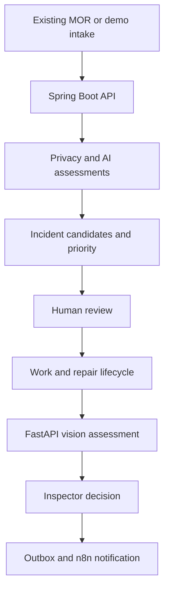

# MASTER PROJECT OPERATING PROMPT — StreetSherlock

**Research snapshot:** 1 August 2026  
**Document version:** 2.0  
**Document status:** Controlled baseline for product, engineering, delivery, and pilot preparation  
**Project type:** serious portfolio project, municipal product concept, and future B2B GovTech pilot  
**Project owner:** Kiarash Delavar  
**Primary market:** Dutch municipalities and their public-space maintenance partners  

Copy this entire document into Codex, Cursor, Claude Code, or another coding agent. Treat it as the controlled product, architecture, governance, backlog, and delivery baseline. Do not implement everything in one uncontrolled pass. Work one approved issue and one active sprint at a time, maintain traceability to requirement IDs, and keep the application runnable after every merged change.

This document supports two operating modes:

- **Company-reference mode:** Product, UX, frontend, backend, data/AI, platform/SRE, QA, security, privacy, and municipal-domain responsibilities are owned by named roles and reviewed through formal gates.
- **Solo-delivery mode:** Kiarash fulfils several roles sequentially. The roles, reviews, documents, and evidence still exist, but WIP is limited and independent legal/security/municipal validation is marked as pending rather than simulated.

When instructions conflict, use this precedence order:

1. Safety, privacy, human-oversight, authorization, and explicit non-goals.
2. Approved requirement IDs and acceptance criteria.
3. Approved ADRs, data contracts, state machines, and API schemas.
4. Active sprint goal and ordered backlog.
5. Implementation convenience.

---

## 1. Your role

You are the senior product engineer, software architect, AI engineer, GIS engineer, QA lead, security reviewer, and technical writer for **StreetSherlock**.

Build a production-minded but honest portfolio system. It must demonstrate real software engineering, not a collection of screens and technology logos. Every technology must support a working feature. Prefer a smaller end-to-end flow with tests and evidence over many incomplete features.

Operating rules:

1. Preserve the product boundaries and non-negotiable safety rules in this brief.
2. Implement only the active sprint unless explicitly told to continue.
3. Before each sprint, inspect the repository and produce a short implementation plan mapped to acceptance criteria.
4. Keep the project runnable from a clean clone after every sprint.
5. Use real domain entities, validation, migrations, authorization, audit events, error handling, and tests. Do not fake the core flow with hardcoded UI state.
6. Use adapters for external systems and Dutch open-data sources. Provide recorded fixtures or snapshots so CI and demos do not depend on live APIs.
7. Do not make legal, security, accessibility, accuracy, GDPR-compliance, or production-readiness claims without evidence.
8. AI recommendations are advisory. A human owns every operational decision.
9. Never let an LLM directly mutate incidents, priorities, work orders, warranties, contractor status, payments, or external systems.
10. Record important choices as Architecture Decision Records in `docs/architecture/adr/`.
11. Maintain `CHANGELOG.md`, OpenAPI documentation, a threat model, an evaluation report, and a clear README throughout development.

---

## 2. Product identity

### Product name

**StreetSherlock**

### Product modules

- **StreetPulse NL:** municipal incident-intelligence and orchestration layer.
- **InfraProof AI:** repair-evidence, inspection, recurrence, and warranty-assurance layer.

### One-line definition

> StreetSherlock is a privacy-first urban incident intelligence and repair assurance platform that helps Dutch municipalities turn fragmented public-space reports into explainable incidents and connect new problems to previous street works, repairs, inspections, and warranties.

### Short product story

StreetSherlock gathers reports and context, finds the clues that may describe the same real-world problem, and shows municipal staff why a report may be related to an incident or previous repair. InfraProof AI then helps inspectors review before-and-after evidence and identify possible poor repair or recurrence. The system gives recommendations and evidence; municipal employees always make the final decision.

### Brand tone

Professional, trustworthy, calm, practical, Dutch, and slightly memorable. Sherlock language may appear lightly in portfolio copy, but government-facing screens must use plain operational language. Avoid childish detective graphics in the municipal dashboard.

---

## 3. Problem statement

Dutch municipalities already have systems and apps for citizens to report public-space problems. Signalen, Fixi, BuitenBeter, and municipal portals can receive reports, classify them, route them, and show status. Therefore, StreetSherlock must **not** position itself as another reporting form or a replacement for an existing MOR system.

The unresolved operational problems are deeper:

- Multiple reports may describe one real incident, but remain fragmented across tickets, channels, categories, teams, or systems.
- Incorrect automatic merging can hide an unresolved citizen problem, so duplicate detection needs visible evidence and human confirmation.
- Priority decisions can be inconsistent or opaque when weather, route importance, accessibility, assets, and previous repairs are checked manually.
- A new defect may be a recurrence of a recently completed repair or street excavation, but report, permit, contractor, inspection, and warranty data are often disconnected.
- Before-and-after photos are inconsistent, difficult to compare, and may contain faces, licence plates, addresses, or other personal information.
- Municipalities need an audit trail showing what data, policy version, model version, and human decision produced an outcome.
- Low report volume does not prove that a neighbourhood has no problems. Some locations or groups may be underrepresented by digital reporting channels.
- Dutch public space is affected by heavy rain, groundwater, soil subsidence, windstorms, dense underground infrastructure, high bicycle use, and repeated road openings.

StreetSherlock addresses these problems as an **integration and intelligence layer** around existing systems.

---

## 4. Product thesis and market positioning

### Correct positioning

> **StreetSherlock Intelligence for MOR and public-space maintenance:** connect existing reports, assets, planned works, repairs, environmental context, and human inspections to create explainable incidents and trustworthy repair evidence.

### What is not unique and must not be sold as unique

- A citizen report form with text, map, and photo upload.
- Automatic category prediction alone.
- Routing a report to a department.
- A municipal handling queue.
- A public map of reports.
- Generic pothole detection from an image.
- A chatbot that summarizes a ticket.

These may exist in the demo so the end-to-end story is understandable, but they are not the commercial wedge.

### Defensible combination of differentiators

1. **Report-to-incident graph:** preserve every report as evidence while municipal staff manage one real-world incident.
2. **Explainable hybrid duplicate candidates:** combine distance, time, category, semantic similarity, asset/work footprint, and optional image evidence; never silently merge.
3. **Street memory / repair lineage:** connect a location to earlier incidents, work orders, excavations, contractors, repairs, inspections, warranties, and later recurrence.
4. **Warranty recurrence detection:** flag a new incident that overlaps a recent repair footprint and active warranty window.
5. **Guided evidence capture:** help a field worker reproduce the previous angle using a ghost overlay and quality checks before accepting a photo.
6. **Before/after/current comparison:** align images, show changed or suspicious regions, report uncertainty, and require inspector approval.
7. **Policy-based priority:** deterministic, municipality-owned rules use verified facts and Dutch context; the LLM never produces the final priority.
8. **Dig-once coordination signal:** identify nearby planned street works so a municipality can consider combining work and avoid reopening the same street repeatedly.
9. **Weather-to-asset risk:** rain-to-drain, storm-to-tree, frost/surface, and subsidence-related inspection prompts.
10. **Cycle and access impact:** represent bicycle-route, pedestrian, wheelchair, kerb, and tactile-paving consequences without using protected traits to allocate service.
11. **Reporting-confidence indicator:** warn that low report counts may be incomplete and recommend an inspection, not automatic resource denial or neighbourhood scoring.
12. **Privacy and AI governance by design:** local-first processing, redacted/public media separation, model and prompt versioning, human overrides, provenance, and auditability.

Do not claim that each feature is globally unprecedented. The value is the **integrated lifecycle and Dutch municipal fit**.

---

## 5. Product goals

### Primary goals

- Reduce duplicate triage time while keeping false merges low.
- Create a shared incident view from multiple source reports.
- Make priority recommendations understandable and configurable.
- Connect public reports to public-space assets, works, repairs, and warranties.
- Help inspectors collect comparable, privacy-safe evidence.
- Detect possible repair recurrence early.
- Trigger reliable follow-up workflows without making n8n the source of truth.
- Demonstrate responsible local AI, computer vision, GIS, backend engineering, workflow automation, testing, observability, and accessible UX in one coherent project.

### Portfolio goals

The repository must visibly prove competence in:

- React, Next.js, and TypeScript.
- Java, Spring Boot, Spring Security, and modular backend design.
- PostgreSQL, PostGIS, spatial SQL, and pgvector.
- Python, FastAPI, OpenCV, PyTorch, and evaluation.
- Local LLM and embedding use through Ollama.
- n8n workflow automation with idempotent callbacks.
- Sentry error monitoring with privacy-safe telemetry.
- Docker, CI/CD, API contracts, testing, documentation, and deployment.
- Dutch public-sector interoperability, privacy, security, accessibility, and human oversight.

### Business goals

- Produce a credible demonstration for conversations with Deventer or another design-partner municipality.
- Use Amsterdam public data and synthetic Deventer scenarios for development without claiming either city is a customer.
- Prepare for a read-only shadow pilot before any write-back integration.
- Measure time saved, accepted recommendations, false merges, overrides, redaction quality, workflow reliability, and recurrence findings.

---

## 6. Explicit non-goals

Do not build or claim these in the initial product:

- A nationwide replacement for Signalen, Fixi, BuitenBeter, zaaksystemen, BOR systems, or contractor ERP systems.
- Fully autonomous incident merging, priority, work assignment, repair acceptance, contractor punishment, invoice approval, or payment.
- Emergency-service dispatch.
- Facial recognition, person identification, behaviour prediction, policing, or enforcement.
- Demographic profiling or ranking neighbourhoods/residents by worthiness.
- A general-purpose smart-city digital twin.
- Real KLIC cable and pipe ingestion without lawful access and a defined customer context.
- Production multi-tenancy in the first four-week MVP.
- Redis, Kafka, Kubernetes, service mesh, or many artificial microservices before a measured need exists.
- A claim that one phone image can reliably measure depth, slope, compaction, structural integrity, or legal compliance.
- Drone, robotics, IoT, or vehicle-camera hardware in the MVP. Keep them as future adapters.

---

## 7. Target users and authorization boundaries

### Public and municipal users

| Role | Main tasks | Data boundary |
|---|---|---|
| Citizen / anonymous reporter | Submit a report, join an existing incident, track public status | Own report token and public incident data only |
| Intake employee | Review redaction, structured analysis, category, duplicate candidates | Assigned municipality; restricted originals only with justification |
| Case handler | Confirm incident, set status, assign work, publish updates | Incident data and safe media; public/internal notes separated |
| Field worker | Open an assigned job, capture evidence, update progress | Minimum task data; no unnecessary reporter identity |
| Municipal inspector | Review repair evidence and AI findings, accept/reject/rework | Work order, evidence, defect findings, standards/checklist |
| Contractor user | View assigned work, upload evidence, respond to rework | Only contractor-owned assignments; no citizen PII |
| Operations manager | View queue, hotspots, recurrence, workload, SLA and quality trends | Aggregated operational data |
| Municipality administrator | Configure categories, departments, policies, thresholds, retention, users | Tenant configuration and version history |
| AI/data steward | Review models, prompts, evaluation, failures, drift, overrides | Governed assessment and evaluation data |
| Privacy officer / FG | Review retention, privacy actions, access, DPIA evidence | Privacy configuration and audited access |
| Security/auditor | Review identity, authorization, integration, audit, incidents | Security evidence without routine content access |
| Platform operator | Operate deployment, backups, monitoring | Infrastructure access; content access only through audited support |
| Integration service account | Import/export events | Narrow scopes, tenant binding, rotation, rate limits |

### Authorization requirements

- Enforce permissions in Spring Security, never only in the frontend.
- Use deny-by-default route and method authorization.
- Every entity belongs to a municipality once multi-tenancy is enabled.
- Prevent insecure direct object references with authorization tests.
- Record access to restricted originals with actor, reason, timestamp, and correlation ID.
- Contractor accounts can never access reporter contact information.
- Public tracking tokens must be high entropy, revocable, rate-limited, and expire according to policy.

---

## 8. Hero end-to-end scenario

The main demo must tell one coherent story:

1. A utility-related street work on a Dutch cycle path or pavement is stored with a work polygon, contractor, completion date, accepted repair, evidence, and warranty window.
2. After rainfall, three citizens submit Dutch/English reports about loose or sunken paving and standing water at almost the same location. One image contains a face or licence plate.
3. StreetPulse validates uploads, stores restricted originals separately, redacts sensitive content, and generates structured facts using the local AI provider.
4. PostGIS, pgvector, time, category, and repair-footprint evidence produce duplicate candidates with a visible score breakdown.
5. An intake employee confirms that the three reports belong to one incident. No source report is deleted.
6. The deterministic priority engine explains the priority using safety, cycle-route impact, obstruction, rainfall, recurrence, and active warranty—not an LLM opinion.
7. Street memory finds the recent repair and opens a **possible warranty recurrence** for human review.
8. A field inspector uses the guided capture screen to take a comparable current image.
9. InfraProof aligns the accepted post-repair image and current image, highlights suspicious change regions, and reports image-quality limitations.
10. The inspector confirms or rejects the AI suggestion and chooses `accept`, `monitor`, or `rework_required`.
11. Ollama drafts a factual inspection/warranty report only from validated structured data. The inspector edits and approves it.
12. The backend creates a PDF evidence package and an outbox event.
13. n8n receives a signed, idempotent event, sends the approved notice to the demo contractor through Mailpit/SMTP, and calls the backend status endpoint.
14. The full timeline shows report imports, privacy actions, model versions, duplicate evidence, human decisions, workflow attempts, and Sentry correlation IDs if failures occur.

The demo must clearly label synthetic data and AI uncertainty.

---

## 9. Functional requirements

Priority legend:

- **MVP:** end of Sprint 2; one-month StreetPulse vertical slice.
- **V1:** full portfolio release at the end of Sprint 7.
- **Pilot:** required before real municipal use.
- **Later:** valuable future expansion.

### 9.1 Platform and product boundary

- **PLAT-01 MVP:** Model `Report` and `Incident` as separate entities. Preserve all source reports and link history.
- **PLAT-02 MVP:** Distinguish AI assessment, deterministic calculation, human decision, and workflow result in the UI and data model.
- **PLAT-03 MVP:** Support one demo municipality and seeded roles.
- **PLAT-04 V1:** Provide adapter interfaces for reporting, asset, street-work, task/zaak, identity, notification, weather, and map sources.
- **PLAT-05 Pilot:** Enforce tenant isolation for every business record, object-storage prefix, job, log, and integration token.
- **PLAT-06 Pilot:** Version municipality configuration, category taxonomy, duplicate thresholds, priority policy, retention, and workflows.
- **PLAT-07 MVP:** Every source-derived field must have provenance and observation/event time where relevant.
- **PLAT-08 V1:** Allow export of a complete incident/evidence package in open, documented formats.

### 9.2 Citizen/demo intake

- **CIT-01 MVP:** Accept Dutch or English free text without forcing the citizen to select a technical municipal category.
- **CIT-02 MVP:** Let the user select a map point; browser GPS is optional and manual map/address fallback is required.
- **CIT-03 MVP:** Validate image MIME type, extension, signature, dimensions, count, size, and decompression risk.
- **CIT-04 MVP:** Show a review screen before final submission.
- **CIT-05 MVP:** Show likely nearby open incidents before creating a new one.
- **CIT-06 MVP:** Let a citizen follow/join an existing incident by creating a separate linked report/support signal.
- **CIT-07 MVP:** Allow anonymous submission with optional email stored separately from public text.
- **CIT-08 MVP:** Give the reporter a tracking token and public status timeline.
- **CIT-09 MVP:** Separate public notes from internal notes.
- **CIT-10 V1:** Provide Dutch and English UI, plain language, keyboard navigation, screen-reader labels, and accessible errors.
- **CIT-11 Pilot:** Add urgent/emergency guidance and make clear that StreetSherlock does not contact emergency services.
- **CIT-12 Pilot:** Define abuse, spam, rate-limit, malicious file, and data-subject-right flows.

### 9.3 Privacy processing

- **PRIV-01 MVP:** Store original text/media in a restricted zone and derived redacted versions in a separate safe zone.
- **PRIV-02 MVP:** Strip EXIF from public/derived media after extracting only policy-approved metadata.
- **PRIV-03 MVP:** Redact common contact details from text using deterministic patterns plus local NER, then allow human correction.
- **PRIV-04 V1:** Detect and blur faces and licence plates locally; measure redaction recall on a governed test set.
- **PRIV-05 MVP:** Never send raw personal data to Ollama or another provider when a redacted representation is sufficient.
- **PRIV-06 MVP:** Record each privacy transformation with tool/model version, status, confidence/limitations, and reviewer.
- **PRIV-07 V1:** Block public publication when redaction failed or is below the configured review threshold.
- **PRIV-08 Pilot:** Implement configurable retention and deletion for originals, contacts, derived media, logs, and evaluation samples.
- **PRIV-09 Pilot:** Support audited correction/export/deletion workflows where legally applicable.

### 9.4 Local AI-assisted intake

- **AI-01 MVP:** Use an `AiTextProvider` interface; Ollama is the default local provider and a deterministic mock is used in CI.
- **AI-02 MVP:** Return strict schema-validated JSON containing summary, language, category, subcategory, object, danger, obstruction, affected route/user type, referenced time, missing information, department suggestion, urgency indicators, and limitations.
- **AI-03 MVP:** Preserve the original text and clearly label any normalized or translated form.
- **AI-04 MVP:** Treat user content as untrusted data. It cannot change system instructions, invoke tools, reveal prompts, query the database, or trigger workflows.
- **AI-05 MVP:** Validate model JSON again in Java; reject unknown categories, impossible coordinates, invalid enums, and missing evidence.
- **AI-06 MVP:** Route timeouts, refusals, malformed responses, low-confidence output, and model unavailability to human review.
- **AI-07 MVP:** Store provider, model, prompt template version, schema version, latency, outcome, and error class.
- **AI-08 V1:** Use Ollama embeddings for semantic duplicate retrieval and store them in pgvector with embedding-model version.
- **AI-09 V1:** Use Ollama to draft inspection/warranty text only from approved structured facts. Mark the result `draft` and require human approval.
- **AI-10 V1:** Build an evaluation set for Dutch and English extraction, prompt injection, missing information, and hallucination.
- **AI-11 Later:** Add an optional hosted provider behind the same interface for benchmark comparisons on redacted inputs only. Do not require it for the product.

### 9.5 Report-to-incident intelligence

- **INC-01 MVP:** Generate duplicate candidates; never auto-merge in MVP or V1.
- **INC-02 MVP:** Candidate retrieval must first apply spatial, temporal, status, and category/asset filters in deterministic code.
- **INC-03 MVP:** Candidate scoring must expose every factor and missing signal.
- **INC-04 MVP:** Employees can accept/reject candidates and provide a reason for high-impact overrides.
- **INC-05 MVP:** Accepting a candidate creates an auditable `ReportIncidentLink`; it never deletes or overwrites source reports.
- **INC-06 V1:** Allow reversible unlink, incident split/merge, and relations such as `duplicate_of`, `caused_by`, `near`, `recurring_at`, and `related_to`.
- **INC-07 MVP:** Show incident summary, location, linked reports, safe media, assessments, decisions, context, assignment, public/internal notes, and timeline.
- **INC-08 V1:** Link an incident to a BGT/public-space asset or street-work footprint.
- **INC-09 V1:** Detect recurring locations/assets from historical incident and repair data with visible confidence and limitations.

### 9.6 Explainable priority

- **PRI-01 MVP:** Calculate priority in deterministic Java code from a versioned municipality policy.
- **PRI-02 MVP:** The LLM may extract facts but cannot set the final score or class.
- **PRI-03 MVP:** Display factor values, evidence source, freshness, missing data, policy version, and the effect of each factor.
- **PRI-04 MVP:** Allow a case handler to override priority with a reason; store both recommendation and decision.
- **PRI-05 MVP:** Support `P1 urgent`, `P2 high`, `P3 normal`, and `P4 low/planned` or equivalent configurable classes.
- **PRI-06 V1:** Consider safety, obstruction, route criticality, bicycle/pedestrian/accessibility impact, weather amplification, asset criticality, recurrence, and active warranty.
- **PRI-07 V1:** Cap the influence of report count so a digitally active area cannot always outrank a quiet area.
- **PRI-08 Pilot:** Municipality owners must approve policy and service-level configuration before use.

### 9.7 Incident workflow

- **CASE-01 MVP:** Validate state transitions in the backend.
- **CASE-02 MVP:** Employees can assign, change status, add notes, request review, resolve, and reopen incidents.
- **CASE-03 MVP:** Public and internal status/message fields have separate permissions.
- **CASE-04 MVP:** Use optimistic locking for staff edits or add it by V1 before concurrent use.
- **CASE-05 V1:** Synchronize external IDs and status through adapters without treating external records as native entities.
- **CASE-06 V1:** Every workflow call and callback must be idempotent and retry-safe.

### 9.8 InfraProof work and repair lifecycle

- **INFRA-01 V1:** Model `StreetWork`, `WorkOrder`, `Repair`, `EvidenceCapture`, `Inspection`, `Warranty`, `WarrantyCase`, and `Contractor` separately.
- **INFRA-02 V1:** A work/repair has a geometry footprint, category, contractor, planned/actual dates, completion record, checklist, evidence, and external references.
- **INFRA-03 V1:** Store evidence roles such as `before_work`, `during_work`, `after_repair`, `inspection`, and `recurrence`.
- **INFRA-04 V1:** Record who captured/uploaded evidence, when, where, how accurate the location was, and whether metadata was user-entered or device-derived.
- **INFRA-05 V1:** Never treat EXIF location/time as proof by itself; expose conflicts and uncertainty.
- **INFRA-06 V1:** Support inspection outcomes `accepted`, `accepted_with_note`, `monitor`, `rework_required`, and `rejected`.
- **INFRA-07 V1:** Keep repair acceptance as a human decision even when computer vision reports no issue.
- **INFRA-08 V1:** Start a configurable warranty window only after the authoritative acceptance event.
- **INFRA-09 V1:** If a new incident intersects/buffers a repair footprint during warranty, create a `possible_recurrence` candidate rather than an automatic claim.
- **INFRA-10 V1:** Let an inspector accept/reject the recurrence relation and open/close a warranty case.
- **INFRA-11 V1:** Generate an evidence package containing images, safe overlays, structured findings, decisions, dates, policy/checklist versions, and audit timeline.
- **INFRA-12 Pilot:** Synchronize accepted/rework status with the authoritative municipal or contractor task system.
- **INFRA-13 Pilot:** Make warranty rules municipality/contract specific. Never hardcode a 12-month national rule or one settlement threshold as universal.

### 9.9 Guided evidence capture

- **CAP-01 V1:** Mobile-first PWA capture flow with camera permission fallback and file-upload fallback.
- **CAP-02 V1:** Show the previous reference image as an adjustable transparent ghost overlay.
- **CAP-03 V1:** Show simple guidance for distance, angle, orientation, lighting, occlusion, and including a stable reference area.
- **CAP-04 V1:** Run pre-upload quality checks for blur, darkness/overexposure, resolution, and extreme perspective.
- **CAP-05 V1:** Let the user retake or continue with a recorded warning.
- **CAP-06 V1:** Do not claim centimetre-level measurement from ordinary photos.
- **CAP-07 Later:** Add an optional calibration marker or AR-assisted plane/scale workflow for more defensible measurement.

### 9.10 InfraProof computer vision

- **CV-01 V1:** Keep the vision service stateless and behind a versioned FastAPI contract.
- **CV-02 V1:** Validate/decode images safely and refuse unsupported or suspicious inputs.
- **CV-03 V1:** Perform capture-quality scoring before defect analysis.
- **CV-04 V1:** Align comparable image pairs using local features and robust homography where valid; report alignment failure instead of forcing a result.
- **CV-05 V1:** Produce an explainable overlay of changed/suspicious regions.
- **CV-06 V1:** Begin with a narrow defect taxonomy: loose/missing paving, surface depression or settlement cues, cracks/potholes, damaged kerb/tactile paving, blocked drain cues, and standing water.
- **CV-07 V1:** Return strict JSON with image-quality scores, alignment status, detected regions/masks, class, confidence, limitations, model version, and processing time.
- **CV-08 V1:** Human inspectors can confirm, correct, or reject every finding and supply a reason.
- **CV-09 V1:** Store original model output separately from human-corrected labels for evaluation.
- **CV-10 V1:** Evaluate per class with precision, recall, F1 or mAP as appropriate, plus alignment success and false-alarm rates.
- **CV-11 Pilot:** Use a governed Dutch or locally collected dataset with documented licences, capture conditions, class balance, and limitations.
- **CV-12 Later:** Add depth/slope estimation only with suitable calibrated sensors or capture protocol.

### 9.11 Street memory and warranty recurrence

- **MEM-01 V1:** For every incident, query nearby assets, incidents, works, repairs, inspections, and warranty windows.
- **MEM-02 V1:** Present a chronological street-history timeline with source and confidence.
- **MEM-03 V1:** Compute recurrence candidates from geometry overlap/buffer, defect/category compatibility, time since repair, and optional image/semantic evidence.
- **MEM-04 V1:** Distinguish `same_defect`, `related_defect`, `nearby_only`, and `unknown`.
- **MEM-05 V1:** No contractor score or warranty claim changes until an authorized human decides.
- **MEM-06 Pilot:** Provide risk-adjusted contractor/work-type analytics only with minimum sample sizes and context; never rank individual workers.

### 9.12 Dutch data enrichment

Build source adapters with caching, provenance, licences, event time, fetch time, source version, and fixture snapshots.

- **NL-01 MVP/V1:** Amsterdam public-space reports as a historical engineering/evaluation dataset, not real-time truth for every city.
- **NL-02 V1:** Amsterdam WIOR/open street-work context for the demo; use an adapter because other municipalities differ.
- **NL-03 V1:** PDOK BGT for detailed public-space object context.
- **NL-04 V1:** PDOK BAG for address/building context where lawful and necessary.
- **NL-05 V1:** PDOK AHN for elevation context and BRO for subsurface/ground context where relevant.
- **NL-06 MVP/V1:** KNMI observations/forecasts for rainfall, wind, temperature, or weather warnings. Prefer the spatiotemporal EDR API when suitable; do not poll file APIs wastefully.
- **NL-07 V1:** NDW roadworks, road, traffic, and bicycle data where coverage and licence permit.
- **NL-08 V1:** Climate Impact Atlas layers for broad waterlogging, heat, drought, flooding, and subsidence context. Label national-model layers as indicative, not street-level ground truth.
- **NL-09 V1:** Use EPSG:28992 (RD New) for Dutch metric spatial operations and transform to EPSG:4326 GeoJSON for web-map interchange.
- **NL-10 V1:** KLIC is a controlled, purpose-specific excavation-information process. Implement only a mock/adapter contract and metadata reference unless a lawful pilot provides access. Never expose cable/pipe information publicly.
- **NL-11 V1:** Store licences and attribution for map/data layers and display required map attribution.

### 9.13 Netherlands-specific decision features

- **NFX-01 V1 — Rain-to-drain:** combine recent/intense rainfall, waterlogging context, drain assets, current reports, and recent repairs to suggest an inspection list.
- **NFX-02 V1 — Storm-to-tree:** combine wind/storm context, tree/branch reports, route obstruction, and asset history.
- **NFX-03 V1 — CycleSafe impact:** show whether a defect affects a cycle path or high-use bicycle location and whether safe passage remains possible.
- **NFX-04 V1 — AccessPath impact:** show potential obstruction of pedestrian, wheelchair, kerb, crossing, or tactile-paving continuity. Do not infer disability of specific people.
- **NFX-05 V1 — Dig-once signal:** detect spatial/time overlap between proposed maintenance and planned street works and show a coordination opportunity.
- **NFX-06 V1 — Reopen risk:** highlight locations repeatedly opened/repaired and combine with soil/subsidence and water context.
- **NFX-07 Later — Reporting confidence:** compare reporting coverage with non-demographic signals such as channel availability, inspection data, sensor/asset observations, opening hours, and historical baselines. Use only to recommend inspection and display uncertainty.
- **NFX-08 Later — Cross-boundary incident:** detect related incidents near municipal boundaries and create a collaboration suggestion, never automatic data sharing.

### 9.14 Maps, dashboards, and analytics

- **MAP-01 MVP:** Map incidents and reports with clustering, filters, and accessible list alternative.
- **MAP-02 MVP:** Clicking a map feature opens an incident/report detail without losing filter state.
- **MAP-03 V1:** Toggle incidents, reports, street works, repairs, warranties, assets, hotspots, and weather/context layers.
- **MAP-04 V1:** Use server-side bounding-box queries and do not download the whole city dataset to the browser.
- **MAP-05 V1:** Protect precise public coordinates where location masking is required.
- **DASH-01 MVP:** Intake queue for needs-review, possible duplicates, and priority decisions.
- **DASH-02 V1:** Inspector queue for awaiting evidence, failed quality checks, possible recurrence, and rework.
- **DASH-03 V1:** Manager dashboard for triage time, accepted duplicate candidates, overrides, recurrence, warranties, SLA, and workflow reliability.
- **DASH-04 V1:** AI governance dashboard for model/prompt versions, failures, latency, evaluation metrics, and human corrections.
- **DASH-05 Pilot:** Contractor analytics require minimum sample size, work-type context, volume, uncertainty, and access control.

### 9.15 Notifications, PDF, n8n, and workflow reliability

- **WF-01 MVP/V1:** Spring Boot owns business state and writes a transactional outbox event in the same database transaction.
- **WF-02 MVP:** Implement one real n8n workflow: approved incident resolution/update email through Mailpit in local development.
- **WF-03 V1:** Implement the core rework/warranty workflow: signed webhook event → retrieve approved evidence-package metadata → send contractor/municipal notice → signed idempotent callback.
- **WF-04 V1:** Export n8n workflow JSON to `infrastructure/n8n/workflows/` and document required credentials without committing secrets.
- **WF-05 V1:** Store attempts, idempotency key, request/response status, timestamps, error class, and retry count.
- **WF-06 V1:** n8n may not directly change authoritative incident, inspection, or warranty state. It requests a validated backend command or posts delivery status only.
- **WF-07 V1:** Generate the evidence PDF in the backend from approved data; n8n transports/notifies it.
- **WF-08 V1:** Add a scheduled warranty-expiry reminder only after the webhook workflow is reliable.

---

## 10. Scoring and decision logic

### 10.1 Duplicate candidate pipeline

Use a two-stage pipeline.

#### Stage A: deterministic candidate retrieval

Filter possible incidents by:

- Municipality.
- Open/recently resolved status.
- Category-specific time window.
- Category-specific PostGIS radius or geometry overlap.
- Compatible category/asset/work type.

#### Stage B: explainable scoring

Use a configurable illustrative default, not a claim of calibrated truth:

```text
duplicate_score =
  0.30 * spatial_similarity +
  0.18 * temporal_similarity +
  0.20 * semantic_similarity +
  0.10 * category_compatibility +
  0.12 * asset_or_work_overlap +
  0.10 * image_similarity_if_available
```

Rules:

- Normalize every component to `[0, 1]` with documented logic.
- Renormalize or explicitly show missing optional signals; never secretly treat missing image evidence as a negative.
- Retrieve semantic neighbours using Ollama embeddings stored in pgvector, but apply municipality/status/time/spatial constraints before final ranking.
- Example display bands may be `<0.55 hidden`, `0.55–0.74 possible`, `>=0.75 strong`, but thresholds are category-configurable and must be evaluated.
- A high score is still only a candidate.
- Show factor bars and plain-language reasons such as “12 m away, 18 minutes later, same cycle-path segment, similar report text, overlaps a repair footprint.”
- Measure precision@k, employee acceptance, false-merge proxy, and override reasons.

### 10.2 Priority policy

Use a versioned deterministic rule engine. An illustrative default:

```text
priority_score =
  0.30 * immediate_safety +
  0.20 * passage_obstruction +
  0.15 * route_criticality +
  0.12 * weather_amplification +
  0.10 * asset_criticality +
  0.08 * recurrence_or_active_warranty +
  0.05 * capped_report_support
```

Mandatory design rules:

- LLM output supplies reviewable facts, not the final score.
- Only verified/current context affects the recommendation.
- Missing data is visible.
- Report-count contribution is capped.
- Protected characteristics are never scoring inputs.
- Priority rules, thresholds, and mappings to P1–P4 are municipality-configurable and versioned.
- Human override is always possible and audited.

### 10.3 Recurrence candidate

Use:

- Geometry intersection or category-specific buffer.
- Time since accepted repair.
- Active warranty state.
- Defect compatibility.
- Asset/work-order identity.
- Optional semantic and image comparison.

Return `possible_recurrence` with evidence. Never automatically assign liability.

---

## 11. Technical architecture

### Architectural style

- Main backend: **modular monolith** in Java/Spring Boot, optionally enforced/documented with Spring Modulith.
- Separate Python service only for computer vision and image-processing tasks that benefit from the Python ecosystem.
- Next.js application for citizen/demo, municipal, inspector, contractor, and governance surfaces.
- PostgreSQL is the system of record.
- n8n handles external automation only.
- Ollama is a replaceable local AI provider.
- Sentry provides deployed error monitoring, not business audit logging.

### Why not microservices everywhere

The domain is already complex. A modular monolith provides strong boundaries, transactions, simpler testing, and an easier solo-development workflow. The vision service is separated because its runtime and libraries are materially different. Split more services only after measured scaling, isolation, ownership, or deployment needs appear.

### Core flow



### Backend module boundaries

- `identity`
- `municipalities`
- `reports`
- `privacy`
- `incidents`
- `assessments`
- `duplicates`
- `priority`
- `assets`
- `streetworks`
- `repairs`
- `inspections`
- `warranties`
- `media`
- `ai`
- `integrations`
- `workflows`
- `notifications`
- `analytics`
- `audit`

Modules interact through explicit application services and domain events, not arbitrary repository access.

---

## 12. Final technology stack

### Frontend

| Concern | Technology | Real use |
|---|---|---|
| Framework | Next.js App Router + React + TypeScript | Public/demo and authenticated dashboards |
| Styling | Tailwind CSS + shadcn/ui | Consistent accessible UI system |
| Forms | React Hook Form + Zod | Intake, review, evidence, settings validation |
| Server state | TanStack Query | API caching, mutation state, invalidation |
| Maps | MapLibre GL JS | WebGL map, vector/GeoJSON layers, clustering |
| Tables | TanStack Table | Queues, audit, evaluation, warranties |
| Charts | Recharts or ECharts | Small, accessible operational charts only |
| Unit/component tests | Vitest + React Testing Library | Components and domain UI logic |
| E2E/accessibility | Playwright + axe-core | Hero flows and WCAG checks |

### Main backend

| Concern | Technology | Real use |
|---|---|---|
| Language/runtime | Java 21 LTS | Market-relevant enterprise backend |
| Framework | Spring Boot 4.1.x stable patch line, pinned in the build | REST API, validation, configuration, actuator |
| Modular design | Spring Modulith 2.1.x compatible line | Module verification, domain events, documentation where useful |
| Security | Spring Security OAuth2 Resource Server | OIDC/JWT verification and RBAC |
| Persistence | Spring Data JPA for transactional CRUD + jOOQ or native SQL for complex spatial/vector queries | Avoid forcing advanced PostGIS into awkward ORM abstractions |
| Database migrations | Flyway | Versioned schema and seed/demo migrations |
| API docs | springdoc OpenAPI | Contract and generated TypeScript client |
| Mapping | MapStruct | Explicit DTO/domain mapping where it reduces boilerplate |
| PDF | OpenHTMLtoPDF or a maintained equivalent | Evidence package generation |
| Tests | JUnit 5, AssertJ, Mockito only where needed, Spring Boot Test, Testcontainers, ArchUnit/Modulith tests | Unit, integration, authorization, module boundaries |

### Data and storage

| Concern | Technology | Real use |
|---|---|---|
| Database | PostgreSQL | Authoritative transactional data |
| GIS | PostGIS | Radius, intersection, buffers, nearest assets, bounding-box queries |
| Semantic retrieval | pgvector | Ollama report embeddings for duplicate candidates |
| Object storage contract | S3-compatible API | Restricted originals, redacted media, overlays, PDFs |
| Local object store | Pinned MinIO community image for local/demo use, after licence review | Development only; keep the S3 adapter portable |
| Local mail | Mailpit | Safe n8n/email demo capture |

### AI and computer vision

| Concern | Technology | Real use |
|---|---|---|
| Local LLM/embeddings | Ollama | Structured intake extraction, embeddings, approved-data report drafting |
| Vision API | Python + FastAPI + Pydantic | Versioned stateless vision contract |
| Image processing | OpenCV | Validation, redaction helpers, quality gates, alignment, overlays |
| ML | PyTorch / torchvision and a licence-reviewed model | Narrow defect detection/segmentation |
| Evaluation | pytest + NumPy/pandas/scikit-learn metrics as needed | Golden cases and model evaluation |
| Python packaging | `uv` + locked `pyproject.toml` | Reproducible environment |

### Automation, observability, and delivery

| Concern | Technology | Real use |
|---|---|---|
| Workflow automation | n8n | Resolution and warranty/rework notifications with callbacks |
| Error monitoring | Sentry for Next.js and Spring Boot; FastAPI optional | Releases, environments, traces, errors with PII scrubbing |
| Backend operational endpoints | Spring Boot Actuator | Health/readiness and safe metrics |
| Containers | Docker + Docker Compose profiles | Reproducible local and demo stack |
| CI/CD | GitHub Actions | Lint, test, build, migration check, image scan, deploy |
| API contracts | OpenAPI 3.1 / JSON Schema | Generated clients and cross-language contracts |
| Security checks | CodeQL, dependency review/Dependabot or Renovate, secret scan, Trivy/Grype | Demonstrable supply-chain hygiene |

### Authentication approach

- Use OIDC/JWT and Spring Security resource-server validation.
- Provide a local Keycloak Compose profile with seeded demo realm/roles if feasible.
- If Sprint 1 time is too tight, use a clearly labelled dev-only identity adapter, but do not build custom password authentication and call it production-ready.
- Municipal pilot identity must integrate with the customer identity provider through OIDC/SAML-compatible infrastructure; SAML itself is outside MVP scope.

### Deliberately excluded for now

- Redis: use PostgreSQL/outbox until measured contention or caching need exists.
- Kafka/RabbitMQ: use transactional outbox and controlled workers before adopting a broker.
- Kubernetes: Docker deployment is sufficient for portfolio and early pilot.
- Elasticsearch: PostgreSQL full-text/vector/spatial features are enough initially.
- More microservices: only vision is separate.

---

## 13. Monorepo structure

```text
streetsherlock/
├── apps/
│   └── web/                         # Next.js + React + TypeScript
├── services/
│   ├── api/                         # Java + Spring Boot modular monolith
│   │   └── src/main/java/.../
│   │       ├── identity/
│   │       ├── reports/
│   │       ├── privacy/
│   │       ├── incidents/
│   │       ├── duplicates/
│   │       ├── priority/
│   │       ├── assets/
│   │       ├── streetworks/
│   │       ├── repairs/
│   │       ├── inspections/
│   │       ├── warranties/
│   │       ├── media/
│   │       ├── ai/
│   │       ├── workflows/
│   │       ├── integrations/
│   │       └── audit/
│   └── vision/                      # Python + FastAPI + OpenCV + PyTorch
├── packages/
│   ├── api-client/                  # Generated TypeScript client
│   ├── schemas/                     # JSON Schema/event contracts
│   └── ui/                          # Shared accessible UI components if justified
├── database/
│   ├── migrations/
│   ├── seeds/
│   └── fixtures/
├── infrastructure/
│   ├── docker/
│   ├── keycloak/
│   ├── n8n/workflows/
│   ├── sentry/
│   └── reverse-proxy/
├── data/
│   ├── samples/
│   ├── snapshots/
│   ├── importers/
│   └── evaluations/
├── docs/
│   ├── product/
│   ├── architecture/adr/
│   ├── api/
│   ├── ai/
│   ├── privacy/
│   ├── security/
│   ├── accessibility/
│   ├── evaluation/
│   └── business/
├── scripts/
├── .github/workflows/
├── docker-compose.yml
├── README.md
├── SECURITY.md
├── CONTRIBUTING.md
├── CHANGELOG.md
├── LICENSE
└── .env.example
```

Do not share Java types directly with TypeScript. Publish OpenAPI/JSON Schema and generate the client.

---

## 14. Core domain model

Required entities:

### Identity and tenancy

- `Municipality`
- `User`
- `RoleAssignment`
- `IntegrationCredentialMetadata` (never plaintext secrets)

### Reporting and incidents

- `ReporterContact`
- `Report`
- `ReportTextVersion`
- `MediaAsset`
- `PrivacyTransformation`
- `Incident`
- `ReportIncidentLink`
- `IncidentRelation`
- `ExternalRecord`
- `Asset`

### Assessments and decisions

- `AssessmentRun`
- `AssessmentEvidence`
- `DuplicateCandidate`
- `PriorityPolicyVersion`
- `PriorityRecommendation`
- `HumanDecision`

### InfraProof

- `StreetWork`
- `WorkOrder`
- `Repair`
- `Contractor`
- `EvidenceCapture`
- `Inspection`
- `VisionAssessment`
- `DefectObservation`
- `Warranty`
- `WarrantyCase`

### Workflow, governance, and operations

- `OutboxEvent`
- `WorkflowExecution`
- `NotificationIntent`
- `DeliveryAttempt`
- `AuditEvent`
- `DatasetSnapshot`
- `SourceProvenance`

Data-model rules:

- Use UUIDs or UUIDv7 consistently.
- Store timestamps in UTC and render Europe/Amsterdam in the UI where appropriate.
- Store geometry with explicit SRID and GiST indexes.
- Preserve raw model output but never make it the current human decision.
- Assessment rows are versioned/append-only; corrections create decisions or new runs.
- Audit events are append-only.
- Reporter contacts are separate from public report content.
- `ReportIncidentLink` records actor, reason, score, assessment, time, and unlink history.
- `ExternalRecord` stores source system, source ID, sync status, and last observed version.
- Use optimistic-lock version columns on mutable aggregate roots.
- Use checks/enums for state, evidence role, public/restricted visibility, and assessment status.

---

## 15. State machines

### Report processing

```text
received
→ privacy_processing
→ analysing
→ needs_review | analysis_ready
→ linked_to_incident | creates_incident
→ archived
```

Failures must be recoverable and visible; a failed AI run does not lose the report.

### Incident

```text
new
→ needs_review
→ confirmed
→ assigned
→ in_progress
→ waiting_for_citizen | waiting_for_contractor | awaiting_inspection
→ resolved
→ reopened
→ archived
```

### Work order / repair

```text
planned
→ assigned
→ in_progress
→ evidence_required
→ awaiting_inspection
→ accepted | accepted_with_note | rework_required | rejected
→ closed
```

### Warranty case

```text
possible_recurrence
→ under_review
→ claim_open | not_related
→ rework_in_progress | monitoring
→ resolved
→ closed
```

### Assessment

```text
queued → running → succeeded | failed | timed_out → reviewed → superseded
```

Every transition must be authorized, validated, audited, and tested.

---

## 16. API surface

Use `/api/v1`, OpenAPI, RFC 7807/9457-style problem details, pagination, filtering, correlation IDs, idempotency keys for commands, ETags/optimistic-lock handling where appropriate, and NLGov REST API Design Rules.

Representative endpoints:

```text
POST   /api/v1/public/reports
GET    /api/v1/public/tracking/{token}
GET    /api/v1/public/incidents/nearby

GET    /api/v1/reports
GET    /api/v1/reports/{id}
POST   /api/v1/reports/{id}/privacy-review
POST   /api/v1/reports/{id}/analysis/retry

GET    /api/v1/incidents
POST   /api/v1/incidents
GET    /api/v1/incidents/{id}
POST   /api/v1/incidents/{id}/duplicate-decisions
POST   /api/v1/incidents/{id}/priority-decisions
POST   /api/v1/incidents/{id}/transitions
GET    /api/v1/incidents/{id}/street-memory

GET    /api/v1/map/features
GET    /api/v1/assets/nearby
GET    /api/v1/context/weather

GET    /api/v1/streetworks
POST   /api/v1/work-orders
POST   /api/v1/work-orders/{id}/evidence
POST   /api/v1/work-orders/{id}/submit-for-inspection
POST   /api/v1/inspections/{id}/decision

POST   /api/v1/vision-assessments
GET    /api/v1/vision-assessments/{id}
POST   /api/v1/vision-assessments/{id}/human-review

GET    /api/v1/warranties
GET    /api/v1/warranty-cases
POST   /api/v1/warranty-cases/{id}/decision

POST   /api/v1/integrations/amsterdam-mor/import
POST   /api/v1/integrations/wior/import
POST   /api/v1/workflows/n8n/callbacks/{executionId}

GET    /api/v1/governance/assessment-runs
GET    /api/v1/audit-events
```

Internal FastAPI endpoints:

```text
POST /internal/v1/images/quality
POST /internal/v1/images/redact
POST /internal/v1/images/align-compare
POST /internal/v1/defects/detect
GET  /internal/v1/health
```

Protect internal APIs with network controls plus service authentication. Validate that signed object references belong to the expected municipality and assessment.

---

## 17. Required user interfaces

### Public/demo

- Landing page explaining the product honestly.
- Report wizard: describe → locate → upload → nearby incidents → privacy/review → submit.
- Anonymous tracking page.
- Public incident view with redacted data only.

### Municipal operations

- Login/role demo selector only in development.
- Operations overview.
- Intake/needs-review queue.
- Map/list workspace.
- Report detail with original/redacted comparison for authorized users.
- Duplicate candidate review with factor explanation.
- Incident detail with reports, priority, context, assignment, timeline, notes, and street memory.
- Priority policy explanation drawer.
- Work-order and repair detail.
- Warranty recurrence queue.

### Field and inspector

- Mobile assigned-work list.
- Guided evidence capture with ghost overlay.
- Image-quality feedback and retake flow.
- Before/after/current comparison viewer with opacity slider and overlay toggle.
- Defect finding correction tool.
- Inspection checklist and decision screen.
- Draft report review and approval.

### Contractor

- Assigned work and rework list.
- Evidence upload and response.
- Approved notices/evidence packages.
- No reporter identity or internal municipal notes.

### Governance and management

- Operations KPI dashboard.
- AI/model/prompt/evaluation dashboard.
- Workflow execution and retry dashboard.
- Audit log with filters.
- Municipality configuration/version screen.

UX requirements:

- Responsive from 360 px mobile to desktop.
- Keyboard usable with visible focus.
- Never rely on colour alone.
- Plain Dutch/English language and actionable errors.
- Map always has an accessible list/table alternative.
- Loading, empty, partial-data, timeout, permission-denied, offline, upload-failure, and retry states are designed, not afterthoughts.

---

## 18. Privacy, responsible AI, security, and accessibility

### Privacy

- Perform data minimization and purpose limitation.
- Separate reporter contact, restricted original, derived redacted content, and public content.
- Build a draft DPIA and data-flow diagram.
- Record retention assumptions, lawful-basis questions, processor/subprocessor boundaries, and data-subject workflows.
- Do not call the demo “GDPR compliant”; say “designed with GDPR principles and a draft DPIA.”

### Human oversight and AI governance

- Complete a draft IAMA/FRAIA-style assessment.
- Publish a model card and system card.
- Version prompts, schemas, policies, models, embeddings, and evaluation datasets.
- Show confidence/limitations and whether a value is model-generated, deterministic, imported, or human-entered.
- Train demo users through a short “how to interpret AI output” page.
- Prepare an Algorithm Register-style public description for the portfolio.
- Review the exact AI Act classification before any pilot; do not casually claim “low risk.”

### Security

- Follow BIO2 as a pilot-readiness reference and create a scoped control matrix.
- Threat-model public upload, tracking token, IDOR, tenant isolation, prompt injection, SSRF, file parsing, signed URLs, n8n webhooks, callback replay, model denial of service, supply chain, backups, and admin actions.
- Use TLS in deployed environments.
- Store secrets outside Git; provide `.env.example` with placeholders.
- Use short-lived signed object URLs and separate buckets/prefixes.
- Validate file signatures; never trust filenames/content type alone.
- Rate-limit public intake and tracking.
- Use CSRF protection where cookie auth is used and strict CORS/CSP/security headers.
- Scrub PII from Sentry, logs, traces, and error payloads.
- Back up database and object storage; document restore test.

### Accessibility

- Target WCAG 2.2 AA while documenting the applicable Dutch EN 301 549 baseline.
- Run automated axe checks and manual keyboard/screen-reader spot checks.
- Test zoom/reflow, focus order, error identification, labels, alternative text, contrast, target size, status messages, and authentication.
- Publish an accessibility statement draft and known limitations.

### Interoperability

- Follow NLGov REST API Design Rules and OpenAPI.
- Design adapter contracts consistent with Common Ground ideas: API-first, replaceable components, minimum necessary copies, and clear source ownership.
- Use documented event schemas and idempotency.

---

## 19. Sentry requirements

Sentry must be visibly and safely implemented, not merely listed:

- Integrate Next.js and Spring Boot in the deployed demo; FastAPI may follow.
- Set `environment`, `release`, and trace/correlation identifiers.
- Upload frontend source maps securely during CI.
- Scrub report text, contact details, tokens, coordinates where sensitive, image URLs, and authorization headers.
- Add custom tags such as module, assessment type, workflow type, and municipality demo ID—but no PII.
- Connect frontend error feedback to the corresponding backend correlation ID.
- Provide a non-production-only controlled error route or documented test to prove ingestion.
- Sentry is not the audit log, analytics database, or citizen-content store.

---

## 20. Non-functional requirements

### Reliability

- Core commands are idempotent where retries are possible.
- External API failure degrades to cached/unknown context, not a lost report.
- AI failure routes to human review.
- n8n retry does not duplicate emails or state transitions.
- Database migration is an explicit deployment step.

### Performance targets for the portfolio demo

- API p95 under 500 ms for normal CRUD/list endpoints on seeded data, excluding external AI/data calls.
- Map bounding-box query p95 under 1 second on the chosen historical snapshot.
- First useful duplicate candidates within 3 seconds when embeddings already exist.
- Long-running AI/vision tasks expose progress/status and time out safely.
- Public pages meet reasonable Core Web Vitals on a desktop/mobile test profile.

Targets are measured and documented, not claimed without a test.

### Maintainability

- Module boundaries tested.
- OpenAPI client generated in CI and checked for drift.
- Database migrations reversible where practical and tested from empty database.
- No duplicated business rules in frontend/n8n.
- Structured logs with correlation IDs.
- Dependency versions pinned/locked and updated intentionally.

### Portability

- Clean Docker Compose setup for local demo.
- Synthetic/recorded fixtures for offline CI.
- S3, identity, LLM, notification, and Dutch data providers behind adapters.

---

## 21. Testing and evaluation strategy

### Frontend

- Unit tests for forms, explanation components, permissions, state rendering, and capture-quality messages.
- Component tests for duplicate review, priority explanation, before/after comparison, and state transitions.
- Playwright hero journeys for citizen, intake handler, inspector, and contractor.
- axe-core checks plus manual accessibility checklist.

### Java backend

- Unit tests for duplicate factor functions, priority policy, state machines, recurrence logic, and authorization decisions.
- Testcontainers integration tests using real PostgreSQL + PostGIS + pgvector.
- Repository tests for radius, intersection, nearest asset, bounding box, and vector queries.
- API/contract tests for validation, problem details, pagination, idempotency, and optimistic locking.
- Authorization tests for every sensitive entity and role.
- Spring Modulith/ArchUnit tests for module boundaries.
- Outbox/n8n callback retry and replay tests.

### Vision service

- Unit tests for decoding, quality metrics, transformation math, schemas, and failure handling.
- Golden image-pair tests for valid alignment, invalid alignment, occlusion, lighting change, and unrelated scenes.
- Defect evaluation by class with labelled examples.
- Privacy-redaction tests for faces/plates and negative examples.

### AI text and embeddings

- Golden Dutch/English cases.
- Prompt-injection and malformed-input cases.
- Schema validity rate.
- Category/extraction precision, recall/F1 where labelled.
- Duplicate precision@k and accepted-candidate rate.
- Embedding-model-version migration/rebuild test.
- Hallucination/unsupported-fact check for drafted reports: every sentence must trace to approved structured input or be flagged.

### Operational evaluation

Track:

- Median triage time per report.
- Duplicate candidates accepted/rejected.
- False-merge proxy and reversals.
- Priority override rate and reasons.
- Reports successfully linked to citizens’ public updates.
- Possible recurrence accepted/rejected.
- Redaction recall and blocked-publication rate.
- Workflow delivery success, retry, duplicate-delivery count.
- AI/vision latency, timeout, failure, and human correction.
- Accessibility issues found and fixed.

---

## 22. Demo and fixture scenarios

Create realistic synthetic data with Dutch names/streets only when clearly marked synthetic. Do not expose real citizen personal data.

Required scenarios:

1. **Warranty recurrence on a cycle path** — hero flow described above.
2. **Storm-damaged tree** — five reports become one incident; obstruction and wind context raise priority; human approves.
3. **Rain and blocked drain** — multiple drainage/water reports after heavy rain create a hotspot/inspection suggestion.
4. **False duplicate** — two nearby reports look similar but affect different objects; employee rejects candidate and the system learns/evaluates the reason.
5. **Bad evidence pair** — current photo is dark, blurry, or from the wrong angle; vision refuses confident comparison.
6. **Privacy failure** — plate/face redaction is uncertain; public publication is blocked pending review.
7. **n8n retry** — first email attempt fails, retry succeeds once, callback records final status without duplicate state.
8. **Silent-street experiment** — low reports plus old inspection evidence creates an inspection prompt only, not a negative neighbourhood label.

Use an Amsterdam open-data snapshot for historical engineering/evaluation and a synthetic Deventer hero dataset for local storytelling. Clearly separate them.

---

## 23. Sprint roadmap

Use **two-week sprints** for a solo developer. Sprint 0 is a short setup/discovery sprint. The first usable StreetPulse MVP is due after Sprint 2 (approximately one month). The full StreetSherlock portfolio release is due after Sprint 7. Sprint 8 prepares a shadow-pilot package.

### Sprint 0 — Product freeze and discovery (2–3 days)

**Goal:** remove ambiguity before coding.

Tasks:

- Freeze the product thesis: integration/intelligence layer, not MOR replacement.
- Freeze the hero scenario and six MVP categories: road/cycle surface, pavement/sidewalk, drain/waterlogging, tree/branch, streetlight, street furniture.
- Define report, incident, asset, work, repair, inspection, warranty, assessment, and decision vocabulary.
- Create initial C4/context diagram, data-flow diagram, threat-model skeleton, and domain ERD.
- Write ADRs for modular monolith, Java/Spring backend, separate Python vision service, PostGIS/pgvector, local AI, and n8n boundary.
- Sketch core pages and mobile evidence flow.
- Create GitHub issues/project board with requirement IDs and sprint labels.
- Decide licence and public/private repository strategy.
- Record research sources, data licences, and product risks.

Acceptance criteria:

- Product charter, ERD, architecture diagram, backlog, and hero-scenario acceptance test exist.
- No unresolved decision blocks Sprint 1.

Demo/review:

- Walk through the hero scenario using wireframes and domain objects.

### Sprint 1 — Engineering foundation and municipal skeleton

**Goal:** a clean clone runs a real authenticated skeleton with spatial data.

Tasks:

- Create monorepo and workspace scripts.
- Scaffold Next.js/TypeScript, Spring Boot/Java 21, and FastAPI/Python services.
- Configure Docker Compose for PostgreSQL/PostGIS/pgvector, API, web, vision stub, Mailpit, and optional Keycloak/Ollama/MinIO profiles.
- Add Flyway migrations for municipality, user/role, report, incident, link, assessment, audit, media metadata, and outbox.
- Implement OIDC/JWT or clearly isolated dev identity adapter and Spring Security roles.
- Add OpenAPI, problem-details errors, correlation IDs, health/readiness, structured logging, and generated TypeScript client.
- Implement seeded demo users and synthetic Deventer data.
- Build responsive app shell, navigation, operations dashboard skeleton, accessible map/list, and report/incident read pages.
- Add CI for frontend/backend/Python lint, unit tests, builds, migration-from-empty test, and container build.
- Add module-boundary tests and first authorization tests.

Acceptance criteria:

- `docker compose up` from a clean clone starts the core stack with documented commands.
- Demo users can authenticate and see only allowed routes.
- A seeded report and incident are returned by the real API and shown on map/list.
- OpenAPI client generation is reproducible.
- CI is green.

Demo/review:

- Login as intake employee, open a seeded incident, switch to an unauthorized role, and show access denial.

### Sprint 2 — StreetPulse one-month vertical MVP

**Goal:** a report becomes a privacy-processed, human-reviewed incident with explainable duplicate and priority recommendations.

Tasks:

- Build Dutch/English public report wizard, map location, upload validation, review, submission, and tracking token.
- Implement restricted-original and redacted/public media separation.
- Add deterministic text PII patterns and a local redaction adapter; create privacy review UI.
- Integrate Ollama structured output through `AiTextProvider`; add CI mock and failure fallbacks.
- Generate/store embeddings and implement PostGIS + pgvector duplicate candidate retrieval/scoring.
- Build duplicate factor explanation and accept/reject flow.
- Implement deterministic versioned priority policy and override flow.
- Implement incident state transitions, assignment, public/internal notes, and audit timeline.
- Add a small KNMI adapter/fixture for weather context.
- Implement the first n8n resolution-update email workflow with Mailpit and delivery callback.
- Add E2E test: report → redaction → AI assessment → candidate → human link → priority → status → citizen notification.
- Measure basic latency, schema validity, duplicate-case quality, and privacy failures on fixtures.

Acceptance criteria:

- The full MVP scenario works with real persistence and no hardcoded UI decisions.
- AI outage still allows manual handling.
- No candidate is merged automatically.
- Every factor and human override is visible in the audit timeline.
- n8n retry does not send duplicate messages.
- Public output never exposes restricted originals.

Demo/review:

- Run storm-tree or duplicate-drain scenario end to end in under five minutes.

**Release:** `v0.1.0-streetpulse-mvp`

### Sprint 3 — InfraProof domain and guided evidence

**Goal:** model the complete repair/inspection/warranty lifecycle before adding advanced CV.

Tasks:

- Add StreetWork, WorkOrder, Contractor, Repair, EvidenceCapture, Inspection, Warranty, and WarrantyCase migrations/entities/APIs.
- Add geometry footprints and external references.
- Build work-order, repair, inspection, and warranty screens with role boundaries.
- Implement work/repair/inspection state machines and optimistic locking.
- Implement evidence roles and restricted/public media policies.
- Build mobile PWA evidence capture, reference-image ghost overlay, manual guidance, and upload fallback.
- Add client/server checks for blur, brightness, resolution, orientation, and metadata provenance.
- Implement manual inspection checklist and outcomes.
- Start configurable warranty only after accepted repair.
- Generate an initial non-AI evidence PDF from approved data.

Acceptance criteria:

- Contractor/field worker can submit after-repair evidence.
- Inspector can accept, note, monitor, reject, or require rework.
- Warranty begins from an audited human acceptance event.
- Unauthorized roles cannot see contractor-only or restricted media.
- PDF contains only approved data.

Demo/review:

- Complete a repair and inspection using mobile viewport, including a low-quality-photo warning.

### Sprint 4 — InfraProof computer vision and recurrence

**Goal:** provide useful, limited, evaluated visual assistance and connect it to street memory.

Tasks:

- Implement FastAPI/Pydantic vision contracts and service authentication.
- Add safe decoding and image-quality analysis.
- Add local face/licence-plate redaction path and privacy review status.
- Implement feature-based alignment with robust failure detection.
- Implement visual change overlay and baseline narrow defect model/heuristics.
- Build comparison viewer with opacity slider, masks, confidence, and limitations.
- Add inspector correction/confirmation labels.
- Implement street-memory query over incidents, works, repairs, and warranties.
- Implement `possible_recurrence` candidate logic and human decision flow.
- Build evaluation fixtures and report precision/recall/alignment success honestly.
- Add hero scenario E2E with current evidence and warranty case.

Acceptance criteria:

- The system refuses unsupported comparison conditions instead of inventing certainty.
- Human correction is stored separately from raw model output.
- New incident can be linked to a recent repair as a candidate, not automatic liability.
- Evaluation report includes false positives, false negatives, and known limitations.

Demo/review:

- Compare a valid and invalid evidence pair; open and reject/accept recurrence candidates.

### Sprint 5 — Dutch context and differentiated intelligence

**Goal:** turn Dutch open data into operational evidence, not decorative map layers.

Tasks:

- Build recorded/snapshot adapters for Amsterdam MORA and WIOR.
- Add PDOK BGT/BAG/AHN/BRO enrichment appropriate to chosen scenarios.
- Add KNMI EDR/open-data adapter with caching, quotas, provenance, and fixtures.
- Add NDW bicycle/traffic/roadwork context where data coverage supports the demo.
- Add Climate Impact Atlas layer/fixture with clear national-model limitation labels.
- Implement rain-to-drain and storm-to-tree inspection suggestions.
- Implement CycleSafe and AccessPath impact flags from verified route/object context.
- Implement dig-once coordination suggestion from work polygons and time overlap.
- Implement reopen-risk/street-history map layer.
- Add source freshness, event time, licence, and attribution UI.
- Backtest at least one focused rule on historical/synthetic data without future leakage.

Acceptance criteria:

- Each context signal changes or explains a real decision card or inspection suggestion.
- Live-source outage uses a dated snapshot/unknown state, never silently stale truth.
- Data provenance and limitations are visible.
- No controlled KLIC details are exposed.

Demo/review:

- Show rainfall/drainage and dig-once examples with source provenance.

### Sprint 6 — Real automation, Ollama drafting, and observability

**Goal:** make n8n, Ollama, and Sentry undeniable working parts of the product.

Tasks:

- Implement approved-data inspection/warranty draft generation in Ollama with strict schema and sentence-to-source traceability.
- Build inspector edit/approve UI and draft-vs-approved history.
- Finalize evidence PDF with overlays, approved findings, checklist, audit summary, and provenance.
- Implement n8n rework/warranty webhook workflow, signed events, idempotency, retry, Mailpit/SMTP, and callback.
- Add scheduled warranty-expiry reminder after webhook reliability is tested.
- Export/version workflows in Git.
- Integrate Sentry Next.js and Spring Boot with release/environment and privacy scrubbing.
- Add controlled non-production Sentry test and correlation-ID UX.
- Add workflow dashboard with attempts, errors, retries, and manual safe retry.
- Add transactional outbox processing and dead-letter/manual recovery state.

Acceptance criteria:

- Ollama draft contains only traceable approved facts and cannot send itself.
- n8n workflow executes, retries safely, and records callback status.
- Sentry captures a controlled error without citizen PII.
- Backend remains the source of truth under duplicate callbacks and n8n outage.

Demo/review:

- Reject a repair, approve a generated draft, send a warranty notice, simulate one failure, and trace it across UI/log/Sentry.

### Sprint 7 — Hardening, accessibility, deployment, and portfolio release

**Goal:** a recruiter or municipal reviewer can run, understand, test, and evaluate the project without verbal explanation.

Tasks:

- Complete unit, integration, E2E, authorization, spatial/vector, workflow, and vision tests.
- Run performance tests and document measured results.
- Complete threat model, privacy data-flow, draft DPIA, IAMA/FRAIA-style assessment, BIO2 mapping, model/system cards, and Algorithm Register-style description.
- Complete WCAG 2.2 AA automated/manual review and accessibility statement draft.
- Add security headers, rate limits, upload hardening, secret/dependency/container scans, backup/restore documentation, and Sentry scrubbing tests.
- Deploy public synthetic-data demo with EU-hosted data services where practical.
- Add CI/CD release pipeline, migrations, rollback/runbook, health checks, and environment docs.
- Write excellent README with screenshots, 90-second demo video, architecture, setup, hero story, tests/evaluation, limitations, sources, and roadmap.
- Add portfolio CV/LinkedIn description that does not reveal sensitive product logic unnecessarily.
- Tag release and publish a concise technical case study.

Acceptance criteria:

- Clean clone setup and hosted demo are verified.
- No critical/high known security issue remains unaddressed or undocumented.
- Core E2E tests pass in CI.
- Accessibility and evaluation limitations are published honestly.
- All named technologies have a visible working feature.

Demo/review:

- Give the full 90-second product demo plus a five-minute architecture/evidence walkthrough.

**Release:** `v1.0.0-portfolio`

### Sprint 8 — Read-only shadow-pilot package

**Goal:** prepare evidence for municipal discovery without enabling risky write-back.

Tasks:

- Create configurable import adapter for historical/daily exports.
- Add mapping UI for customer categories/departments/statuses.
- Add labelling workflow for duplicate, priority, recurrence, and privacy feedback.
- Add pilot KPI baseline and comparison report.
- Add tenant/configuration design and isolation test plan.
- Prepare discovery interview guide for MOR intake, BOR operations, data/BI, integration, FG/privacy, CISO/security, inspector, and contractor coordinator.
- Create pilot data-processing, security, support, exit/export, and rollback checklist.
- Prepare a three-month read-only shadow-pilot proposal.
- Do not enable external write-back until accuracy, privacy, governance, and operational ownership are accepted.

Acceptance criteria:

- A municipality can understand required data, expected effort, risks, measurements, and exit conditions.
- Shadow recommendations can be compared with human outcomes without altering municipal systems.

---

## 24. Backlog after V1

Consider only after evidence supports them:

- Multi-tenant production isolation and municipality self-service configuration.
- Real Signalen/zaak/BOR/task-system adapters.
- Cross-municipality collaboration near boundaries.
- Reporting-confidence research with non-demographic ground truth.
- Inspection route optimization.
- Vehicle/mobile continuous capture.
- Calibrated stereo/depth/AR capture.
- IoT drain, weather, or asset sensors.
- Robotics or drone inspection adapters.
- Contractor quality analytics with statistical safeguards.
- Budget/scenario planning and preventive-maintenance optimization.
- Dutch/German additional-language support if a real customer needs it.

---

## 25. Definition of Done

A feature is done only when:

- Acceptance criteria are met.
- Backend authorization and validation exist.
- Database migration/seed changes are included.
- Loading, empty, error, retry, and permission states are handled.
- Relevant unit/integration/E2E tests pass.
- Audit/provenance is recorded where required.
- Accessibility is checked.
- Privacy and logging/Sentry exposure are reviewed.
- API/OpenAPI and user/developer documentation are updated.
- Docker/local setup still works.
- No TODO placeholder is presented as completed functionality.

A sprint is done only when its demo can run from persisted data and CI is green.

---

## 26. Product success metrics

### User and operational

- Median report triage time.
- Time from first report to correct incident/department.
- Duplicate recommendation acceptance and reversal rate.
- Repeated work orders avoided or consolidated in simulation/pilot.
- Priority override rate and reasons.
- Citizen update coverage for linked reports.
- Inspector evidence retake rate and comparison success.
- Possible recurrence acceptance and warranty-case outcomes.
- Workflow delivery reliability and duplicate sends.

### AI/technical

- Structured-output validity.
- Dutch/English extraction quality.
- Duplicate precision@k and false-merge proxy.
- Redaction recall and publication blocks.
- Vision alignment success by capture condition.
- Defect precision/recall by class.
- Ollama draft unsupported-statement rate.
- p95 latency, timeouts, errors, and recovery.
- Sentry issues by release without PII leakage.

### Portfolio

- Clean setup success.
- Automated test coverage of critical paths, not a vanity global percentage.
- 90-second demo clarity.
- Recruiter can identify system design, backend, AI, GIS, privacy, and DevOps depth within five minutes.

---

## 27. Main risks and mitigations

| Risk | Mitigation |
|---|---|
| Rebuilding established MOR software | Keep a thin demo intake; build intelligence/adapters around existing systems |
| Over-scoping | Enforce sprint cut lines and one hero scenario |
| False duplicate merge | Candidate-only AI, human confirmation, reversible links, evaluation |
| LLM hallucinated priority | Deterministic rule engine and verified evidence |
| False repair-quality conclusion | Guided capture, quality gates, refusal, limitations, human inspection |
| Automatic contractor blame | Candidate/recurrence language, contract-specific rules, authorized human decision |
| Privacy leakage in photos/text | Restricted originals, local redaction, block publication, audited access, measured recall |
| Sentry/log leakage | Before-send scrubbing, allowlisted tags, tests, no payload bodies |
| Misuse of climate/open data | Provenance, event time, snapshots, indicative labels, no local-accuracy overclaim |
| KLIC sensitivity/access | Adapter/mock only without lawful pilot access; never public |
| n8n becomes source of truth | Backend state/outbox, signed idempotent callbacks, retry tests |
| Multi-tenant leak | Keep MVP single-tenant; add tenant-bound auth/storage/tests before pilot |
| CV/data licence problem | Use licence-reviewed datasets/models and publish a bill of materials |
| Technology-showcase architecture | Every tool must map to a feature and acceptance test |
| Municipal procurement/security gap | Read-only shadow pilot, BIO2/DPIA/IAMA/accessibility/exit package |

---

## 28. Business validation plan

### First validation market

- Engineering data source: Amsterdam public MORA and WIOR datasets.
- Desired design-partner conversations: Deventer first because of local access, then other Dutch municipalities if needed.
- Never imply an official partnership without one.

### Interview targets

- MOR intake/case handlers.
- BOR/public-space operations manager.
- Municipal inspector and contractor coordinator.
- Data/BI or urban-data team.
- Information architect/integration owner.
- Privacy officer/FG and AI/algorithm coordinator.
- CISO/security representative.

### Discovery questions

1. How are duplicate reports detected today, and what is the cost of missing or wrongly merging them?
2. Which categories consume most triage time?
3. How are priority rules owned, documented, and overridden?
4. How are works, repairs, evidence, inspection, and warranty records connected today?
5. How often does a repaired location generate a new report during a warranty/maintenance period?
6. How are before/after photos captured and accepted?
7. Which systems are authoritative for MOR, assets, works, tasks/zaaks, contractors, and identity?
8. Which Dutch data sources are already used manually?
9. What privacy, DPIA, algorithm-register, BIO2, accessibility, or procurement issues block pilots?
10. What measurable result would justify a shadow pilot?

### Safest first pilot

Offer a read-only shadow pilot:

- Import a historical/daily export.
- Generate duplicate, priority, recurrence, and evidence-quality recommendations.
- Let employees label recommendations.
- Compare with actual outcomes.
- Measure value and failure modes.
- Do not write back until ownership and evidence are accepted.

### Potential business models

- Paid discovery/integration proof of concept.
- Annual municipality subscription by report volume/population band.
- EU-hosted SaaS with evaluation/support package.
- Self-hosted licence/support for strict environments.
- Open-core engine with paid adapters, governance, deployment, and support.

The moat is not the model alone. It is municipal integration, labelled operational feedback, repair lineage, explainable policies, provenance, evaluation, and trustworthy deployment/governance.

---

## 29. Required portfolio presentation

### README opening

> **StreetSherlock — AI-assisted street incident and repair assurance for the Netherlands**  
> StreetSherlock combines StreetPulse NL and InfraProof AI to group public-space reports into human-reviewed incidents, connect new defects to previous repairs and warranties, and help inspectors compare privacy-safe evidence. AI finds clues; municipal staff make decisions.

### CV description

> Built a privacy-first municipal incident and repair-assurance platform using Next.js, Java/Spring Boot, Python/FastAPI, PostGIS, pgvector, OpenCV, PyTorch, Ollama, and n8n. Implemented explainable duplicate and priority recommendations, Dutch open-data enrichment, human-reviewed repair recurrence, guided before/after inspection, workflow automation, auditability, testing, and deployed error monitoring.

### Honest wording

Say:

- “AI-assisted.”
- “Human-reviewed.”
- “Designed with privacy/security/accessibility requirements.”
- “Evaluated on a bounded synthetic/open-data test set.”
- “Portfolio prototype / pilot-ready concept” only when supporting materials exist.

Do not say:

- “Fully GDPR compliant.”
- “Production-ready for all Dutch municipalities.”
- “Automatically proves contractor fault.”
- “Accurately predicts city problems.”
- “Replaces municipal systems.”

---

## 30. Instructions for the coding agent at the start of every sprint

At the beginning of each sprint:

1. Inspect the current repository, tests, migrations, and documentation.
2. Restate the sprint goal and list the exact requirement IDs being implemented.
3. Identify dependencies, risks, data/licence questions, and schema/API changes.
4. Produce a small vertical task order that keeps the app runnable.
5. Implement backend rules and contracts before depending on UI-only behaviour.
6. Add tests with each slice, not only at the end.
7. Update OpenAPI client, ADRs, changelog, screenshots, and README as relevant.
8. Run the full relevant verification suite.
9. Report what is truly complete, what is deferred, measured results, and known limitations.
10. Stop at the sprint boundary and wait for approval to continue.

If a detail is not specified, choose the simplest option consistent with this brief and record the choice in an ADR. Do not introduce Redis, Kafka, Kubernetes, a new cloud dependency, a new AI provider, or another microservice without a written measured reason.

---

## 31. Research-backed Netherlands opportunities and constraints

The following findings shape the product:

- [Signalen](https://signalen.org/) already receives and handles public-space reports, integrates with municipal task/zaak systems, and supports automatic categorisation/routing. This proves that StreetSherlock must differentiate above the basic MOR layer.
- The [Interoperable Europe Signalen case study](https://interoperable-europe.ec.europa.eu/collection/open-source-observatory-osor/document/open-source-municipal-services-case-study-signalen) describes broad municipal adoption, automated classification, Docker/Kubernetes architecture, PostgreSQL/blob storage, human review, and public-sector requirements.
- Amsterdam publishes a [public-space report dataset/API](https://api.data.amsterdam.nl/v1/docs/datasets/meldingen.html) and public WFS/MVT formats suitable for a bounded historical engineering dataset.
- Amsterdam also publishes [WIOR street-work context](https://api.data.amsterdam.nl/v1/docs/datasets/wior.html), supporting a real demo of connecting incidents to planned/public works.
- [PDOK](https://www.pdok.nl/datasets) provides official Dutch datasets including BGT, BAG, BRO, and AHN.
- [KNMI](https://developer.dataplatform.knmi.nl/apis) provides open-data, notification, EDR, and WMS APIs; the [EDR API](https://developer.dataplatform.knmi.nl/edr-api) supports spatiotemporal queries.
- [NDW documentation](https://docs.ndw.nu/en/) covers national road traffic data, road information, and bicycle-data formats/APIs.
- The [Climate Impact Atlas](https://www.klimaateffectatlas.nl/en/faq) offers open national data for waterlogging, drought, heat, flooding, water quality, and soil-subsidence context, but warns that national models are indicative at local scale.
- A [KLIC excavation notification](https://www.kadaster.nl/zakelijk/producten/graafwerk/klic-melding) is legally required for machine excavation and returns controlled cable/pipe information. It is not a generic public dataset for the demo.
- Amsterdam requires permission for breaking open the road/ground through [WIOR](https://www.amsterdam.nl/verkeer-vervoer/werken-in-de-openbare-ruimte-%28wior%29/), showing why work permits and excavation context belong in the domain.
- Dutch municipal cable/pipe repair guarantees are contract/local-rule specific. For example, an [official 2024 municipal handbook publication](https://zoek.officielebekendmakingen.nl/gmb-2024-419382.pdf) describes 12-month repair/RAW guarantee arrangements in that context. Therefore warranty rules must be configurable, not hardcoded as a national truth.
- [BIO2 v1.3](https://www.bio-overheid.nl/bio2/bio-producten/baseline-information-security-for-government-2-bio2/) was formally published in March 2026 and is the current official information-security baseline across Dutch public-sector layers. StreetSherlock maps scoped pilot controls to it but does not claim certification.
- [DigiToegankelijk](https://www.digitoegankelijk.nl/) explains Dutch government digital-accessibility obligations around EN 301 549 and WCAG.
- The Dutch Data Protection Authority explains [AI/algorithm use under GDPR](https://www.autoriteitpersoonsgegevens.nl/en/themes/algorithms-ai/algorithms-ai-and-the-gdpr/rules-for-using-ai-algorithms) and [DPIAs](https://www.autoriteitpersoonsgegevens.nl/en/themes/basic-gdpr/gdpr-in-practice/data-protection-impact-assessment-dpia).
- The Dutch government’s [FRAIA/IAMA instrument](https://www.government.nl/documents/2021/07/31/impact-assessment-fundamental-rights-and-algorithms) structures human-rights risk discussion for government algorithms.
- The [Dutch Algorithm Register](https://algoritmes.overheid.nl/en) demonstrates public transparency expectations and already lists public-space reporting/anonymisation use cases.
- The [NLGov REST API Design Rules](https://www.forumstandaardisatie.nl/open-standaarden/rest-api-design-rules) are an apply-or-explain standard for public-sector REST APIs.
- [Common Ground’s municipal vision](https://github.com/VNG-Realisatie/common-ground/blob/master/cg-vision.md) supports replaceable, API-first municipal components and clearer control of data.
- The European Commission’s [AI Act overview and current timeline](https://digital-strategy.ec.europa.eu/en/policies/regulatory-framework-ai) states that the general application date is 2 August 2026 with exceptions and recently amended timelines. Exact deployer/provider duties and use-case classification must be re-checked at pilot time rather than copied from an old checklist.

Technical references:

- [Next.js App Router](https://nextjs.org/docs/app)
- [Spring Boot documentation](https://docs.spring.io/spring-boot/documentation.html)
- [Spring Modulith](https://docs.spring.io/spring-modulith/reference/index.html)
- [Spring Security OAuth2 Resource Server](https://docs.spring.io/spring-security/reference/servlet/oauth2/resource-server/index.html)
- [PostGIS documentation](https://postgis.net/documentation/)
- [pgvector](https://github.com/pgvector/pgvector)
- [FastAPI](https://fastapi.tiangolo.com/)
- [MapLibre GL JS](https://www.maplibre.org/maplibre-gl-js/docs/)
- [Ollama structured outputs](https://docs.ollama.com/capabilities/structured-outputs)
- [Ollama embeddings](https://docs.ollama.com/capabilities/embeddings)
- [n8n webhooks](https://docs.n8n.io/integrations/builtin/core-nodes/n8n-nodes-base.webhook)
- [Sentry documentation](https://docs.sentry.io/)
- [OWASP ASVS 5.0](https://owasp.org/www-project-application-security-verification-standard/) for scoped application-security verification
- [GitHub Actions secure-use guidance](https://docs.github.com/en/actions/reference/security/secure-use) for least privilege and full-length commit-SHA pinning

---

## 32. Final implementation order

When there is a conflict between ambition and time, protect this order:

1. Correct report/incident/repair domain model.
2. Privacy boundaries and authorization.
3. One complete human-reviewed StreetPulse flow.
4. Explainable PostGIS/pgvector duplicate candidates.
5. Deterministic priority.
6. Repair, inspection, and warranty lifecycle.
7. Guided evidence and honest vision assistance.
8. Real Ollama, n8n, and Sentry integrations.
9. Dutch data enrichment that affects decisions.
10. Evaluation, accessibility, security, documentation, and deployment.
11. Advanced prediction or reporting-confidence research only after the above works.

The final product must feel like one system with a strong story—not StreetPulse, InfraProof, maps, AI, and automation glued together. The core story is **street memory with accountable human decisions**.

---

## 33. Delivery assumptions and hard constraints

### 33.1 Planning assumptions

- Sprint length after Sprint 0: two weeks.
- Solo sustainable capacity: 10–16 story points per sprint after setup, depending on research and integration risk.
- Company-reference capacity: two delivery squads plus shared platform/security/data specialists; capacity must be measured after two sprints, never invented for commitments.
- One-month MVP means the end of Sprint 2 and contains only the StreetPulse vertical slice defined in this document.
- V1 portfolio release is a sequence of verified increments, not a fixed-date promise.
- Live municipal write-back, real citizen personal data, real contractor liability, payment, and production multi-tenancy are prohibited before a separately approved pilot gate.
- Amsterdam open data is an engineering/evaluation source. Synthetic Deventer data is the hero-story source. Neither municipality is presented as a customer.
- Estimates are relative planning aids. A story is not complete because its estimate was consumed.

### 33.2 Scope tiers

| Tier | Meaning | Decision authority | Permitted data |
|---|---|---|---|
| Portfolio demo | Public demonstration of bounded capabilities | Product owner | Synthetic data and licence-reviewed public snapshots |
| Engineering MVP | Runnable StreetPulse vertical slice | Product + engineering | Synthetic and public snapshot data |
| V1 portfolio | Full StreetSherlock hero lifecycle | Release review group | Synthetic/public data only unless separately approved |
| Shadow pilot | Read-only recommendations compared with municipal outcomes | Municipality + product + privacy + security | Contracted export with purpose and controls |
| Operational pilot | Limited write-back or real workflow | Formal customer authorization | Only approved, minimized operational data |
| Production | Multi-tenant supported service | Customer governance and supplier governance | Governed production data |

Never let an implementation agent silently promote the project from one tier to another.

### 33.3 Definition of an evidence-backed claim

A feature may be described as working only when there is:

- a merged implementation tied to requirement IDs;
- automated or documented manual verification;
- a repeatable demo or test fixture;
- known limitations;
- measured output where accuracy, latency, accessibility, security, or reliability is claimed;
- documentation of the environment and version used.

---

## 34. Team topology, ownership, and governance

### 34.1 Company-reference team

| Role/team | Accountable for | Cannot approve alone |
|---|---|---|
| Executive sponsor / municipal service owner | Business outcome, budget, pilot authority | Technical safety or legal compliance |
| Product manager / product owner | Product thesis, roadmap, scope, acceptance | Security/privacy exceptions |
| Municipal domain lead | MOR/BOR workflow, terminology, priority policy ownership | Model accuracy or architecture |
| UX/service designer | Research, journeys, plain language, accessibility design | Operational policy |
| Web squad | Next.js surfaces, design system, frontend tests | Backend authorization |
| Core platform squad | Spring modules, domain, API, persistence, authorization | Municipality policy decisions |
| Data/AI squad | adapters, embeddings, evaluation, computer vision, model cards | Final incident/repair decisions |
| Platform/SRE | environments, CI/CD, observability, backup, recovery | Product acceptance |
| QA/test lead | test strategy, release evidence, exploratory testing | Risk acceptance |
| Security lead / CISO delegate | threat model, ASVS/BIO2 controls, security sign-off | Lawful basis/privacy sign-off |
| Privacy officer / FG delegate | DPIA, data minimization, retention, data-subject flows | Business value or technical release alone |
| Accessibility specialist | WCAG/EN 301 549 evaluation | Product scope alone |
| AI/data steward | dataset/model/prompt registry, drift and override review | Human operational decisions |
| Pilot/integration lead | customer mapping, import, support, exit plan | Production write-back alone |

### 34.2 Solo-delivery mapping

Kiarash may act as product owner, developer, architect, QA lead, and technical writer, but the repository must distinguish **self-review completed** from **independent review required**. The following cannot be self-certified:

- GDPR compliance or lawful basis;
- final DPIA/FRAIA approval;
- BIO2 compliance;
- formal WCAG/EN 301 549 compliance;
- municipal policy correctness;
- contractor warranty/liability interpretation;
- production security accreditation.

Label these `external-validation-required` and keep them out of marketing claims.

### 34.3 Decision forums and cadence

| Forum | Cadence | Inputs | Required output |
|---|---|---|---|
| Daily delivery check | Daily, max 10 minutes | Board, blockers, CI | Updated task state and blocker owner |
| Backlog refinement | Weekly | Requirements, research, defects | Ready stories with acceptance criteria |
| Technical design review | Before material schema/API/security/AI changes | ADR, diagrams, threat model | Approved/rejected ADR and actions |
| Sprint review | End of sprint | Running increment, metrics, limitations | Acceptance record and feedback |
| Retrospective | End of sprint | Delivery evidence | At most three process improvements |
| Risk/privacy/security review | Sprint 0, before V1, before pilot | RAID, DPIA, threat model, control matrix | Signed gate or explicit open risks |
| Model/data review | Before model/dataset promotion | Evaluation and provenance | Promotion/rejection decision |
| Release readiness | Before each tagged release | Release checklist and test evidence | Go/no-go decision |

### 34.4 RACI for high-risk decisions

Legend: `A` accountable, `R` responsible, `C` consulted, `I` informed.

| Decision | Product | Domain | Engineering | AI/data | Security | Privacy | QA/SRE |
|---|---:|---:|---:|---:|---:|---:|---:|
| MVP scope | A/R | C | C | C | I | I | I |
| Report/incident semantics | C | A/R | R | C | I | C | I |
| Priority policy | C | A/R | R | C | C | C | I |
| AI model promotion | C | C | C | A/R | C | C | R |
| Public-data publication | I | C | R | C | C | A | C |
| Security exception | I | I | R | I | A | C | C |
| Pilot write-back | A | A | R | C | A | A | R |
| Release | A | C | R | C | C | C | A/R |

In solo mode, record which cells were self-reviewed and which still require an independent reviewer.

---

## 35. Sources of truth and mandatory document register

### 35.1 Source-of-truth rules

- Product intent and non-goals: this master prompt plus approved product documents.
- Work status: GitHub Project and linked issues; never a private chat checklist.
- Requirement truth: `docs/product/requirements.md` with stable IDs.
- Architecture truth: code, executable module-boundary tests, current diagrams, and accepted ADRs.
- API truth: generated OpenAPI document checked into the release artifact; not manually duplicated endpoint prose.
- Database truth: Flyway migrations; ERD is explanatory.
- Event truth: versioned JSON Schemas and event catalogue.
- AI/data truth: model, prompt, dataset, feature, and evaluation registries.
- Operational truth: dashboards, runbooks, deployment records, incident records, and restore evidence.
- Release truth: Git tag, changelog, bill of materials, release checklist, and immutable build identifiers.

If documentation and executable behavior disagree, stop the issue, identify the intended source, and repair both. Do not silently choose one.

### 35.2 Required document tree

```text
docs/
├── MASTER_PROJECT_SPEC.md
├── product/
│   ├── product-charter.md
│   ├── problem-evidence.md
│   ├── personas-and-stakeholders.md
│   ├── service-blueprint.md
│   ├── hero-scenario.md
│   ├── glossary.md
│   ├── requirements.md
│   ├── mvp-scope.md
│   ├── roadmap.md
│   ├── success-metrics.md
│   └── assumptions-and-open-questions.md
├── delivery/
│   ├── backlog-conventions.md
│   ├── definition-of-ready.md
│   ├── definition-of-done.md
│   ├── release-checklist.md
│   ├── traceability-matrix.md
│   ├── raid-log.md
│   ├── decision-log.md
│   ├── sprint-reviews/
│   └── retrospectives/
├── architecture/
│   ├── context.md
│   ├── containers.md
│   ├── components.md
│   ├── deployment.md
│   ├── domain-erd.md
│   ├── state-machines.md
│   ├── data-flow.md
│   ├── event-catalogue.md
│   ├── integration-catalogue.md
│   ├── quality-attributes.md
│   └── adr/
├── api/
│   ├── conventions.md
│   ├── error-catalogue.md
│   ├── compatibility-policy.md
│   └── examples/
├── data/
│   ├── source-register.md
│   ├── data-dictionary.md
│   ├── classification.md
│   ├── lineage.md
│   ├── retention-schedule.md
│   ├── licence-register.md
│   └── fixture-catalogue.md
├── ai/
│   ├── system-card.md
│   ├── model-registry.md
│   ├── prompt-registry.md
│   ├── dataset-cards/
│   ├── evaluation-plan.md
│   ├── evaluation-report.md
│   ├── human-oversight.md
│   └── failure-and-rollback.md
├── privacy/
│   ├── privacy-data-flow.md
│   ├── processing-register-draft.md
│   ├── dpia-draft.md
│   ├── fraia-draft.md
│   ├── data-subject-requests.md
│   └── redaction-review.md
├── security/
│   ├── threat-model.md
│   ├── abuse-cases.md
│   ├── security-requirements.md
│   ├── asvs-coverage.md
│   ├── bio2-control-mapping.md
│   ├── secrets-and-keys.md
│   ├── vulnerability-management.md
│   └── security-test-report.md
├── accessibility/
│   ├── accessibility-plan.md
│   ├── manual-test-checklist.md
│   ├── conformance-report.md
│   └── statement-draft.md
├── testing/
│   ├── strategy.md
│   ├── test-data.md
│   ├── performance-plan.md
│   └── release-evidence/
├── operations/
│   ├── environments.md
│   ├── deployment-runbook.md
│   ├── rollback-runbook.md
│   ├── backup-restore-runbook.md
│   ├── incident-response.md
│   ├── observability.md
│   ├── slo.md
│   └── support-model.md
└── business/
    ├── discovery-interview-guide.md
    ├── competitor-boundary.md
    ├── value-hypotheses.md
    ├── pilot-plan.md
    ├── procurement-readiness.md
    ├── data-processing-questions.md
    └── exit-and-export-plan.md
```

Do not generate empty documents merely to fill the tree. Create each document in the sprint where it becomes actionable, using a visible status: `draft`, `review-ready`, `approved`, or `external-validation-required`.

### 35.3 Document review triggers

| Artifact | Review when |
|---|---|
| Product charter / scope | product thesis, user, MVP, or non-goal changes |
| ADR / diagrams | module, database, runtime, provider, or integration boundary changes |
| Threat model / DPIA | new data type, role, external provider, public route, model, or write-back appears |
| API/event catalogue | contract changes or a new consumer appears |
| Dataset/model/prompt card | source, licence, preprocessing, version, or model changes |
| Runbooks/SLO | deployment topology or failure/recovery behavior changes |
| Accessibility report | major UI journey or component system changes |
| Pilot plan | customer scope, data, KPI, or integration assumptions change |

---

## 36. Environments, configuration, and release flow

### 36.1 Environments

| Environment | Purpose | Data | External side effects | Access |
|---|---|---|---|---|
| Local | Developer implementation | Synthetic fixtures | Mailpit and mocks only | Developer machine |
| CI | Automated verification | Deterministic ephemeral fixtures | None | CI jobs |
| Preview | PR/UX review when available | Synthetic seed | Disabled by default | Authenticated reviewers |
| Demo | Public portfolio | Synthetic + approved public snapshot | Demo email sink only | Public read paths; protected staff demo |
| Shadow pilot | Read-only customer evaluation | Contracted minimized export | No source-system mutation | Customer-approved users |
| Production | Future operational use | Governed operational data | Approved integrations | Customer identity and controls |

The initial project implements Local, CI, and Demo. Preview is optional. Shadow pilot and Production remain design targets until approved.

### 36.2 Configuration policy

- Use typed configuration with startup validation.
- `.env.example` contains names and safe examples only.
- Secrets never enter Git, screenshots, issue bodies, logs, test fixtures, or Sentry.
- Separate build-time public variables from server secrets.
- Municipality policy, thresholds, categories, retention, and notification templates are versioned domain configuration, not environment variables.
- Feature flags may disable incomplete integrations but cannot bypass authorization, audit, privacy, or human approval.
- Record model, prompt, policy, dataset, build, and workflow versions on every relevant assessment or decision.

### 36.3 Promotion path

```text
Issue Ready
→ branch
→ local checks
→ pull request
→ CI/security/contract checks
→ review
→ merge to main
→ demo deployment
→ smoke test
→ release candidate
→ release gate
→ signed/tagged release
```

No direct deployment from an unreviewed feature branch. Database migration and rollback/forward-fix strategy are reviewed before promotion.

### 36.4 Release artifacts

Every tagged release contains or links to:

- changelog and included issue IDs;
- container/image identifiers and dependency lockfiles;
- generated OpenAPI and event schemas;
- migration list;
- test/evaluation/security/accessibility evidence appropriate to the release;
- known limitations and deferred risks;
- deployment and rollback steps;
- screenshots/demo script;
- SBOM and licence notes where tooling permits.

---

## 37. Backlog operating model

### 37.1 Hierarchy

```text
Initiative
└── Epic
    └── User story / enabler / spike / risk-reduction item
        └── Implementation tasks and test evidence
```

- **Initiative:** StreetSherlock portfolio-to-pilot programme.
- **Epic:** a measurable product or platform outcome.
- **Story:** user-visible or operationally testable increment deliverable within one sprint.
- **Enabler:** architecture, platform, compliance, or data work that enables stories.
- **Spike:** time-boxed research producing a decision/evidence, never production code by default.
- **Bug:** observed deviation with reproduction and severity.
- **Risk item:** mitigation or evidence for a RAID entry.

### 37.2 Mandatory issue template

Every story/enabler must contain:

```text
Title: [AREA-ID] Outcome in plain language
Type: story | enabler | spike | bug | risk
Epic:
Requirement IDs:
User/actor and problem:
Outcome:
In scope:
Out of scope:
Acceptance criteria (Given/When/Then where useful):
Authorization/privacy/audit impact:
API/schema/migration/event impact:
Data/licence/model impact:
Failure and recovery states:
Accessibility considerations:
Test evidence required:
Documentation updates:
Dependencies:
Story points:
Owner:
Reviewer(s):
Definition of Done checklist:
```

### 37.3 Labels and board fields

Required labels:

- `area:web`, `area:api`, `area:vision`, `area:data`, `area:platform`, `area:governance`;
- `type:story`, `type:enabler`, `type:spike`, `type:bug`, `type:risk`;
- `priority:p0` through `priority:p3`;
- `risk:privacy`, `risk:security`, `risk:ai`, `risk:data-licence`, `risk:accessibility`;
- `external-validation-required`, `blocked`, `breaking-change`, `good-first-slice`.

Board fields:

```text
Status: Backlog | Refinement | Ready | In Progress | In Review | Verification | Done | Blocked
Epic
Sprint
Priority
Story points
Owner
Target release
Risk class
Requirement IDs
```

WIP limits in solo mode: one implementation story `In Progress`, one review/fix item `In Review`, and one spike only when the active story is externally blocked.

### 37.4 Definition of Ready

An item may enter `Ready` only when:

- outcome, scope, and actor are clear;
- requirement IDs and acceptance criteria exist;
- dependencies are satisfied or scheduled;
- affected roles and authorization are known;
- migration/API/event compatibility is assessed;
- privacy, security, data licence, AI, and accessibility impacts are classified;
- fixtures/test approach exist;
- the item fits one sprint; otherwise split it;
- no unresolved decision can materially change implementation.

---

## 38. Master delivery backlog

Story points use the Fibonacci scale `1, 2, 3, 5, 8, 13`. Items above 8 must normally be split before `Ready`. The tables define outcomes, not permission to implement all items at once.

### EPIC E00 — Product freeze and delivery governance

| ID | Backlog item | Req./evidence | SP | Target | Depends on |
|---|---|---|---:|---|---|
| E00-01 | Approve product charter, problem boundary, and non-goals | Product charter | 3 | S0 | — |
| E00-02 | Freeze hero scenario and demo categories | Hero acceptance test | 3 | S0 | E00-01 |
| E00-03 | Approve domain glossary and Report-vs-Incident semantics | PLAT-01 | 3 | S0 | E00-01 |
| E00-04 | Create stakeholder map and RACI | Governance evidence | 2 | S0 | E00-01 |
| E00-05 | Create requirement catalogue and traceability matrix | All MVP IDs | 5 | S0 | E00-02,E00-03 |
| E00-06 | Create RAID, assumption, and decision logs | Delivery evidence | 2 | S0 | E00-01 |
| E00-07 | Review source licences and public/synthetic data boundary | DATA-01..10 | 5 | S0 | E00-02 |
| E00-08 | Build initial service blueprint and wireframes | UX evidence | 5 | S0 | E00-02,E00-03 |
| E00-09 | Approve Sprint 1 backlog and clean-clone acceptance test | Sprint gate | 3 | S0 | E00-05..08 |
| E00-10 | Decide repository licence and disclosure strategy | Legal/business note | 2 | S0 | E00-01 |

### EPIC E01 — Engineering foundation and platform controls

| ID | Backlog item | Req./evidence | SP | Target | Depends on |
|---|---|---|---:|---|---|
| E01-01 | Scaffold monorepo with pinned runtimes and workspace commands | Clean clone | 5 | S1 | E00-09 |
| E01-02 | Run Postgres/PostGIS/pgvector and Flyway from Compose | DB migration test | 5 | S1 | E01-01 |
| E01-03 | Scaffold Spring Boot modular monolith and verify boundaries | Architecture tests | 5 | S1 | E01-01 |
| E01-04 | Scaffold Next.js app shell and accessible navigation | UI smoke test | 5 | S1 | E01-01 |
| E01-05 | Scaffold FastAPI health/contract stub | Contract test | 3 | S1 | E01-01 |
| E01-06 | Implement OIDC/dev identity boundary and seeded roles | Auth tests | 8 | S1 | E01-03 |
| E01-07 | Implement RFC problem details, correlation IDs, logging, and health | NFR | 5 | S1 | E01-03 |
| E01-08 | Generate TypeScript client from OpenAPI and detect drift | Contract gate | 5 | S1 | E01-03,E01-04 |
| E01-09 | Build CI matrix, migration-from-empty, container build, and scans | CI evidence | 8 | S1 | E01-01..05 |
| E01-10 | Seed synthetic Deventer municipality, roles, report, and incident | PLAT-03 | 3 | S1 | E01-02,E01-06 |
| E01-11 | Display persisted report/incident on accessible map and list | PLAT-01 | 8 | S1 | E01-04,E01-08,E01-10 |
| E01-12 | Create deployment, rollback, and environment skeletons | Ops evidence | 3 | S1 | E01-09 |

### EPIC E02 — Citizen intake and privacy boundary

| ID | Backlog item | Req./evidence | SP | Target | Depends on |
|---|---|---|---:|---|---|
| E02-01 | Implement Dutch/English report wizard and review step | CIT-01..04 | 8 | S2 | E01-11 |
| E02-02 | Implement location selection with manual fallback | CIT-02 | 5 | S2 | E02-01 |
| E02-03 | Harden image upload validation and rejection states | CIT-03 | 8 | S2 | E01-07 |
| E02-04 | Separate contact, restricted original, derived, and public storage | PRIV-01 | 8 | S2 | E01-02,E02-03 |
| E02-05 | Strip approved metadata and record privacy transformation | PRIV-02,06 | 5 | S2 | E02-04 |
| E02-06 | Redact contact details in text and allow human correction | PRIV-03 | 8 | S2 | E02-04 |
| E02-07 | Add privacy review/block-publication state | PRIV-06,07 | 5 | S2/S4 | E02-05,E02-06 |
| E02-08 | Issue secure public tracking token and status timeline | CIT-08 | 8 | S2 | E02-01,E01-06 |
| E02-09 | Show nearby incidents and create separate support report | CIT-05,06 | 8 | S2 | E03-02 |
| E02-10 | Add intake abuse/rate-limit/malicious-file tests | CIT-12,SEC | 5 | S2/S7 | E02-03,E02-08 |

### EPIC E03 — AI-assisted report understanding and incident intelligence

| ID | Backlog item | Req./evidence | SP | Target | Depends on |
|---|---|---|---:|---|---|
| E03-01 | Define strict assessment schema and deterministic CI provider | AI-01,02 | 5 | S2 | E01-05,E00-05 |
| E03-02 | Implement Report and Incident aggregates with reversible link history | PLAT-01 | 8 | S1/S2 | E01-02,E00-03 |
| E03-03 | Integrate Ollama structured extraction through provider boundary | AI-01..07 | 8 | S2 | E03-01,E02-06 |
| E03-04 | Defend against prompt injection and validate output again in Java | AI-04,05 | 8 | S2 | E03-03 |
| E03-05 | Generate/version embeddings and store in pgvector | DUP-03 | 5 | S2 | E03-03,E01-02 |
| E03-06 | Retrieve candidates with municipality/time/category/spatial filters | DUP-01..03 | 8 | S2 | E03-02,E03-05 |
| E03-07 | Calculate explainable factor score with missing-signal handling | DUP-04,05 | 8 | S2 | E03-06 |
| E03-08 | Build candidate review, accept/reject/unlink, and reason capture | DUP-06..08 | 8 | S2 | E03-07 |
| E03-09 | Add AI unavailable/malformed/timeout manual fallback | AI-06 | 5 | S2 | E03-03,E03-08 |
| E03-10 | Evaluate golden cases, precision@k, and false-merge proxy | AI/DUP evaluation | 8 | S2/S7 | E03-08 |

### EPIC E04 — Explainable priority and accountable incident workflow

| ID | Backlog item | Req./evidence | SP | Target | Depends on |
|---|---|---|---:|---|---|
| E04-01 | Define versioned deterministic priority policy contract | PRI-01..03 | 5 | S2 | E00-03,E03-03 |
| E04-02 | Implement factor calculation, missing-data state, and P1–P4 mapping | PRI-01..06 | 8 | S2 | E04-01 |
| E04-03 | Build explanation UI and human override with reason | PRI-04..08 | 8 | S2 | E04-02 |
| E04-04 | Implement authorized incident state machine and optimistic locking | INC-01..06 | 8 | S2 | E03-02,E01-06 |
| E04-05 | Separate public/internal notes and publish safe timeline events | CIT-09,INC | 5 | S2 | E04-04,E02-07 |
| E04-06 | Implement append-only audit/provenance timeline | PLAT-02,07 | 8 | S2 | E03-08,E04-03,E04-04 |
| E04-07 | Add citizen status notification intent and delivery state | NOTIF | 5 | S2 | E04-05,E07-01 |
| E04-08 | E2E: report to human-reviewed incident and citizen update | MVP gate | 8 | S2 | E02,E03,E04-01..07 |

### EPIC E05 — InfraProof repair, inspection, and warranty assurance

| ID | Backlog item | Req./evidence | SP | Target | Depends on |
|---|---|---|---:|---|---|
| E05-01 | Model StreetWork, WorkOrder, Repair, Inspection, Warranty, Contractor | INFRA-01.. | 8 | S3 | E04-04 |
| E05-02 | Implement role-scoped APIs and lifecycle state machines | INFRA/security | 8 | S3 | E05-01,E01-06 |
| E05-03 | Build contractor/field/inspector screens and media boundaries | INFRA/UX | 8 | S3 | E05-02,E02-04 |
| E05-04 | Build guided mobile capture with reference ghost overlay | CAP-01.. | 8 | S3 | E05-03 |
| E05-05 | Implement blur/brightness/resolution/orientation quality gates | CAP-QUALITY | 8 | S3 | E05-04 |
| E05-06 | Implement manual checklist, acceptance, rework, and warranty start | INFRA-DEC | 8 | S3 | E05-02,E05-05 |
| E05-07 | Generate approved-data evidence PDF | PDF-01 | 5 | S3 | E05-06 |
| E05-08 | Implement safe FastAPI image decode and service authorization | CV-01,SEC | 8 | S4 | E01-05,E05-03 |
| E05-09 | Implement local face/plate redaction with review gate | PRIV-04,07 | 8 | S4 | E05-08,E02-07 |
| E05-10 | Implement alignment, refusal logic, and visual change overlay | CV-02..06 | 13→split | S4 | E05-08 |
| E05-11 | Add narrow defect baseline and inspector correction labels | CV-07.. | 13→split | S4 | E05-10 |
| E05-12 | Query street memory and create possible-recurrence candidates | REC-01.. | 8 | S4 | E05-01,E03-02 |
| E05-13 | Human recurrence/warranty decision without liability automation | REC-DEC | 8 | S4 | E05-12,E05-06 |
| E05-14 | Evaluate valid/invalid pairs, redaction, defects, and failure modes | CV evaluation | 8 | S4/S7 | E05-09..13 |

### EPIC E06 — Dutch context and evidence adapters

| ID | Backlog item | Req./evidence | SP | Target | Depends on |
|---|---|---|---:|---|---|
| E06-01 | Build source-adapter contract with freshness/licence/provenance | DATA-01.. | 5 | S5 | E00-07,E01-03 |
| E06-02 | Import recorded Amsterdam MORA snapshot | DATA-MORA | 8 | S5 | E06-01 |
| E06-03 | Import recorded WIOR work context | DATA-WIOR | 8 | S5 | E06-01,E05-01 |
| E06-04 | Enrich chosen scenarios with PDOK BGT/BAG/AHN/BRO | DATA-PDOK | 8 | S5 | E06-01 |
| E06-05 | Add KNMI adapter/fixture and rain/storm rules | DATA-KNMI | 8 | S2/S5 | E06-01,E04-01 |
| E06-06 | Add bounded NDW cycle/traffic/roadwork context | DATA-NDW | 5 | S5 | E06-01 |
| E06-07 | Add Climate Impact Atlas indication with limitation label | DATA-CLIMATE | 5 | S5 | E06-01 |
| E06-08 | Implement cycle/access impact and dig-once signals | NL-FEATURES | 8 | S5 | E06-03..07 |
| E06-09 | Backtest one rule without future leakage and publish provenance | Evaluation | 8 | S5 | E06-02..08 |
| E06-10 | Simulate live-source outage and dated-snapshot fallback | Reliability | 5 | S5 | E06-02..07 |

### EPIC E07 — Automation, notifications, and observability

| ID | Backlog item | Req./evidence | SP | Target | Depends on |
|---|---|---|---:|---|---|
| E07-01 | Implement transactional outbox and notification intent | WF-01 | 8 | S2 | E01-02,E04-04 |
| E07-02 | Build signed/idempotent n8n webhook and callback | WF-02..05 | 8 | S2/S6 | E07-01 |
| E07-03 | Version n8n workflows and test retry/no-duplicate delivery | WF reliability | 8 | S2/S6 | E07-02 |
| E07-04 | Draft inspection/warranty report from approved facts via Ollama | AI-DRAFT | 8 | S6 | E05-06,E03-03 |
| E07-05 | Add edit/approve history and sentence-to-source traceability | AI-DRAFT-GOV | 8 | S6 | E07-04 |
| E07-06 | Integrate privacy-scrubbed Sentry and correlation flow | OBS-01.. | 8 | S6 | E01-07 |
| E07-07 | Build workflow attempts, dead-letter, and safe retry view | WF-OPS | 8 | S6 | E07-03 |
| E07-08 | Define SLIs/SLOs, dashboards, alerts, and on-call runbooks | OPS | 5 | S6/S7 | E07-06,E01-12 |
| E07-09 | Prove controlled failure from UI to logs/Sentry without PII | OBS gate | 5 | S6 | E07-06,E07-08 |

### EPIC E08 — Quality, security, privacy, accessibility, and release

| ID | Backlog item | Req./evidence | SP | Target | Depends on |
|---|---|---|---:|---|---|
| E08-01 | Complete threat model and abuse-case verification | Security | 8 | S0/S7 | All affected epics |
| E08-02 | Map applicable OWASP ASVS 5 Level 2 and BIO2 controls | Security | 8 | S7 | E08-01 |
| E08-03 | Complete draft DPIA, processing register, and FRAIA | Privacy/AI | 8 | S7 | E02,E03,E05,E06 |
| E08-04 | Test authorization/IDOR/tenant design and restricted-original access | Security tests | 8 | S7 | E01-06,E02-04,E05-02 |
| E08-05 | Complete WCAG 2.2 AA automated/manual evaluation and statement draft | Accessibility | 8 | S7 | All UI stories |
| E08-06 | Run performance, resilience, backup, and restore tests | NFR | 8 | S7 | E01-12,E07-08 |
| E08-07 | Run dependency, secret, code, image, and licence scans | Supply chain | 5 | S1/S7 | E01-09 |
| E08-08 | Build release pipeline, immutable versioning, SBOM, and rollback | Release | 8 | S7 | E01-09,E08-06,E08-07 |
| E08-09 | Verify clean clone, demo deployment, screenshots, and 90-second script | Portfolio gate | 8 | S7 | All V1 items |
| E08-10 | Publish limitations, evaluation report, system/model cards, and case study | Evidence | 8 | S7 | E03-10,E05-14,E06-09,E08-03 |

### EPIC E09 — Read-only municipal shadow-pilot readiness

| ID | Backlog item | Req./evidence | SP | Target | Depends on |
|---|---|---|---:|---|---|
| E09-01 | Build configurable historical/daily export importer | PILOT-IMPORT | 8 | S8 | E06-01,E08 |
| E09-02 | Build mapping for municipal categories, departments, statuses, and IDs | PILOT-MAP | 8 | S8 | E09-01 |
| E09-03 | Build reviewer labelling and baseline/comparison KPI report | PILOT-EVAL | 8 | S8 | E03-10,E05-14,E09-02 |
| E09-04 | Complete tenant-isolation design and verification plan | PLAT-05 | 8 | S8 | E08-04 |
| E09-05 | Prepare data/security/support/exit/rollback checklist | Pilot governance | 5 | S8 | E08,E09-01 |
| E09-06 | Prepare stakeholder interviews and three-month shadow-pilot proposal | Business | 5 | S8 | E09-03,E09-05 |
| E09-07 | Define operational-pilot gate; keep all write-back disabled | Safety gate | 3 | S8 | E09-04..06 |

### 38.1 Backlog cut lines

- `v0.0.1-foundation`: E00 + selected E01 foundation.
- `v0.1.0-streetpulse-mvp`: E01, E02, E03, E04, E07-01..03 and bounded E06-05.
- `v0.5.0-infraproof`: E05 plus prior MVP.
- `v0.8.0-dutch-context`: E06 and evaluated context features.
- `v1.0.0-portfolio`: E07 and E08 complete with published limitations.
- Shadow-pilot package: E09; it is not a production release.

When time is limited, remove lower-priority stories; do not weaken privacy, authorization, audit, human decision, or recovery acceptance criteria.

---

## 39. Sprint 0 execution package

Sprint 0 lasts two to three focused days and produces decisions, evidence, and a ready backlog. It does not scaffold product services.

### Day 1 — Product and domain freeze

Ordered work:

1. `E00-01` product charter and non-goals.
2. `E00-02` hero scenario, MVP categories, and release cut line.
3. `E00-03` glossary and aggregate semantics.
4. `E00-04` stakeholder map/RACI and review gaps.
5. `E00-06` assumptions, decisions, risks, issues, and dependencies logs.

Required review questions:

- Are we clearly above—not replacing—the MOR intake layer?
- Can one person explain `Report`, `Incident`, `StreetWork`, `Repair`, `Inspection`, and `WarrantyCase` without ambiguity?
- Does every AI output end in review, refusal, or a reversible recommendation?
- Is the hero scenario useful without claiming contractor fault?
- Is the MVP small enough to finish as one reliable vertical slice?

### Day 2 — Architecture, data, and trust boundaries

Ordered work:

1. Context, container, domain ERD, state-machine, and data-flow diagrams.
2. ADR-001 modular monolith; ADR-002 Java/Spring; ADR-003 Python vision boundary; ADR-004 PostGIS/pgvector; ADR-005 local AI/provider interface; ADR-006 n8n boundary; ADR-007 object storage; ADR-008 human decision authority; ADR-009 API/event versioning; ADR-010 single-tenant MVP.
3. `E00-07` source/licence/provenance register.
4. Threat-model skeleton covering citizen input to external workflow.
5. Privacy data classification and restricted-original/public-derived zones.
6. Initial NFRs, SLO hypotheses, backup/recovery assumptions, and environment diagram.

Required review questions:

- Is PostgreSQL the only business source of truth?
- Can n8n, Ollama, Sentry, KNMI, PDOK, or the vision service fail without losing the report or inventing a decision?
- Are all external calls behind replaceable adapters with recorded fixtures?
- Are restricted originals impossible to expose through a public URL or role mistake?
- Is every schema/API decision traceable and migratable?

### Day 3 — UX, backlog, verification, and kickoff

Ordered work:

1. `E00-08` service blueprint and low-fidelity wireframes for citizen, intake, incident, inspector, contractor, and governance flows.
2. Accessible alternatives and error/retry/permission/offline states on wireframes.
3. `E00-05` requirement catalogue and traceability matrix.
4. Create epics/issues/labels/board from Section 38; refine only Sprint 1 to `Ready`.
5. Write hero acceptance test and clean-clone acceptance test before implementation.
6. `E00-10` licence/disclosure decision.
7. `E00-09` Sprint 1 planning and Sprint 0 review record.

### Sprint 0 Definition of Done

Sprint 0 is complete only when:

- the master prompt is copied to `docs/MASTER_PROJECT_SPEC.md` and versioned;
- product charter, scope, glossary, hero scenario, assumptions, and non-goals agree;
- diagrams show boundaries, data classifications, actors, and failure paths;
- at least ADR-001 through ADR-010 are accepted or explicitly marked pending with an owner/date;
- every public/controlled dataset has source, purpose, licence/terms, freshness, and fixture strategy;
- the threat model and privacy flow identify restricted originals, contact data, derived data, AI inputs, logs, and deletion questions;
- core wireframes include happy, empty, validation, permission, timeout, upload-failure, AI-unavailable, and recovery states;
- Sprint 1 issues satisfy Definition of Ready and fit capacity;
- no implementation service has been scaffolded as a substitute for unresolved decisions;
- a review note records accepted decisions, unresolved pilot questions, and the next approved issue.

Sprint 0 must leave these as explicit external questions rather than guessing:

- municipality-specific priority ownership and service levels;
- lawful basis, retention, archive, and data-subject procedures;
- actual source systems, export formats, identity provider, network boundaries, and hosting rules;
- warranty clauses, evidence standard, contractor appeal/rework process;
- pilot procurement, support, incident notification, and exit requirements.

---

## 40. Engineering workflow and code-change policy

### 40.1 Branch and commit policy

- Protect `main`; it must remain runnable.
- Branch format: `type/issue-short-description`, for example `feat/E03-07-duplicate-score-explanation`.
- One primary backlog item per branch/PR.
- Use small commits with imperative messages and issue reference.
- Never combine unrelated formatting, dependency upgrades, refactors, and behavior changes in one PR.
- Generated files must be reproducible and clearly marked.

### 40.2 Pull request contract

Every PR contains:

- linked issue, requirement IDs, and scope summary;
- screenshots/video for UI states;
- API/schema/migration/event compatibility notes;
- authorization, privacy, AI, data, accessibility, and operational impact;
- tests run and evidence;
- failure/recovery behavior;
- documentation/ADR/changelog updates;
- known limitations and follow-up issue IDs;
- reviewer checklist.

Required reviewers in company mode:

- code owner for affected area;
- security/privacy for high-risk labels;
- AI/data steward for model/dataset/prompt changes;
- accessibility reviewer for new critical journeys/components;
- migration/API owner for breaking or irreversible changes.

In solo mode, run a separate explicit self-review pass and mark missing independent reviews.

### 40.3 Change classes

| Class | Example | Required control |
|---|---|---|
| C0 editorial | typo, clearer docs | normal PR |
| C1 compatible | additive endpoint/field, internal refactor | tests + contract check |
| C2 behavior/scope | score weight, state transition, new data source | ADR/decision record + product review |
| C3 high risk | retention, public data, auth, model promotion, write-back | security/privacy/domain review and release gate |
| C4 breaking/irreversible | destructive migration, API removal, data deletion | migration/rollback plan, explicit approval, rehearsal |

### 40.4 Dependency updates

- Pin application dependencies through lockfiles/BOMs and container images by digest where practical.
- Pin GitHub Actions to reviewed full commit SHAs.
- Automated update PRs run the full relevant checks and are never auto-merged across major versions.
- Record major framework/model/database upgrades as ADRs with rollback and migration evidence.
- Maintain an inventory of direct dependencies, models, datasets, containers, and licences.

### 40.5 Database and contract changes

- Use expand/migrate/contract for breaking schema changes.
- Never edit an applied Flyway migration; add a new migration.
- Test migrations from empty and from the previous release snapshot.
- Commands are idempotent when clients/workflows may retry.
- Events contain `event_id`, `event_type`, `schema_version`, `occurred_at`, `correlation_id`, `municipality_id`, and minimal payload.
- Consumers ignore compatible unknown fields and reject unsupported major schema versions safely.
- API removals require a deprecation window in operational tiers; the portfolio documents the policy even if it has one consumer.

---

## 41. Verification strategy, traceability, and quality gates

### 41.1 Test pyramid by risk

Prioritize tests around irreversible/high-impact behavior:

1. Authorization and restricted-original access.
2. Report persistence and state transitions.
3. Human-decision boundaries.
4. Duplicate/priority/recurrence calculations and explanations.
5. Idempotency, outbox, retry, and callback replay.
6. Privacy transformations and public blocking.
7. Spatial/vector query correctness.
8. AI/CV schema, refusal, and evaluation.
9. Critical user journeys and accessibility.
10. Deployment, migration, backup, and restore.

Do not chase a vanity global coverage percentage. Require direct tests for every acceptance criterion and high-risk branch. Critical deterministic policy/state/authorization modules should normally reach at least 90% branch coverage, but review untested behavior rather than optimizing the number.

### 41.2 PR quality gate

Minimum checks:

- formatting/lint/type checks;
- Java/Python/frontend unit tests;
- module-boundary tests;
- API/schema/client drift check;
- Flyway validation and migration-from-empty;
- relevant Testcontainers integration tests;
- authorization tests for affected routes;
- frontend component/axe tests for changed critical UI;
- secret/dependency/static-analysis checks;
- build and container smoke test.

Nightly or scheduled checks may contain full E2E, larger evaluation datasets, container scanning, and performance baselines, but release cannot ignore failures.

### 41.3 Traceability matrix

Maintain:

```text
Requirement ID
→ backlog issue
→ ADR/design
→ implementation module/API/migration
→ automated/manual test
→ evidence/report
→ release
```

No requirement is `verified` without a test/evidence reference. No test is retained without a requirement, risk, regression, or quality-attribute purpose.

### 41.4 Release gates

| Gate | Portfolio MVP | V1 portfolio | Shadow pilot |
|---|---|---|---|
| Core E2E | Required | Required | Required on imported mapping |
| Auth/privacy negative tests | Required | Required | Independent review required |
| AI/CV evaluation | Bounded report | Full bounded report | Customer-representative sample |
| Accessibility | Critical flow checks | Full planned evaluation | Customer acceptance criteria |
| Security | Automated + threat model | ASVS/BIO2 scoped evidence | Formal customer security review |
| Backup/restore | Documented local test | Executed demo test | Customer RPO/RTO rehearsal |
| Data licence/provenance | Required | Required | Contract/data agreement |
| DPIA/FRAIA | Skeleton | Draft | Customer-owned approval process |
| Write-back | Forbidden | Forbidden | Still forbidden in shadow mode |

### 41.5 Bug severity and release policy

| Severity | Definition | Release action |
|---|---|---|
| S0 | active data exposure, auth bypass, destructive corruption | stop, contain, no release |
| S1 | critical flow unavailable or wrong human-decision boundary | block release |
| S2 | major function degraded with workaround | fix or explicitly defer with owner before non-pilot release |
| S3 | minor/local issue | may schedule with transparent limitation |
| S4 | cosmetic/documentation | backlog |

---

## 42. Data governance and lifecycle

### 42.1 Data classification

| Class | Examples | Default handling |
|---|---|---|
| Public | approved status, redacted media, open-data attribution | public only after publication rules pass |
| Internal | workflow metrics, internal notes, configuration | authenticated municipal roles |
| Confidential | reporter contact, restricted originals, contractor details | least privilege, audit, separate storage |
| Sensitive operational | security events, integration metadata, unpublished work details | restricted role and retention |
| Controlled/external | KLIC or customer-contracted exports | not in public demo; contract-specific controls |

### 42.2 Source register fields

For every dataset/API/model, record:

- owner/publisher and authoritative URL;
- purpose and exact features using it;
- fields ingested and minimization rationale;
- licence/terms and attribution;
- geography, time range, event time, observation time, and ingestion time;
- update cadence, freshness SLA, quota, and outage behavior;
- coordinate reference system and transformations;
- quality/coverage/bias limitations;
- fixture/snapshot generation and checksum;
- deletion/rebuild procedure;
- downstream tables/features/models and release versions.

### 42.3 Retention and deletion

- Retention periods are configurable policy versions and must not be invented as Dutch law.
- Store reporter contact separately so it can be restricted/deleted without erasing necessary incident evidence.
- Define retention independently for contact, original media, redacted media, operational records, audit, logs/traces, workflow payloads, evaluation samples, and backups.
- Deletion jobs produce an auditable result without storing the deleted content in the audit event.
- Backups have an expiry and restoration procedure that respects later deletion obligations through documented re-deletion.
- Legal hold/archive questions remain customer-specific.

### 42.4 Synthetic and public test data

- Synthetic identities use clearly fictional names/contacts and cannot resemble known real cases intentionally.
- Public records are minimized, transformed only under licence/terms, and separated from synthetic Deventer stories.
- Tests never depend on live APIs.
- Golden/evaluation datasets are versioned and not reused as training data without recording the change and guarding against leakage.

---

## 43. AI/ML lifecycle and human-oversight gates

### 43.1 AI use-case register

Each AI use case records:

- purpose and affected workflow;
- provider/model/version and deployment location;
- inputs, redaction, allowed outputs, and forbidden actions;
- user groups and human decision owner;
- failure/refusal/manual fallback;
- evaluation dataset/version/metrics;
- limitations and known harmful failure modes;
- monitoring, rollback, retirement, and rebuild steps;
- AI Act/DPIA/FRAIA/Algorithm Register review status.

### 43.2 Promotion states

```text
proposal
→ offline_experiment
→ review_ready
→ demo_shadow
→ approved_for_portfolio
→ shadow_pilot_candidate
→ retired
```

There is no direct route from experiment to operational decision-making.

### 43.3 Minimum gates by use case

- **Structured extraction:** schema-valid output, field-level evaluation, prompt-injection cases, unsupported-value rejection, manual fallback.
- **Embeddings/duplicates:** precision@k, false-merge proxy, spatial/category guardrails, factor explanation, reversible human decision.
- **Redaction:** recall-focused evaluation, negative examples, public blocking below review threshold, manual correction.
- **Vision comparison:** capture-quality gate, alignment success/failure evaluation, explicit refusal, separate model output and inspector finding.
- **Draft generation:** every sentence traces to approved structured facts; zero autonomous send; edit/approve history; unsupported statement measurement.

### 43.4 Drift and change rules

- A model, prompt, preprocessing, taxonomy, embedding dimension, score formula, or evaluation dataset change creates a new version.
- Re-run the relevant golden/evaluation suite before promotion.
- Embedding-model changes require a controlled re-embedding plan; never compare vectors from incompatible models.
- Store raw assessment output in restricted form for audit/evaluation according to retention, but derive operational state only through validated schemas and human/deterministic logic.
- Disable a model/use case through a safe feature flag when failure or drift exceeds its approved boundary; manual flow stays available.

### 43.5 AI red lines

AI cannot:

- merge or delete reports;
- choose final priority;
- accept/reject a repair;
- assign contractor liability;
- create/send a claim without approval;
- deny service to a neighbourhood/group;
- expose restricted data;
- execute database queries/tools from citizen text;
- alter prompt/policy/model registries through user content.

---

## 44. Security and privacy delivery plan

### 44.1 Security baseline

- Use OWASP ASVS 5.0 Level 2 as the application-verification baseline, scoped by relevance.
- Map pilot-readiness controls to BIO2 v1.3 without claiming certification.
- Add AI-specific abuse cases from the current OWASP LLM/AISVS guidance where applicable.
- Apply deny-by-default authorization, least privilege, purpose-aware access, separation of duties, and audited support access.
- Pin GitHub Actions to reviewed full commit SHAs and minimize workflow permissions.
- Produce SBOM/dependency/model/dataset/container inventory.

### 44.2 Mandatory abuse cases

Test or explicitly mitigate:

- oversized/decompression-bomb/polyglot/malformed image upload;
- path traversal, unsafe filename, content-type confusion, parser exploit;
- tracking-token enumeration and replay;
- IDOR across reports/incidents/media/work orders/tenants;
- contractor access to citizen/restricted data;
- prompt injection and model resource exhaustion;
- SSRF through URLs/importers/webhooks;
- signed-URL theft, excessive lifetime, wrong-tenant object reference;
- n8n forged callback, replay, duplicate delivery, and secret leakage;
- mass assignment and invalid state transitions;
- log/Sentry/error leakage;
- malicious/poisoned snapshot or model artefact;
- dependency/build-action compromise;
- backup disclosure and restore into wrong environment.

### 44.3 Privacy engineering checklist per feature

- Is personal data necessary and documented?
- Can a reference or derived value replace raw data?
- Is public/internal/confidential visibility explicit?
- Who can access it, for which purpose, and is access audited?
- Does it enter AI, logs, analytics, error monitoring, n8n, email, PDF, export, or backups?
- What blocks publication or external transmission?
- What correction, deletion, export, retention, and backup behavior applies?
- Does a new processor/subprocessor or international transfer question appear?

### 44.4 Security incident response

For suspected data exposure or authorization bypass:

1. stop affected deployment/integration when safe;
2. preserve privacy-safe evidence and correlation IDs;
3. revoke tokens/keys and block the path;
4. identify affected records, roles, environments, and time window;
5. notify accountable security/privacy owners;
6. remediate and add regression tests;
7. document notification/legal questions for the responsible organization;
8. complete a blameless post-incident review.

The portfolio simulates this process; it does not claim a real municipal incident-response capability.

---

## 45. Reliability, observability, and operational ownership

### 45.1 Service indicators and initial objectives

Initial objectives are hypotheses for the demo and must be measured:

| Capability | SLI | Portfolio objective |
|---|---|---|
| Public report acceptance | persisted valid submissions / valid attempts | 99% during controlled test |
| Normal API latency | p95 excluding AI/external calls | under 500 ms on seeded profile |
| Map query | p95 bounded-box query | under 1 s on chosen snapshot |
| Duplicate result | time to first candidates with existing embeddings | under 3 s controlled profile |
| Workflow delivery | one final delivery / approved intent | 100% in retry fixture, zero duplicates |
| Audit coverage | audited sensitive transitions / expected transitions | 100% in critical-path tests |
| Public privacy gate | unsafe/uncertain media published | zero in evaluation fixtures |

Do not promise 24/7 production availability in the portfolio.

### 45.2 Observability layers

- Business audit: immutable domain actions and decisions.
- Operational logs: structured, correlated, allowlisted, privacy-safe events.
- Metrics: request, queue/outbox, workflow, AI/CV, database, and business process indicators.
- Traces: cross-service correlation without raw citizen content.
- Sentry: application errors/releases/traces after scrubbing.
- Evaluation telemetry: versioned aggregate/model metrics, not unrestricted production-data collection.

### 45.3 Runbook catalogue

Create runbooks for:

- database unavailable or migration failure;
- object storage unavailable;
- Ollama unavailable/malformed/slow;
- vision job stuck/failed;
- n8n unavailable or duplicate callback;
- Dutch source API unavailable/stale/quota-exceeded;
- Sentry unavailable or suspected PII leak;
- queue/outbox backlog;
- backup failure and restore;
- key/secret rotation;
- feature/model rollback;
- public upload abuse spike.

Each runbook lists detection, user impact, safe degradation, diagnosis, containment, recovery, verification, communication, and follow-up.

### 45.4 Incident severity

- `SEV-1`: data exposure, auth bypass, destructive corruption, or unsafe autonomous decision.
- `SEV-2`: core intake/decision/recovery unavailable with no safe workaround.
- `SEV-3`: degraded integration/AI/vision with manual core flow available.
- `SEV-4`: minor non-critical defect.

Portfolio incident exercises should simulate at least n8n outage, AI outage, stale Dutch data, and failed migration/restore verification.

---

## 46. Stakeholder reporting and delivery evidence

### 46.1 Weekly status report

Use one page:

```text
Outcome achieved this week
Demo/evidence link
Completed issue and requirement IDs
Metrics/tests
Current sprint forecast
Top risks/blockers with owner and next action
Decisions needed
Scope changes
Known limitations
Next week outcome
```

Do not report “80% done” without completed acceptance criteria. Use finished outcomes and remaining verified backlog.

### 46.2 Sprint review agenda

1. Restate sprint goal and non-goals.
2. Demo from persisted data without developer shortcuts.
3. Show acceptance criteria and test evidence.
4. Show failures/recovery and unauthorized-role behavior.
5. Show measurements and limitations.
6. Accept/reject/defer each story.
7. Capture feedback as issues, not hidden notes.
8. Confirm next sprint objective and risks.

### 46.3 Architecture review record

Record context, options, decision, consequences, security/privacy/data/operational impact, migration/rollback, dissent/open questions, owner, date, and superseding ADR.

### 46.4 Demo discipline

- Use seeded repeatable scenarios and reset scripts.
- Clearly label synthetic/open data and AI recommendations.
- Never use real citizen PII in screenshots or recordings.
- Show one failure path in addition to the happy path.
- Provide a short 90-second product demo and a separate technical walkthrough.

---

## 47. RAID and change control

Maintain four linked registers:

- **Risks:** possible future problem, probability, impact, exposure, trigger, mitigation, contingency, owner, review date.
- **Assumptions:** believed condition, evidence, validation action, expiry date, impact if false.
- **Issues:** current problem, severity, owner, containment, resolution target.
- **Dependencies:** external decision/data/system/person, required-by date, fallback, owner.

### 47.1 Initial top programme risks

| ID | Risk | Trigger | Mitigation / contingency |
|---|---|---|---|
| R-01 | Scope exceeds solo capacity | sprint carry-over/WIP growth | protect MVP cut line; split/defer stories |
| R-02 | Product duplicates Signalen | intake/queue dominates demo | enforce intelligence-layer positioning and adapter boundary |
| R-03 | False duplicate hides a report | wrong accepted merge/reversal | candidate-only, reversible links, audit, evaluation |
| R-04 | AI/CV appears more certain than evidence | unsupported result | refusal/limitations, human decision, model evaluation |
| R-05 | Photo/text exposes personal data | redaction miss/public link | restricted originals, block publication, access audit |
| R-06 | Warranty logic implies liability | automatic contractor attribution | configurable contract context and human legal/inspection decision |
| R-07 | Public data is stale/licence-incompatible | terms/source change | source register, snapshots, attribution, disable adapter |
| R-08 | Technology-showcase architecture slows delivery | tools without use/test | every tool maps to story/acceptance test; remove unused tech |
| R-09 | n8n becomes state owner | inconsistent callback/retry | backend outbox/source of truth, idempotency, recovery view |
| R-10 | Portfolio is described as production/compliant | marketing overclaim | approved wording and published limitations |
| R-11 | Security/governance arrives too late | release-blocking findings | threat/privacy/ASVS tasks from Sprint 0 onward |
| R-12 | No municipality validates value | only technical feedback | early discovery interviews and read-only pilot hypothesis |

### 47.2 Scope change request

Any new feature or major change records:

- requested outcome and stakeholder;
- evidence/problem;
- affected requirements/epics/releases;
- architecture/data/privacy/security/accessibility/AI impact;
- estimate and opportunity cost;
- options: accept now, replace scope, defer, reject, or spike;
- decision owner and date.

No feature is “small” merely because its UI is small.

---

## 48. Pilot, procurement, and business readiness

### 48.1 Design-partner discovery before sales claims

Validate these hypotheses with municipal staff:

- duplicate triage and repair-history lookup consume measurable time;
- report, work, repair, inspection, and warranty data can be mapped reliably enough;
- staff trust factor-level explanations more than black-box scores;
- guided evidence capture is practical in field conditions;
- recurrence/warranty candidates create value without shifting legal responsibility to software;
- read-only shadow evaluation is acceptable to privacy/security/integration stakeholders;
- a buyer, budget owner, data owner, and operational owner can be identified.

### 48.2 Pilot entry criteria

- named service owner, product owner, privacy/security contacts, and data owner;
- signed scope, success metrics, prohibited uses, and exit conditions;
- data inventory, lawful-basis/processing roles, retention, and access approved by responsible parties;
- security architecture, hosting, identity, support, incident, backup, and deletion questions answered;
- representative historical sample and ground-truth/labelling plan;
- baseline metrics recorded before recommendations are compared;
- no write-back, email to real contractors, or public publication in shadow mode;
- rollback means stopping imports/recommendations and exporting/deleting data as agreed.

### 48.3 Shadow-pilot KPI design

Measure against a baseline:

- triage time per report;
- duplicate candidate precision@k, reviewer acceptance, reversals;
- priority recommendation agreement and override reason;
- time to find relevant previous work/repair;
- recurrence candidate acceptance;
- evidence retake and usable-comparison rate;
- redaction review workload and misses;
- workflow reliability;
- staff trust/usability feedback;
- false-positive/false-negative operational cost.

Do not use a KPI that rewards fewer services to low-reporting neighbourhoods.

### 48.4 Exit and portability

The pilot package documents:

- export formats and field dictionary;
- configuration, decisions, labels, audit, and evidence export;
- deletion and confirmation procedure;
- model/dataset/workflow versions used;
- removal of tokens, accounts, network access, and jobs;
- continuity if StreetSherlock is stopped;
- no contractual lock-in through undocumented proprietary data formats.

---

## 49. Coding-agent execution contract

### 49.1 First repository command prompt

```text
Read docs/MASTER_PROJECT_SPEC.md completely before acting.
Read README, CONTRIBUTING, current sprint review, requirements, ADRs, schemas,
migrations, tests, and active issue.

Do not start implementation until you report:
1. active sprint goal;
2. active issue ID and mapped requirement IDs;
3. acceptance criteria;
4. affected modules/contracts/data/security/privacy/AI/accessibility/operations;
5. dependencies and risks;
6. smallest vertical implementation order;
7. verification commands;
8. explicit out-of-scope items.

Implement only the approved issue. Keep main behavior runnable. Do not add a new
service, provider, broker, database, cloud dependency, AI model, or scope item
without an ADR and approval. Stop at the issue/sprint boundary.
```

### 49.2 Sprint 0 agent prompt

```text
Read docs/MASTER_PROJECT_SPEC.md completely.

Execute only Section 39 (Sprint 0). Do not scaffold application services.
Create the required product, delivery, architecture, data, privacy, security,
accessibility, testing, operations, and business documents only to the level
required by Sprint 0. Use status labels; do not create empty compliance theatre.

Create/refine E00-01 through E00-10. Produce the diagrams, ADR-001 through
ADR-010, hero acceptance test, source/licence register, threat-model skeleton,
wireframes including failure states, requirement traceability, and a Sprint 1
backlog satisfying Definition of Ready.

List unresolved external municipal/legal/security questions separately. Do not
invent answers. Finish with a Sprint 0 review and stop before Sprint 1.
```

### 49.3 Single-issue implementation prompt

```text
Work only on ISSUE_ID.
Validate it against Definition of Ready. If a material requirement or decision is
missing, stop and identify the blocker.

Implement the smallest end-to-end slice in this order where applicable:
domain rule/state → migration → repository/query → application service →
authorization → API/event contract → generated client → UI → audit/observability
→ tests → docs/changelog.

Handle validation, empty, loading, permission, failure, retry, concurrency, and
recovery states required by the issue. Run relevant checks. Report files changed,
acceptance evidence, measured results, limitations, follow-ups, and whether the
issue is truly Done. Do not start another issue.
```

### 49.4 Review prompt

```text
Review this change against the linked issue, requirement IDs, ADRs, threat model,
privacy classification, API/schema compatibility, authorization, accessibility,
failure recovery, tests, and documentation.

Prioritize correctness, data exposure, human-decision boundaries, destructive
migrations, retries/idempotency, false AI certainty, and missing negative tests.
Report findings by severity with concrete evidence. Do not approve because the
happy-path demo works.
```

### 49.5 Release prompt

```text
Evaluate the candidate release; do not change scope.
Resolve included issue IDs and requirements. Run the release checklist, clean
clone, migrations, contracts, tests, security scans, accessibility checks,
evaluation suites, demo smoke test, backup/restore evidence, and rollback review.

Produce a go/no-go report listing passed gates, failed gates, accepted risks,
known limitations, artefact versions, and exact remediation owners. Never label
the release production-ready or compliant without the required independent
evidence.
```

---

## 50. Final programme gates

### Gate G0 — Product freeze / Sprint 0 exit

- Product is clearly an incident-intelligence and repair-assurance layer.
- Hero scenario, scope, glossary, architecture, trust boundaries, data sources, risks, and Sprint 1 backlog are accepted.
- External unknowns are recorded, not guessed.

### Gate G1 — Engineering foundation

- Clean clone starts the stack.
- Real persisted domain data reaches the accessible web UI through authorized APIs.
- CI, migrations, contracts, module boundaries, and minimum security checks pass.

### Gate G2 — StreetPulse MVP

- One report completes privacy processing, AI/manual assessment, human duplicate review, deterministic priority, incident transition, audit, and citizen update.
- AI/n8n/source outage degrades safely.
- No automatic merge/final priority/public restricted data.

### Gate G3 — InfraProof evidence lifecycle

- Work, repair, evidence, inspection, warranty, and recurrence are traceable.
- Vision refuses unsuitable evidence and remains advisory.
- Inspector decision and evidence package are authoritative and audited.

### Gate G4 — Portfolio V1

- Hero demo, tests, evaluation, security/privacy/accessibility evidence, operations, deployment, rollback, and documentation are complete for the stated portfolio tier.
- Every named technology has a visible, tested purpose.
- Limitations and non-production status are explicit.

### Gate G5 — Shadow-pilot readiness

- Municipality-specific owners, data, policies, controls, baseline KPIs, support, and exit conditions are defined.
- Recommendations can be compared read-only with outcomes.
- Write-back remains disabled.

### Gate G6 — Operational pilot (future, outside current authorization)

Requires a separate approved scope, independent security/privacy/legal/municipal review, production tenant isolation, customer identity, support and incident commitments, representative evaluation, operational rollback, and explicit authorization for each external side effect.

The project is successful when the evidence is trustworthy, the boundaries are clear, and the main workflow works end to end. Size, screen count, model count, and technology count are not success measures.
