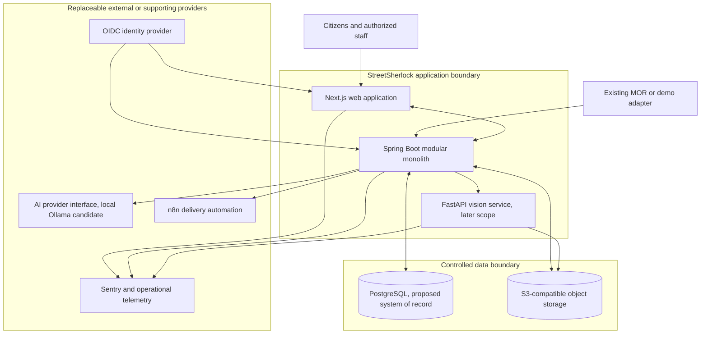
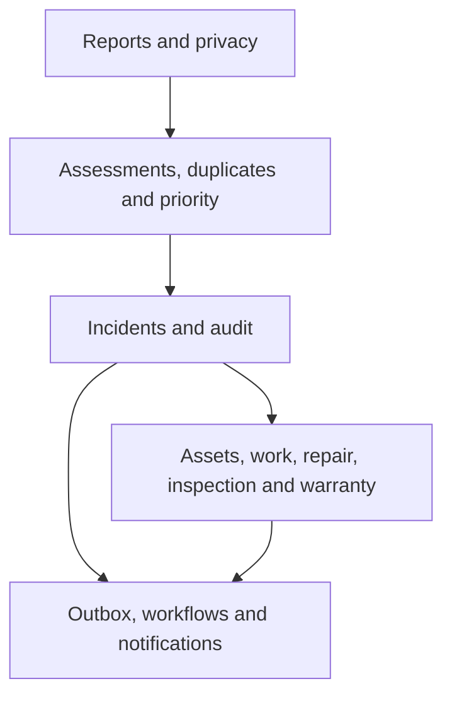

# StreetSherlock Container Architecture

## 1. Document control

| Field | Value |
|---|---|
| Requirement | S0-ARCH-01 |
| Owner | Kiarash Delavar, Engineering / Product Owner |
| Version | 1.0 |
| Status | Approved |
| Scope tier | Portfolio demo and engineering MVP |
| Controlled baseline | Master Project Specification v2.0; `context.md`; approved product/domain documents |
| Related decisions | D-09 through D-18 — Proposed; future ADR-001 through ADR-010 |
| Last updated | 2 August 2026 |
| Next review | During ADR review and before Sprint 1 clean-clone approval |

## 2. Purpose

This document assigns one responsibility to each proposed runtime container and shows where business state, restricted media, automation, AI, identity and observability may live. It is a design baseline, not evidence that the proposed technologies are accepted or deployed.

## 3. Proposed container diagram

## 4. Container responsibilities

| Container | Responsibility | May own | Must not own |
|---|---|---|---|
| Next.js web application | Accessible public/demo and role-based work surfaces | Ephemeral UI state and safe client cache | Official decisions, secrets, authoritative Report/Incident state |
| Spring Boot modular monolith | Commands, authorization, validation, transactions, policy application, audit and integrations | All authoritative business records through PostgreSQL | Provider-specific hidden state or unreviewed AI decisions |
| PostgreSQL with proposed PostGIS/pgvector | Transactional system of record, spatial/vector indexes, outbox and audit references | Business state and versioned decision/assessment records | Original media blobs or plaintext secrets |
| S3-compatible object storage | Restricted originals and controlled derived media/PDF objects | Versioned binary objects with classification metadata | Municipal workflow state or access decisions independent of API policy |
| FastAPI vision service | Stateless versioned image-quality, redaction-helper and defect-evidence assessment | Temporary processing state and reproducible output payloads | Repair acceptance, liability, warranty or durable business state |
| Replaceable AI provider | Structured extraction and embeddings from approved minimized input | No StreetSherlock business state | Direct database access, citizen contact data, official decisions |
| n8n | Delivery orchestration and external callbacks from backend-owned intents | Provider execution metadata only | Incident, repair, notification-intent or retry truth |
| OIDC identity provider | Authentication and signed identity/role claims | Identity-provider account state | StreetSherlock domain authorization decisions |
| Sentry/telemetry | Technical errors, traces and releases after PII scrubbing | Operational telemetry within retention policy | Business audit history, reporter content or decision evidence |

## 5. Proposed backend module boundary

The Spring Boot application is proposed as a modular monolith. Modules communicate through explicit application services and domain events, never arbitrary cross-module repository access.

Proposed module groups:

- foundation: `identity`, `municipalities`, `audit`;
- StreetPulse core: `reports`, `privacy`, `incidents`, `assessments`, `duplicates`, `priority`, `media`;
- later InfraProof: `assets`, `streetworks`, `repairs`, `inspections`, `warranties`;
- boundary modules: `ai`, `integrations`, `workflows`, `notifications`, `analytics`.

This grouping is diagram shorthand. ADR-001 and module tests must define the enforceable package/event rules.

## 6. Communication paths

| From → to | Proposed contract | Control |
|---|---|---|
| Browser → web/API | HTTPS, accessible UI, versioned `/api/v1` contract | CSRF/session strategy or bearer-token rules to be fixed by ADR/security design |
| MOR adapter → API | Versioned import with idempotency and provenance | No direct database writes |
| API → PostgreSQL | Transactional persistence | Optimistic locking, migrations and append-only audit/assessment history |
| API → object storage | Short-lived server-mediated access | No unrestricted public bucket or guessable permanent URL |
| API → AI/vision | Versioned schema, correlation ID, timeout and approved minimized input | Results are advisory and stored as assessment evidence |
| API → outbox → n8n | Transactional intent followed by idempotent delivery | Callback cannot directly invent domain state |
| IdP → web/API | OIDC/JWT claims | Backend authorizes every protected command |
| Applications → telemetry | Scrubbed error/trace events | No business-audit substitution and no raw PII by default |

## 7. Source-of-truth invariants

1. PostgreSQL is the only authoritative business-state store.
2. An object key is evidence only when referenced by an authorized, classified database record.
3. Assessment output becomes evidence, never the current human decision.
4. The transactional outbox owns delivery intent; n8n owns only an execution attempt.
5. The backend verifies identity claims and owns command authorization.
6. Audit events are append-only and separate from Sentry or application logs.
7. The MVP is single-tenant by design until ADR-010 says otherwise; it must not claim production tenant isolation.

## 8. Safe degradation

| Dependency failure | Required behavior | Forbidden behavior |
|---|---|---|
| AI provider unavailable | Persist failed/timed-out `AssessmentRun`; present manual/deterministic route | Drop Report, retry forever invisibly, or create an official decision |
| Vision unavailable | Preserve evidence and allow manual inspection in later scope | Auto-accept repair or infer liability |
| Object storage unavailable | Reject/queue media safely while preserving allowed report data and a visible error | Store unclassified originals in database/logs |
| n8n/provider unavailable | Keep notification intent pending/failed with retry controls | Mark citizen notified without delivery evidence |
| context source unavailable | Use cached/fixture data only if provenance/freshness permits; otherwise omit | Fabricate current weather/asset context |
| IdP unavailable | Deny protected action safely | Grant a default privileged role |
| telemetry unavailable | Continue core workflow and local operational evidence where safe | Lose business audit history |

## 9. Environment boundary

Sprint 1 may prove a local environment only after ADR and backlog approval. Proposed environments are `local`, `CI`, `preview/demo`, `shadow pilot`, and `production`, but only local/CI/controlled demo are within the current tier. Credentials, real data, live callbacks and write-back are not authorized.

## 10. Assumptions and unresolved questions

- Proposed runtimes and extensions must be pinned and proven by a clean-clone test.
- Hosting, network segmentation, secret management and municipal identity are unresolved.
- Object-storage product/licence and retention behavior require review.
- pgvector, Ollama and the vision service must remain optional to the safe manual workflow.
- Availability, capacity and recovery targets are hypotheses until the NFR/SLO task.

## 11. Change triggers

Review this document for any new runtime, database, broker, cache, provider, tenant, trust boundary, real integration, external write, public media path, or deployment tier.

## 12. Acceptance evidence

| Criterion | Result | Evidence |
|---|---|---|
| Responsibilities and boundaries | Pass | Sections 3–6 |
| PostgreSQL sole business source of truth | Pass | Sections 4 and 7 |
| Replaceable providers and safe failure | Pass | Sections 4, 6 and 8 |
| StreetPulse versus later InfraProof | Pass | Section 5 |
| Proposed decisions not silently accepted | Pass | Sections 1–2 and 13 |
| Product Owner approval before merge | Pass | Approval record |

## 13. Approval record

| Role | Name | Decision | Date | Notes |
|---|---|---|---|---|
| Product Owner | Kiarash Delavar | Approved | 2 August 2026 | Approves the diagram baseline only |
| Architecture reviewer | Kiarash Delavar, self-review only | Pending ADR review | — | ADR-001 through ADR-010 remain required |
| Privacy/security/operations reviewers | Unassigned | External validation required | — | Required before relevant real-data, assurance or deployment claims |
