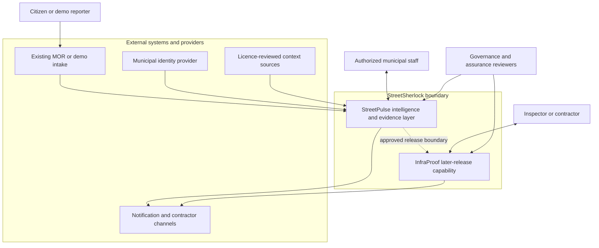

# StreetSherlock System Context

## 1. Document control

| Field | Value |
|---|---|
| Requirement | S0-ARCH-01 |
| Sprint | Sprint 0 — Day 2 architecture and trust boundaries |
| Owner | Kiarash Delavar, Product Owner / Engineering |
| Version | 0.1 |
| Status | Proposed |
| Scope tier | Portfolio demo and engineering MVP |
| Controlled baseline | Master Project Specification v2.0 and approved E00-01 through E00-03 product documents |
| Related decisions | D-09 through D-18 — all remain Proposed pending ADR review |
| Last updated | 2 August 2026 |
| Next review | Before ADR approval or any material actor, authority, data, integration, or scope-tier change |

## 2. Purpose

This document defines StreetSherlock's system boundary, actors, external systems, authority limits, and scope tiers. It prevents the architecture from drifting into a replacement for an existing municipal reporting system.

StreetSherlock is an intelligence and evidence layer above an existing MOR/intake process. It preserves each submitted `Report`, helps authorized employees investigate an `Incident`, and presents advisory evidence. Humans retain every official municipal, repair, warranty, liability, and enforcement decision.

## 3. Scope boundary

| Scope | Included now? | Boundary |
|---|---|---|
| StreetPulse workflow | Yes, proposed MVP | Report intake/import, privacy processing, duplicate candidates, human review, explainable priority recommendation, Incident update, safe citizen update |
| InfraProof workflow | Later release only | Work, repair, inspection, vision evidence, recurrence candidate, warranty review and contractor workflow |
| Existing MOR products | External | Signalen, Fixi, BuitenBeter or a municipal equivalent remain authoritative for their own intake/ticket responsibilities |
| Real municipal integration | No | Only replaceable adapters and recorded fixtures may be designed in Sprint 0 |
| Demo geography | Synthetic only | Deventer is scenario context, not a customer, partner, pilot or validator |
| Official decisions | Human only | AI and automation produce evidence or recommendations; an authorized person decides |

## 4. System-context diagram

The arrows describe proposed information exchange, not approved live integrations. The existing MOR/intake layer remains outside StreetSherlock and keeps its own authority.

## 5. Actors and authority

| Actor | Goal | Allowed authority in this design | Prohibited shortcut |
|---|---|---|---|
| Citizen or demo reporter | Submit or track an observation | Submit a Report and receive a minimized status update | Change an Incident, priority, repair, warranty or liability decision |
| Intake/review employee | Investigate observations | Review privacy output, accept/reject duplicate candidates, create/link/unlink an Incident with reason | Silently delete or merge a Report |
| Operational manager | Manage workload and policy | Approve policy versions and operational priority decisions within assigned role | Treat an AI score as the official decision |
| Inspector | Review work evidence | Record inspection evidence and an authorized inspection decision in later InfraProof scope | Let computer vision accept or reject work automatically |
| Contractor | Perform assigned work | View a minimized work package and submit evidence in later scope | Access reporter identity or unrelated municipal data |
| Privacy/security/accessibility/legal reviewer | Review controls and evidence | Record independent findings within their competence | Be represented by Product Owner self-review |
| System/integration owner | Operate adapters and access | Configure approved integration boundaries and credentials | Give an adapter ownership of business state |

## 6. External-system boundaries

| External system | Proposed purpose | Data minimization | Failure behavior |
|---|---|---|---|
| Existing MOR/demo intake | Supply a Report or external reference | Import only required fields and provenance | Queue/retry import; never invent or discard a Report |
| OIDC identity provider | Authenticate staff and provide claims | Store local subject/role mapping, never passwords | Deny protected access safely; public/demo intake remains separately controlled |
| Context sources such as KNMI/PDOK | Add weather, geometry or asset context | Use licence-reviewed fields and snapshots | Mark context unavailable/stale; continue manual review |
| Replaceable AI provider | Produce structured extraction or embeddings | Send approved minimized/redacted inputs only | Create a visible failed/timed-out assessment and use manual/deterministic flow |
| n8n and delivery providers | Deliver approved notification intents | Receive a minimal payload and idempotency/correlation data | Retain intent in the backend, retry safely, show delivery status |
| Sentry/telemetry provider | Technical error monitoring | Scrub personal data; never use as audit log | Application continues with local logs/health evidence; business history remains intact |

## 7. Authority invariants

1. A `Report` is one submitted observation; an `Incident` is the managed real-world problem.
2. A Report is preserved even when linked to an Incident.
3. Duplicate detection creates a candidate only.
4. Every link, unlink, priority, transition, inspection, repair, recurrence and warranty decision requires an authorized human command.
5. Every official decision records actor, role, time, reason, evidence and prior state in the authoritative backend.
6. No external provider, workflow engine or AI model is a business-state authority.
7. External write-back, real notification and contractor action remain disabled until separately approved.

## 8. Safe-failure expectations

- AI unavailable: preserve the Report and route it to human review with a visible reason.
- Vision unavailable: preserve submitted evidence and allow manual inspection; never accept repair automatically.
- n8n/delivery unavailable: retain the backend-owned notification intent and retry idempotently.
- source unavailable or stale: show freshness/provenance status and omit the unsupported context.
- identity unavailable: fail closed for protected actions; do not downgrade to an unverified privileged role.
- telemetry unavailable: do not lose business audit evidence or block an authorized recovery path.

## 9. Assumptions and unresolved questions

Assumptions:

- an existing intake/MOR layer remains authoritative in a future municipal integration;
- an authorized human reviewer exists for every operational decision;
- synthetic Deventer scenarios are sufficient for the portfolio MVP;
- external systems can be isolated behind replaceable, versioned adapters.

Unresolved external questions:

- actual municipal source system, identity provider, network boundary and hosting policy;
- lawful basis, retention, archiving and data-subject procedures;
- municipality-specific priority authority and service levels;
- approved notification channels and citizen-contact ownership;
- real contractor and inspector role boundaries.

These questions remain open and cannot be answered by the portfolio project alone.

## 10. Change triggers

Review this context when work adds a real municipality, participant, source, data recipient, notification, write-back, contractor, warranty/liability path, production claim, scope tier, or decision authority.

## 11. Acceptance evidence

| Criterion | Result | Evidence |
|---|---|---|
| Actors and external systems identified | Pass | Sections 4–6 |
| Intelligence-layer positioning | Pass | Sections 2–4 |
| Human authority and Report preservation | Pass | Sections 5 and 7 |
| StreetPulse versus InfraProof boundary | Pass | Sections 3–4 |
| Synthetic Deventer and non-claims | Pass | Section 3 |
| Safe external failure | Pass | Sections 6 and 8 |
| ADR decisions remain Proposed | Pass | Document control and Section 12 |
| Product Owner approval before merge | Pending | Approval record |

## 12. Approval record

| Role | Name | Decision | Date | Notes |
|---|---|---|---|---|
| Product Owner | Kiarash Delavar | Pending | — | Approval freezes this proposed context for ADR review; it does not authorize a pilot or production use |
| Architecture reviewer | Kiarash Delavar, self-review only | Pending ADR review | — | D-09 through D-18 remain Proposed |
| Municipal/privacy/security/accessibility/legal reviewers | Unassigned | External validation required | — | Required only at the relevant future assurance or pilot gate |
