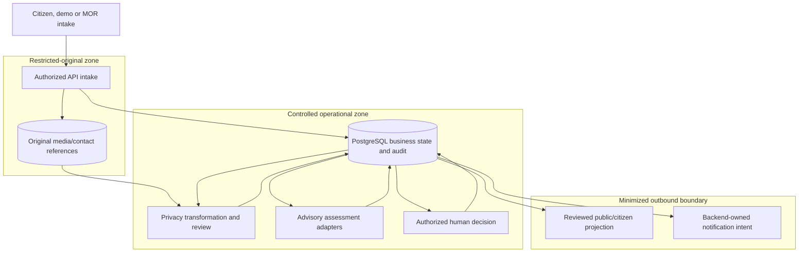
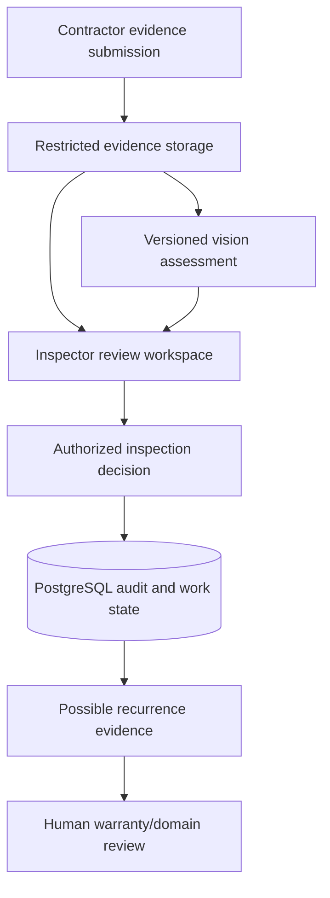

# StreetSherlock Data Flow and Trust Boundaries

## 1. Document control

| Field | Value |
|---|---|
| Requirement | S0-ARCH-01 |
| Owner | Kiarash Delavar, Engineering / Product Owner |
| Version | 1.0 |
| Status | Approved |
| Scope tier | Synthetic portfolio/demo data only |
| Controlled baseline | Master Project Specification v2.0; approved product/domain baseline; context and container proposals |
| Related decisions | D-04 and D-06 accepted product boundaries; D-12 through D-18 remain Proposed where applicable |
| Last updated | 2 August 2026 |
| Next review | During privacy classification, threat-model, ADR and real-source review |

## 2. Purpose and non-authorization

This document traces data from intake to review, publication/delivery and later InfraProof evidence. It identifies classification changes, trust boundaries, minimization, human-decision points and failure containment.

It does not establish a lawful basis, retention period, DPIA/FRAIA result, BIO2 compliance, live integration, public-data licence, municipal approval or production authorization. No real citizen data is approved for the current tier.

## 3. Data classifications

| Class | Examples | Default access/publication rule |
|---|---|---|
| Restricted original | Reporter contact, original photo/video, raw free text that may contain faces, plates, addresses or sensitive details | Named need-to-know roles only; never public; never sent to providers by default |
| Controlled operational | Full Report, Incident notes, assignments, work status, internal category/location detail | Role- and municipality-scoped; not public by default |
| Derived review evidence | Redacted text/media, embeddings, extracted fields, duplicate factors, priority recommendation, vision overlay | Authorized review roles; publication requires separate human approval and provenance |
| Public projection | Approved minimized status/category/generalized location and citizen-facing update | Generated only from reviewed fields; never a direct view of an operational record |
| Audit/security evidence | Human decisions, link/unlink history, access/security events, correlation and policy/model versions | Append-only/restricted; separate from public content and Sentry telemetry |
| Operational telemetry | Health, latency, sanitized errors and traces | PII-scrubbed; short controlled retention; never business audit truth |
| Secrets/configuration | Credentials, signing keys and provider tokens | Approved secret/configuration mechanism; never business tables, logs, fixtures or source control |

## 4. StreetPulse MVP data flow

Only approved minimized/redacted input may cross from the controlled zone to a replaceable AI provider. The human decision is persisted in PostgreSQL before a public projection or notification intent is created.

## 5. Detailed flow register

| ID | From → to | Data/classification | Purpose | Required controls | Failure behavior |
|---|---|---|---|---|---|
| DF-01 | Citizen/demo/MOR → API | Raw Report, optional contact/media; restricted/controlled | Create one preserved observation | validation, rate/abuse controls, provenance, idempotency, correlation | reject visibly or queue a traceable import; never create partial hidden success |
| DF-02 | API → PostgreSQL | Report metadata/content versions; controlled | Authoritative receipt and workflow state | transaction, version, UTC time, source identity, audit | rollback transaction and return safe problem detail |
| DF-03 | API → object storage | Original binary; restricted | Preserve evidence outside database blobs | classification metadata, encryption, short server-mediated access, scan/validation | keep Report where allowed and show media failure; never log/store unclassified binary elsewhere |
| DF-04 | Original → privacy transformation | Raw text/media; restricted | Produce a minimized/redacted derivative | versioned transform, provenance, reviewer state, refusal path | route to human privacy review; do not publish/send to AI |
| DF-05 | API → AI provider | Approved minimized input; derived/controlled | Structured extraction or embedding | explicit allowlist, timeout, provider/model version, no contact data | failed/timed-out assessment plus manual/deterministic fallback |
| DF-06 | Assessment → PostgreSQL | Raw/parsed output, factors and status; derived | Preserve advisory evidence | schema validation, append-only run, input/model/prompt/policy provenance | reject invalid output; never update official decision |
| DF-07 | Reviewer → API/DB | Link/priority/transition decision; audit | Make official human-owned change | RBAC, municipality scope, reason, evidence, optimistic lock | deny/conflict visibly; preserve prior state |
| DF-08 | DB → public projection | Reviewed minimized fields; public | Nearby/status/citizen view | allowlist projection, generalized location where required, publication approval | withhold stale/unsafe content |
| DF-09 | DB outbox → n8n/provider | Minimal notification intent; controlled | Deliver approved update | transactional outbox, idempotency, signed callback, correlation | retain pending/failed intent and retry; never mark delivered without evidence |
| DF-10 | Apps → Sentry/telemetry | Sanitized technical metadata | Diagnose deployed failures | PII scrubbing, sampling, retention, environment separation | core business/audit record remains available independently |

## 6. Trust boundaries

| Boundary | Crossing | Primary threats/questions | Required design evidence |
|---|---|---|---|
| TB-01 Public internet → intake | Untrusted citizen/demo input | abuse, injection, malware, oversized media, spoofed provenance | threat model, validation, rate/abuse controls, media scanning strategy |
| TB-02 External MOR/source → adapter/API | Third-party records/context | stale data, replay, licence breach, mapping drift | source register, fixtures, idempotency, provenance, schema/version checks |
| TB-03 Browser → protected API | Identity and commands | broken access control, role/scope confusion, CSRF/token leakage | OIDC/RBAC design and authorization tests |
| TB-04 API → object storage | Restricted binary evidence | public URL, confused deputy, retention mismatch | object ACL policy, signed access, classification and deletion design |
| TB-05 Controlled system → AI/vision | Derived/minimized inputs | PII leakage, prompt/model drift, unsupported output | data allowlist, contract, evaluation, versioning, timeout/refusal path |
| TB-06 Backend outbox → n8n/provider | Delivery payload/callback | duplicate delivery, forged callback, hidden state | idempotency, signatures, retry/reconciliation and backend-owned truth |
| TB-07 Applications → telemetry | Error/trace metadata | accidental personal data or secret leakage | scrub tests, denylist/allowlist, retention and access review |

## 7. Later InfraProof evidence flow

This flow is later release scope. Vision output and recurrence evidence cannot assign fault, establish liability, accept a repair or open/resolve a legal warranty claim automatically.

## 8. Data minimization and publication rules

1. Store reporter contact separately from Report/public content.
2. Keep original and derived media as distinct classified objects with provenance.
3. Build public responses from an explicit allowlist/projection, never direct entity serialization.
4. Do not send raw contact data or unrestricted originals to AI, Sentry, n8n or context providers.
5. Record provider/model/prompt/policy/dataset versions for derived evidence.
6. Make source, licence, snapshot time and freshness visible for external context.
7. Treat embeddings/features as derived personal/operational data until privacy review says otherwise.
8. Keep business audit separate from operational logs and telemetry.

## 9. Failure and recovery invariants

- A Report is acknowledged only after authoritative persistence succeeds.
- A failed privacy or assessment step creates visible review work; it does not erase or auto-publish input.
- Provider retries are bounded, idempotent and correlated.
- A callback cannot bypass a domain command or authorization check.
- Delivery status is based on evidence, not on starting a workflow.
- Stale/unlicensed context is removed or disabled without blocking the manual core workflow.
- Deletion/correction must propagate to approved derivatives/providers according to a future reviewed procedure; this remains unresolved.

## 10. Assumptions and unresolved questions

- lawful basis, retention, archive, deletion, subject-right and legal-hold rules are unresolved;
- exact data residency, hosting, backup and key-management boundaries are unresolved;
- external-provider terms and whether any input leaves municipal control require review;
- public location precision and media-publication rules require privacy/domain validation;
- real MOR schemas, synchronization ownership and write-back remain unknown;
- no public dataset snapshot may be committed until E00-07 records licence and provenance.

## 11. Change triggers

Review this document for any new data class, recipient, provider, source, public field, model input, telemetry field, retention rule, deletion path, environment, integration, notification, contractor action or write-back.

## 12. Acceptance evidence

| Criterion | Result | Evidence |
|---|---|---|
| Data classes and trust boundaries | Pass | Sections 3–6 |
| Restricted/public separation | Pass | Sections 3–5 and 8 |
| Human decision before outbound state | Pass | Sections 4–5 |
| Safe dependency failure | Pass | Sections 5, 6 and 9 |
| InfraProof later and no liability automation | Pass | Section 7 |
| Unknown legal/privacy answers remain open | Pass | Sections 2 and 10 |
| Product Owner approval before merge | Pass | Approval record |

## 13. Approval record

| Role | Name | Decision | Date | Notes |
|---|---|---|---|---|
| Product Owner | Kiarash Delavar | Approved | 2 August 2026 | Approves the proposed flow baseline only |
| Architecture reviewer | Kiarash Delavar, self-review only | Pending ADR review | — | Provider/storage/API decisions remain Proposed |
| Privacy/security/legal/data reviewers | Unassigned | External validation required | — | Required before real data, formal assurance, source or retention claims |
