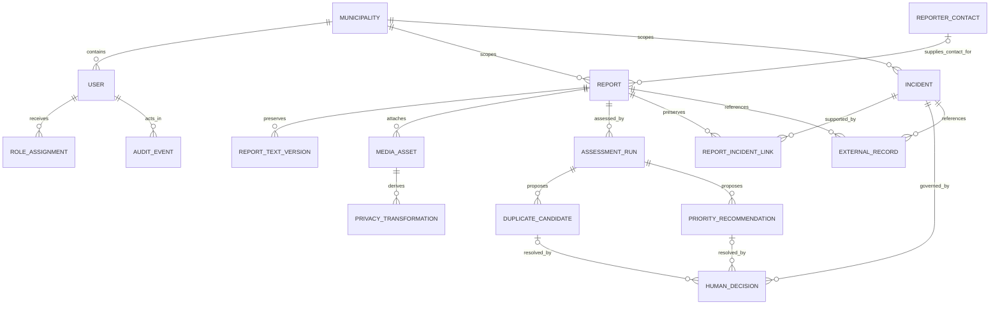
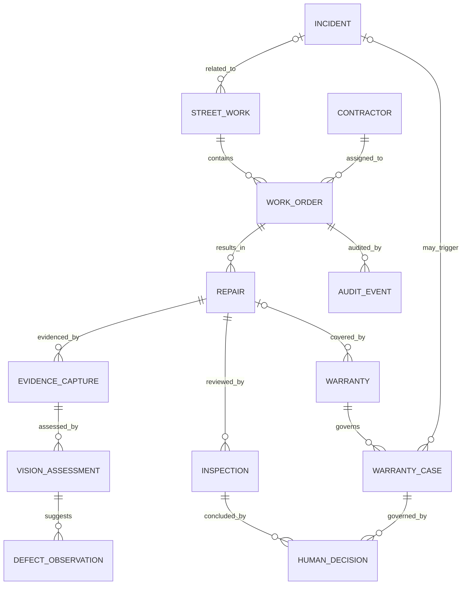

# StreetSherlock Domain ERD

## 1. Document control

| Field | Value |
|---|---|
| Requirement | S0-ARCH-01 |
| Owner | Kiarash Delavar, Engineering / Product Owner |
| Version | 0.1 |
| Status | Proposed |
| Controlled baseline | Approved Glossary v1.0, Hero Scenario v1.0 and MVP Scope v1.0 |
| Related decisions | D-03, D-04 and D-07 accepted product/domain boundaries; D-12, D-15, D-16 and D-18 remain Proposed |
| Last updated | 2 August 2026 |
| Next review | During ADR/data-model review and before the first Flyway migration |

## 2. Purpose and notation

This conceptual ERD freezes aggregate meaning and high-risk relationships before a physical schema is designed. It is not a migration, table definition or authorization model.

Cardinality is conceptual. Optionality, indexes, constraints, deletion behavior, SRIDs and identifiers must be fixed in a reviewed physical model and migrations.

## 3. StreetPulse core conceptual ERD

## 4. Core entity responsibilities

| Entity | Meaning and ownership rule |
|---|---|
| `Report` | One immutable-identity observation from a citizen/demo/imported source; it is never silently merged or deleted because a duplicate candidate exists |
| `ReporterContact` | Restricted contact data separated from public/operational report content |
| `ReportTextVersion` | Preserves source and derived/redacted text versions with provenance |
| `MediaAsset` | Metadata and classified object reference; the binary lives in object storage |
| `PrivacyTransformation` | Versioned derivation from restricted input to reviewed/redacted output |
| `AssessmentRun` | One versioned, reproducible advisory run with provider/model/policy/input/output/provenance/status |
| `DuplicateCandidate` | A scored, explainable possible relationship; it never changes Report or Incident state itself |
| `PriorityRecommendation` | Factor-level advisory result tied to a policy version; not the operational priority decision |
| `Incident` | The real municipal problem being investigated or managed |
| `ReportIncidentLink` | Reversible relationship with actor, reason, evidence, score/assessment reference, time and unlink history |
| `HumanDecision` | Authorized acceptance, rejection, override or transition with reason and evidence |
| `ExternalRecord` | Source-system identity, version, provenance and synchronization observation; not hidden domain truth |
| `AuditEvent` | Append-only record of security- and business-relevant action; not a telemetry event |

## 5. Later InfraProof conceptual ERD

InfraProof is outside `v0.1.0-streetpulse-mvp`. A `VisionAssessment` or recurrence signal may create evidence for review only. It cannot accept/reject repair, open a legal claim, assign fault, establish liability or punish a contractor.

## 6. Aggregate and transaction boundaries

Proposed aggregate roots:

- `Report`: submitted content versions, classified references and assessment initiation;
- `Incident`: lifecycle, links, priority decisions and incident relations;
- `AssessmentRun`: immutable run, evidence and candidate outputs;
- `WorkOrder` / `Repair`: later operational execution and evidence;
- `Inspection`: later authorized inspection conclusion;
- `WarrantyCase`: later recurrence/warranty review without liability automation.

Cross-aggregate updates use explicit application commands and domain events. Arbitrary repository access across modules is prohibited. Exact transaction boundaries remain an ADR/implementation decision.

## 7. High-risk invariants

1. `Report.id` and source provenance survive every duplicate/linking decision.
2. A Report-to-Incident relationship exists only through `ReportIncidentLink` history.
3. Unlinking closes/reverses a link record; it does not erase its history.
4. Model output is stored on an `AssessmentRun` and never overwrites a `HumanDecision`.
5. Mutable aggregate roots use optimistic concurrency/version checks.
6. Assessment and audit records are append-only; corrections create new runs/decisions/events.
7. Contact data and original media are separately classified and authorized.
8. Geometry uses an explicit SRID and reviewed spatial constraints.
9. All timestamps are stored in UTC; the UI may render Europe/Amsterdam.
10. Every record is scoped to the single configured municipality in the MVP; this is not proof of production tenant isolation.

## 8. Data ownership and deletion questions

| Concern | Current boundary | Unresolved decision |
|---|---|---|
| Reporter contact | Restricted and separated | Lawful basis, retention, access/correction/deletion workflow |
| Original media/text | Restricted source evidence | Retention, archive, legal hold and transformation review |
| Derived/redacted media | Controlled evidence; not public by default | Reviewer and publication criteria |
| Assessments/embeddings | Versioned derived evidence | Retention, model-change invalidation and deletion propagation |
| Audit events | Append-only evidence | Formal retention, immutability control and subject-right handling |
| External records | Provenance and observed sync state | Source-specific reconciliation and deletion contract |

No physical cascade-delete behavior may be implemented until these questions are reviewed.

## 9. Assumptions and unresolved questions

- UUID/UUIDv7 choice and database support remain to be fixed.
- The exact role model, row-level scope and municipality identifier require identity/tenancy review.
- Category-specific geometry, asset identity and priority-policy schemas require E00-05 traceability.
- The relationship between one repair, multiple inspections and warranty periods requires municipal/domain review.
- Physical pgvector/PostGIS representation remains Proposed pending ADR-004 and a clean Compose proof.

## 10. Change triggers

Review the ERD when semantics, aggregate ownership, cardinality, deletion/retention, tenancy, identity, evidence classification, state machine, source mapping, liability, or warranty scope changes.

## 11. Acceptance evidence

| Criterion | Result | Evidence |
|---|---|---|
| Report and Incident remain separate | Pass | Sections 3–4 and invariant 1–3 |
| Human/advisory evidence separation | Pass | Sections 3–7 |
| InfraProof isolated from MVP | Pass | Section 5 |
| Restricted data and deletion questions visible | Pass | Sections 7–8 |
| Physical schema not prematurely approved | Pass | Sections 2, 6 and 9 |
| Product Owner approval before merge | Pending | Approval record |

## 12. Approval record

| Role | Name | Decision | Date | Notes |
|---|---|---|---|---|
| Product Owner | Kiarash Delavar | Pending | — | Approves conceptual semantics for continued Sprint 0 work only |
| Architecture/data reviewer | Kiarash Delavar, self-review only | Pending ADR and migration review | — | Physical schema and D-12/D-18 remain Proposed |
| Municipal/privacy/security/legal reviewers | Unassigned | External validation required | — | Required before municipal-correctness, real-data or retention claims |
