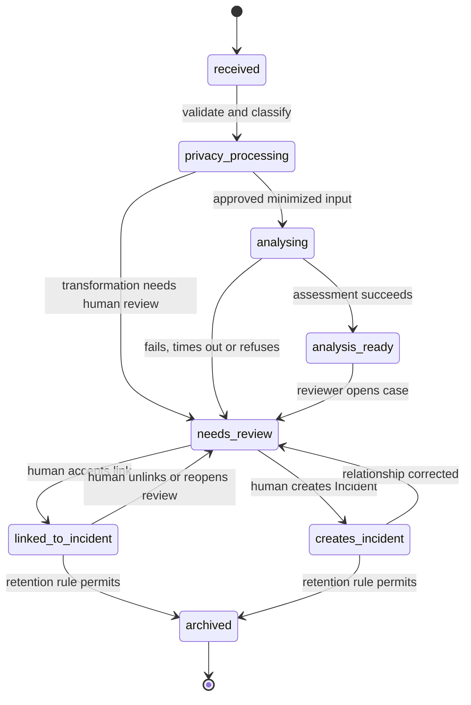
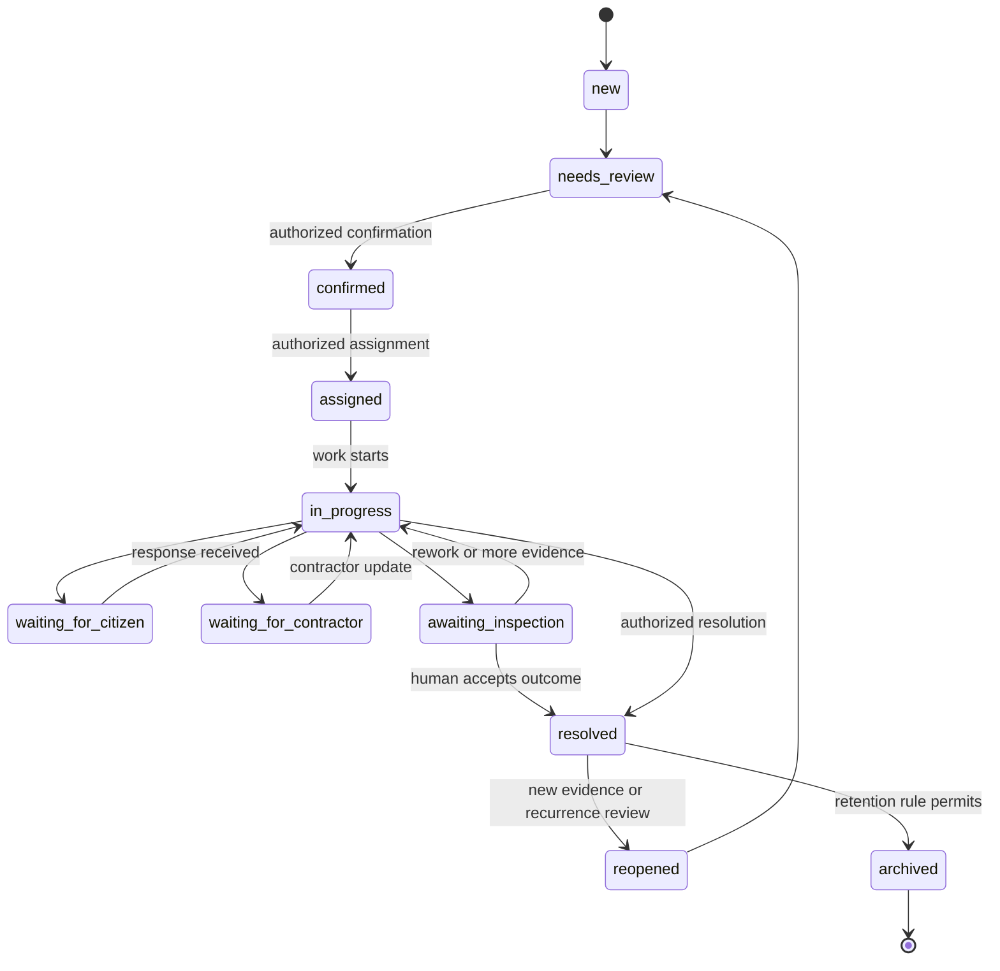
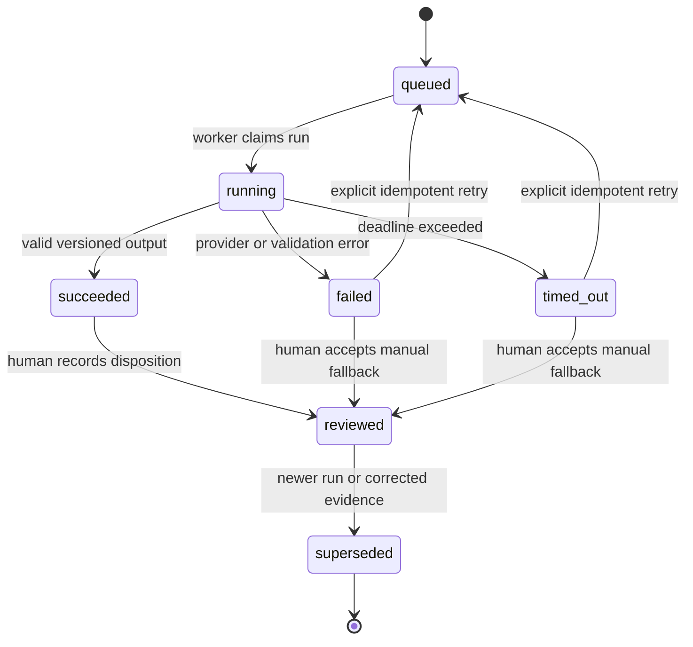
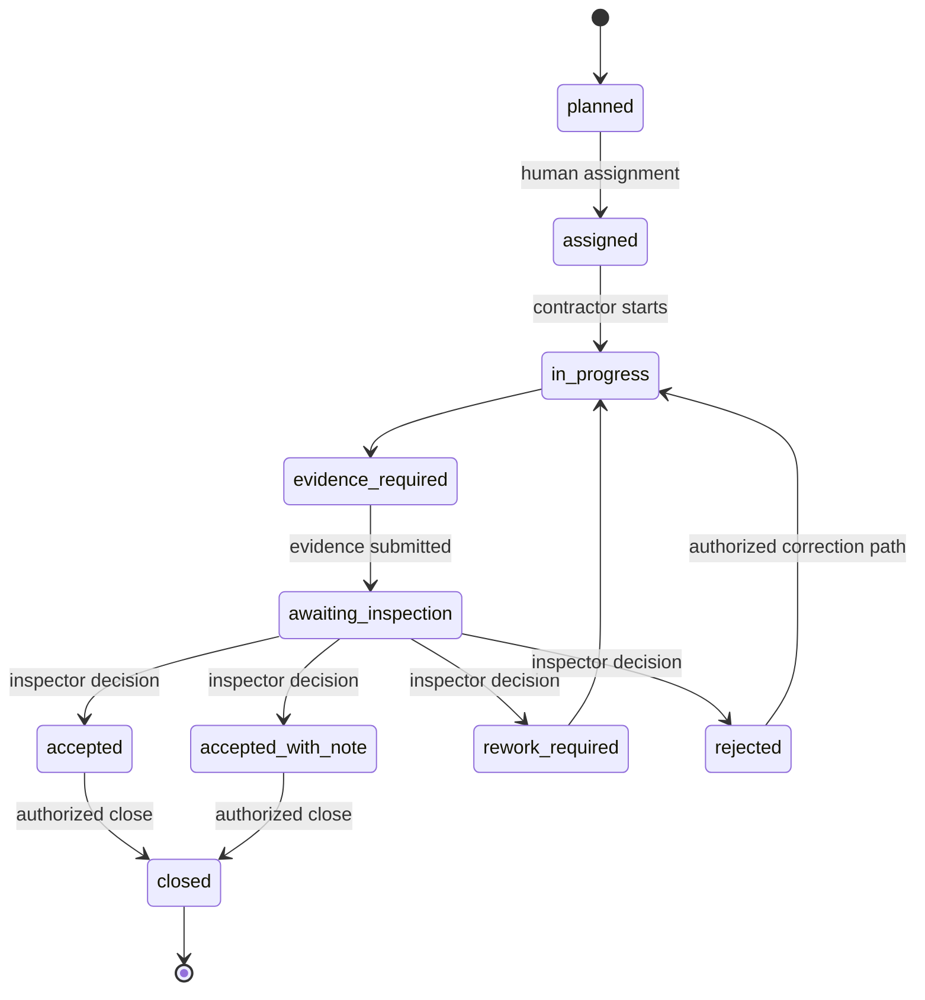
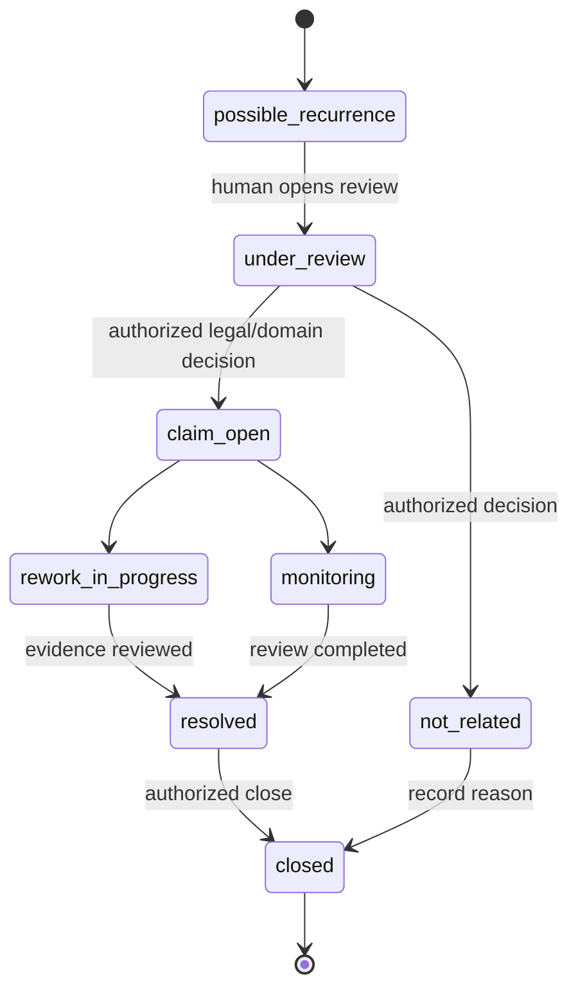

# StreetSherlock State Machines

## 1. Document control

| Field | Value |
|---|---|
| Requirement | S0-ARCH-01 |
| Owner | Kiarash Delavar, Engineering / Product Owner |
| Version | 0.1 |
| Status | Proposed |
| Controlled baseline | Master Project Specification v2.0; approved Hero Scenario, MVP Scope and Glossary |
| Related decisions | D-04 accepted human authority; D-16 remains Proposed implementation pending ADR-008 |
| Last updated | 2 August 2026 |
| Next review | During ADR-008, authorization design and E00-05 acceptance-test review |

## 2. State-machine rules

Every transition must be:

- requested by an identified actor or controlled system process;
- authorized against role and municipality scope;
- validated against current state and optimistic-lock version;
- recorded with time, reason, correlation ID and relevant evidence;
- auditable and idempotent where a command may be retried;
- recoverable without fabricating a successful external action.

AI, computer vision, n8n and delivery providers never execute an official municipal transition on their own.

## 3. Report processing — StreetPulse MVP

`needs_review` must carry a reason such as privacy uncertainty, AI unavailable, insufficient evidence, conflict or requested manual correction. A duplicate candidate never deletes or replaces the Report.

## 4. Incident lifecycle — StreetPulse MVP

The MVP may implement only the states required by its approved vertical slice. Unsupported later-scope states must not be presented as working functionality.

## 5. Advisory assessment lifecycle

Retry creates a traceable attempt/run relationship. It must not overwrite raw output or the human disposition of an earlier run.

## 6. Work/repair lifecycle — later InfraProof only

Computer vision may attach evidence to `awaiting_inspection`; it cannot cause `accepted`, `rework_required` or `rejected`.

## 7. Warranty-case lifecycle — later InfraProof only

`possible_recurrence` is evidence language only. It never means contractor fault, warranty liability or an accepted claim.

## 8. Transition authority matrix

| Transition class | Minimum authority | Required evidence |
|---|---|---|
| Privacy processing result | Authorized reviewer or approved deterministic policy | input version, transformation version, exceptions and reviewer/worker identity |
| Report link/unlink/create Incident | Authorized intake/review employee | candidate factors or manual reason, Report preservation, before/after link state |
| Priority decision | Authorized municipal role | policy version, recommendation factors, override reason if different |
| Incident assignment/status/resolution | Authorized operational role | current version, reason, service/work evidence |
| Inspection result | Authorized inspector | evidence package, limitations, decision reason |
| Warranty/recurrence decision | Authorized domain/legal role | repair/warranty records, inspection evidence, reasoning; never model output alone |
| Archive/deletion action | Authorized role under approved retention policy | lawful/retention basis, affected records and audit reference |

## 9. Failure, retry and concurrency behavior

- A dependency error changes an assessment/delivery attempt, not the official business decision.
- A failed optimistic-lock check returns a conflict and requires refresh/review; it never overwrites another decision.
- Duplicate commands use idempotency keys and return the existing result when safe.
- Partial external delivery remains pending/failed until evidence confirms delivery.
- Invalid transitions return a versioned problem detail and create security/audit evidence when relevant.
- Recovery preserves the original input, attempts, actor and sequence.
- Manual fallback is a first-class path and is not represented as a successful AI/automation run.

## 10. Minimum transition-test evidence

For each implemented transition, tests must cover:

- happy path and authorized actor;
- wrong role/municipality scope;
- invalid source state;
- stale version/concurrent update;
- duplicate command/idempotent retry;
- missing or invalid evidence;
- dependency failure and manual fallback;
- audit event and previous-state preservation.

## 11. Assumptions and unresolved questions

- Municipality-specific state names, role ownership and service levels require domain review.
- Retention/archive transitions require privacy/legal/records-management decisions.
- The exact boundary between Incident resolution and later work/repair acceptance requires municipal validation.
- Reopen and recurrence policies need category-specific acceptance criteria.
- Event/API versioning and command idempotency remain Proposed pending ADR-009.

## 12. Change triggers

Review state machines when a state, transition, actor, authority, evidence requirement, retry rule, retention rule, external callback or liability meaning changes.

## 13. Acceptance evidence

| Criterion | Result | Evidence |
|---|---|---|
| Required lifecycle states | Pass | Sections 3–7 |
| Human authority explicit | Pass | Sections 2, 6–8 |
| Failure/retry paths visible | Pass | Sections 3, 5 and 9 |
| Authorization/audit/concurrency tests defined | Pass | Sections 2, 8–10 |
| MVP/later scope separated | Pass | Sections 3–7 |
| Product Owner approval before merge | Pending | Approval record |

## 14. Approval record

| Role | Name | Decision | Date | Notes |
|---|---|---|---|---|
| Product Owner | Kiarash Delavar | Pending | — | Approval freezes proposed lifecycle language for requirement/ADR review |
| Architecture reviewer | Kiarash Delavar, self-review only | Pending ADR-008/009 review | — | No implementation authority is implied |
| Municipal/privacy/legal reviewers | Unassigned | External validation required | — | Required before operational role, policy, retention or warranty claims |
