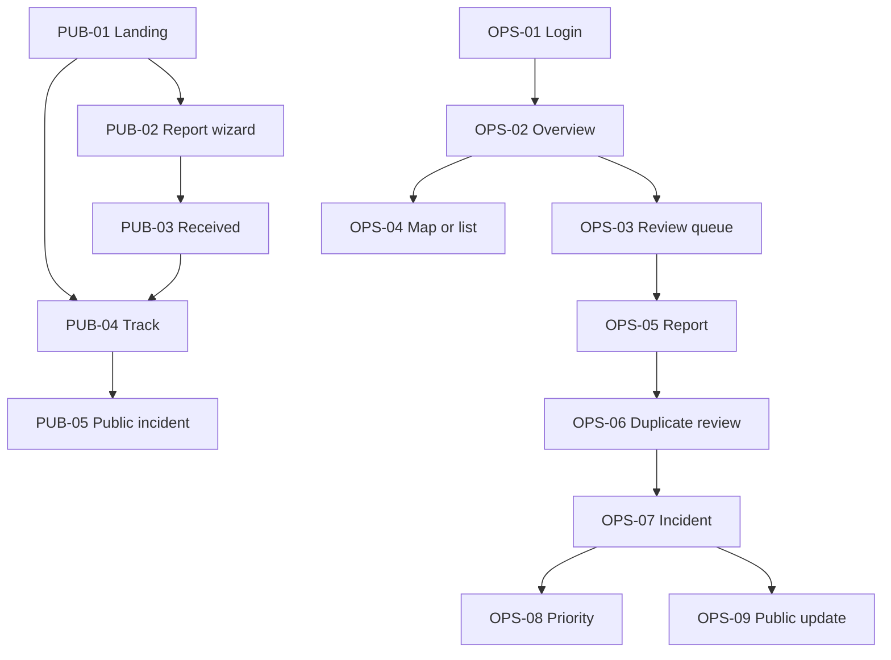

# StreetSherlock Low-Fidelity Wireframes

| Field | Value |
|---|---|
| Document ID | SS-PROD-007 |
| Work item | E00-08 |
| Version | 1.0 |
| Status | Approved |
| Owner | Kiarash Delavar |
| Product Owner | Kiarash Delavar |
| Approval | Approved by Product Owner on 2 August 2026 |
| Review date | 2 August 2026 |
| Next review | Before Sprint 1 app-shell work and before each affected implementation issue |
| Required reviewers | Product Owner self-review; independent service-design, municipal-domain, privacy, security, and accessibility review remain pending |
| Controlled baseline | `docs/MASTER_PROJECT_SPEC.md` |
| Companion documents | `service-blueprint.md`, `../accessibility/interaction-state-matrix.md` |
| Fidelity | Structural low fidelity; no visual-brand or component-library approval |

## 1. How to read this document

These wireframes freeze information hierarchy, navigation, actions, role visibility, advisory labels, failure exits, and responsive intent. They deliberately do not freeze colours, typography, illustration, final Dutch copy, spacing tokens, animation, or a frontend library.

Each page has a stable ID. Implementation stories and tests should reference these IDs rather than inventing new journeys.

## 2. Design rules

1. Show **Synthetic demo data — no municipality is a customer** on all demo surfaces where confusion is possible.
2. Public pages expose only explicitly public-safe projections.
3. Recommendation and decision are separate regions with separate labels and provenance.
4. Primary actions use verbs and identify consequence: **Submit report**, **Accept link**, **Confirm P2 priority**, **Retry delivery**.
5. Destructive/reversing actions require confirmation and show what remains preserved.
6. A map never replaces the equivalent list/table.
7. A loading state never looks like empty data; an empty state never looks like an error.
8. Missing, stale, uncertain, unavailable, refused and human-corrected outputs are visibly different.
9. Status is communicated by text/icon/pattern as well as colour.
10. Focus order follows reading order; dialogs return focus to their invoker.
11. The user can continue manually when AI, weather or vision assistance is unavailable.
12. Later InfraProof pages use **Roadmap — not in StreetPulse MVP** and cannot be mistaken for implemented release scope.

## 3. Page register

### 3.1 Public/demo — StreetPulse MVP

| ID | Route intent | Page | Primary outcome |
|---|---|---|---|
| PUB-01 | `/` | Honest landing | Understand product boundary; start report or tracking |
| PUB-02A | `/report/describe` | Describe | Enter Dutch/English report text |
| PUB-02B | `/report/location` | Locate | Choose map point or manual address |
| PUB-02C | `/report/evidence` | Evidence | Add optional validated media/contact |
| PUB-02D | `/report/nearby` | Nearby incidents | Follow/join or continue separate report |
| PUB-02E | `/report/review` | Privacy/review | Check all inputs and submit |
| PUB-03 | `/report/received` | Confirmation | Store tracking reference and know next step |
| PUB-04 | `/track/{token}` | Anonymous tracking | View public-safe timeline |
| PUB-05 | `/public/incidents/{id}` | Public incident | View allowlisted incident status |

### 3.2 Municipal operations — MVP unless noted

| ID | Route intent | Page | Release |
|---|---|---|---|
| OPS-01 | `/login` | Login; development-only role selector | MVP |
| OPS-02 | `/operations` | Operations overview | MVP |
| OPS-03 | `/operations/review` | Needs-review queue | MVP |
| OPS-04 | `/operations/map` and `/operations/list` | Map/list workspace | MVP |
| OPS-05 | `/reports/{id}` | Report and privacy detail | MVP |
| OPS-06 | `/reports/{id}/duplicates` | Duplicate candidate review | MVP |
| OPS-07 | `/incidents/{id}` | Incident detail/timeline | MVP |
| OPS-08 | `/incidents/{id}/priority` | Priority explanation and decision | MVP |
| OPS-09 | `/incidents/{id}/public-update` | State/public update approval | MVP |
| OPS-L01 | `/work/{id}` | Work-order/repair detail | Later |
| OPS-L02 | `/warranty/recurrence` | Warranty recurrence queue | Later |

### 3.3 Field/inspector — later InfraProof

| ID | Page | Boundary |
|---|---|---|
| FLD-01 | Mobile assigned-work list | Assigned records only |
| FLD-02 | Guided evidence capture | No claim of production-safe offline storage |
| FLD-03 | Before/after/current comparison | Vision may refuse; human interprets |
| FLD-04 | Inspection checklist and decision | Inspector owns decision |
| FLD-05 | Draft report review/approval | Generated text stays draft |

### 3.4 Contractor — later/pilot

| ID | Page | Boundary |
|---|---|---|
| CON-01 | Assigned work and rework list | Only authorized assignments |
| CON-02 | Evidence upload and response | No reporter contact/internal notes |
| CON-03 | Approved notice/evidence package | No automatic liability or acceptance |

### 3.5 Governance and management

| ID | Page | Boundary |
|---|---|---|
| GOV-01 | Operations KPI dashboard | Aggregated/minimized measures |
| GOV-02 | AI/model/prompt/evaluation dashboard | Version, evidence and promotion state |
| GOV-03 | Workflow execution and retry dashboard | Delivery authority only; no incident mutation |
| GOV-04 | Audit log with filters | Role-filtered, content-minimized |
| GOV-05 | Municipality configuration/version screen | Versioned configuration; separately authorized changes |

## 4. Navigation model

Later InfraProof and governance navigation is separated from the MVP critical path. Role authorization—not hidden links alone—protects every route.

## 5. Global shells

### 5.1 Public mobile shell — 360 px minimum

| Order | Region | Content and behavior |
|---:|---|---|
| 1 | Skip link | Moves focus to main content |
| 2 | Compact header | Wordmark, language, help; no hamburger for the five-step report journey |
| 3 | Demo/status banner | Synthetic data and non-emergency statement |
| 4 | Step/title region | Page title, short instruction, progress as text such as “Step 2 of 5” |
| 5 | Message region | Validation/status summary; programmatically announced |
| 6 | Main task | One-column form/content; map followed by equivalent text/list control |
| 7 | Action group | Back, Save/continue where permitted, primary next action |
| 8 | Footer | Privacy, accessibility, limitations, tracking link |

Primary action remains visible after content but does not cover controls. Touch targets aim for at least 44 by 44 CSS pixels pending formal standard mapping.

### 5.2 Operations desktop shell

| Region | Content and behavior |
|---|---|
| Skip link | Main content and optionally results table |
| Header | Product, synthetic environment, municipality fixture, user/role, language |
| Left navigation | Overview, review, map/list, incidents; later work/warranty and governance by role |
| Page header | Breadcrumb, title, status, last updated, correlation/help |
| Filter/action bar | Search, saved filters, map/list switch, refresh; filters persist in URL |
| Main workspace | List/detail or map/list; reading and tab order remain predictable |
| Context panel | Explanation/provenance; can collapse without losing content |
| Status region | Loading, success, partial, stale, error and conflict announcements |

At narrow widths, navigation becomes a labelled drawer, the detail panel becomes a separate route or stacked section, and tables support reflow/card alternatives without horizontal content loss.

### 5.3 Field shell — later

| Region | Content and behavior |
|---|---|
| Header | Assignment ID, network state, roadmap label |
| Task summary | Location, permitted context, safety guidance |
| Capture viewport | Camera/preview with non-visual instructions |
| Quality feedback | Specific retake instruction; never confidence alone |
| Actions | Retake, save bounded draft if policy permits, submit |
| Recovery | Offline/permission/storage guidance and safe exit |

## 6. Public critical-path wireframes

### PUB-01 — Honest landing

| Region | Low-fidelity content |
|---|---|
| Hero | “Connect street reports to one explainable incident.” Short intelligence-layer description |
| Trust strip | Synthetic demo; advisory AI; humans decide; not emergency service |
| Primary actions | **Report a public-space problem**; **Track my report** |
| How it works | Report → protected processing → human review → public update |
| Scope | Six frozen categories; StreetPulse now; InfraProof roadmap |
| Evidence/limits | What is measured, what is not yet validated, data-source attribution |
| Footer | Privacy, accessibility, security disclosure, sources, repository |

Empty or unavailable marketing media must not block the two core actions.

### PUB-02A — Describe

| Region | Low-fidelity content |
|---|---|
| Title | “What is happening?” and Step 1 of 5 |
| Guidance | Examples in plain Dutch/English; emergency warning |
| Control | Multiline description with label, help, character guidance |
| Language | Detected/suggested language is editable; no forced translation |
| Message | Inline error plus summary link on invalid submit |
| Actions | Cancel safely; **Continue to location** |

No AI category is shown before submission as if it were a citizen obligation.

### PUB-02B — Locate

| Region | Low-fidelity content |
|---|---|
| Title | “Where is the problem?” and Step 2 of 5 |
| Choice | Use current location, search address, or place map point |
| Permission | GPS is optional; denial is expected, not an error |
| Map | Pin and keyboard-compatible location controls where feasible |
| Equivalent alternative | Address/coordinates summary and searchable list/text fields |
| Precision note | Explain approximate location and safe correction |
| Actions | Back; **Continue to evidence** |

If the map or geocoder fails, manual address/description remains available and the user can continue when minimum location rules are met.

### PUB-02C — Evidence and optional contact

| Region | Low-fidelity content |
|---|---|
| Title | “Add a photo or contact detail (optional)” and Step 3 of 5 |
| File control | Camera/file choice, accepted formats, count/size guidance |
| Upload list | Filename replaced by safe display label, progress, remove, retry |
| Privacy | Explain restricted original versus public-safe derivative |
| Contact | Optional email in a separately labelled section |
| Failure | Per-file error preserves valid files and earlier steps |
| Actions | Back; **Continue to nearby incidents**; skip optional inputs |

Submission is not blocked solely because an optional file fails.

### PUB-02D — Nearby incidents

| Region | Low-fidelity content |
|---|---|
| Title | “Is this already being handled?” and Step 4 of 5 |
| Explanation | Similarity is only a suggestion; reports remain separate |
| Candidate card | Public-safe title, approximate area, category, public status, date |
| Choice | **Follow and add my report** or **Continue as a separate report** |
| No result | Clear empty state; continue action remains |
| Partial/unavailable | Nearby check unavailable; user may still continue |
| Actions | Back; selected consequence; **Review report** |

Do not expose another reporter, exact restricted coordinates, internal score, internal note, or hidden incident.

### PUB-02E — Review and privacy

| Region | Low-fidelity content |
|---|---|
| Title | “Review your report” and Step 5 of 5 |
| Sections | Description, location, evidence, optional contact, nearby choice |
| Edit links | Return to each step and preserve all valid inputs |
| Privacy status | What will be restricted, processed and possibly public-safe |
| Declaration | Required acknowledgements only when legally/product justified; no bundled consent |
| Error summary | Server validation links to affected section |
| Actions | Back; **Submit report** once; progress state prevents duplicate clicks |

### PUB-03 — Confirmation

| Region | Low-fidelity content |
|---|---|
| Success | “Report received” only after backend commit |
| Tracking | Copy/download reference and direct tracking link |
| Next step | Human review explanation; no guaranteed SLA |
| Contact | What notifications may be sent and how to correct contact if supported |
| Recovery | If the response was lost, check by idempotency/tracking flow rather than resubmit blindly |
| Actions | **Track this report**; return home |

### PUB-04 — Tracking

| Region | Low-fidelity content |
|---|---|
| Token entry | On generic route; errors do not reveal whether another record exists |
| Status summary | Public status, last public update, category/area at safe precision |
| Timeline | Public-safe events only, oldest/newest toggle |
| Joined incident | Explain that the source report still exists independently |
| Delivery | Notification status shown only when safe/useful |
| Help | Correction/contact and emergency guidance |
| States | Invalid/expired token, no public update yet, partial timeline, service timeout |

### PUB-05 — Public incident

| Region | Low-fidelity content |
|---|---|
| Heading | Public-safe incident title/category/status |
| Area | Safe map geometry plus accessible location text |
| Timeline | Approved public notes only |
| Follow/join | Creates a separate report/support signal, not a counter or silent merge |
| Limitations | Data timestamp and source/fixture label |
| Hidden by design | Reporter identity, restricted media, internal notes, candidate factors, priority deliberation |

## 7. Municipal MVP wireframes

### OPS-01 — Login/development role selector

| Region | Low-fidelity content |
|---|---|
| Login | OIDC entry or isolated development identity adapter |
| Demo identities | Only in development; clearly labelled and never production fallback |
| Role explanation | What each demo role can access |
| Error | Authentication failure, session expiry and retry without leaking configuration |
| Actions | **Sign in**; return to public demo |

### OPS-02 — Operations overview

| Region | Low-fidelity content |
|---|---|
| Summary | Counts by review reason with timestamps and limitations |
| Work tiles | Privacy review, duplicate review, priority decision, delivery failure |
| Service health | AI/weather/workflow unavailable or stale; manual paths linked |
| Recent activity | Authorized, minimized incident events |
| Actions | Open filtered queue, map/list, or service recovery |
| Empty | “No items need review” plus last refresh—not a blank dashboard |

### OPS-03 — Needs-review queue

| Region | Low-fidelity content |
|---|---|
| Filters | Review reason, category, age, status, assignment; URL persisted |
| Results | Table with accessible column headings and row action |
| Advisory state | Human review reason and limitation, not “AI decided” |
| Bulk actions | None for link/priority decisions in MVP |
| Empty/partial | Explain active filters and missing source; offer reset/retry |
| Actions | Open report; preserve queue position/filter on return |

### OPS-04 — Map/list workspace

| Region | Low-fidelity content |
|---|---|
| Shared filters | Category, status, date, assignment, review reason |
| View switch | **Map view** / **List view** with same result set |
| Map | Cluster/feature selection; no colour-only category/priority |
| List | Sortable, paginated table/card view; location text |
| Selection | Opens same detail route; returning restores filter, view and scroll |
| Partial source | Missing map layer is labelled; list remains usable |

### OPS-05 — Report/privacy detail

| Region | Low-fidelity content |
|---|---|
| Header | Report ID, independent-report status, source/time, authorization label |
| Source | Restricted original available only to authorized role with access event |
| Derived view | Redacted/normalized content, transformation status and limitations |
| Advisory assessment | Structured fields, provider/version, missing information, correction history |
| Privacy decision | Approve/correct/block publication with reason |
| Navigation | Candidate review; incident link history; audit timeline |
| Failure | Derivative unavailable → source preserved, public blocked, manual correction path |

### OPS-06 — Duplicate candidate review

| Region | Low-fidelity content |
|---|---|
| Persistent reminder | “Candidate only. Reports are never deleted or silently merged.” |
| Source panel | Report facts and safe evidence |
| Candidate list | Incident ID/status/category/location/time; accepted/rejected/open |
| Explanation | Spatial, category, time, status and optional semantic factors with source/freshness |
| Missing signals | Explicitly listed; no invented neutral score |
| Decision | **Accept link** / **Reject candidate** / **Create or keep separate** |
| Confirmation | Consequence, reason field where required, optimistic version |
| Recovery | Conflict reload; reverse/unlink history plan; no partial mutation |

### OPS-07 — Incident detail

| Region | Low-fidelity content |
|---|---|
| Header | Incident status, human-owned final priority, assignment, version |
| Recommendation distinction | Latest advisory priority beside final human decision, never merged visually |
| Tabs/sections | Overview, linked reports, context, notes, public update, street memory, timeline |
| Linked reports | Every source remains separately openable with link history |
| Notes | Public and internal composers separated before typing |
| Timeline | Source → assessments → candidate decisions → priority → state → delivery |
| Later feature | Street memory labelled roadmap until InfraProof release |
| Conflict | Stale edit banner with compare/reload path |

### OPS-08 — Priority explanation and decision

| Region | Low-fidelity content |
|---|---|
| Advisory banner | “Recommendation — a person must decide” |
| Recommendation | P1–P4 demo class, policy version and calculation time |
| Factor table | Value, evidence source, freshness, effect, missing/uncertain state |
| Policy | Demo policy, not Deventer policy |
| Human decision | Confirm or override; reason required according to policy |
| Confirmation | Exact final value and consequences |
| Recovery | Policy/context unavailable → defer/manual route; conflict → reload; unauthorized → no action |

### OPS-09 — State and public update approval

| Region | Low-fidelity content |
|---|---|
| Current/target | Valid transition choices from backend; no UI-only assumption |
| Public preview | Allowlisted content exactly as citizen will see |
| Internal note | Separate control and visibility warning |
| Notification | Channel/template/version and recipients described minimally |
| Confirmation | State, public message and notification intent committed together |
| Delivery status | Pending/sent/failed with link to GOV-03 |
| Recovery | Invalid/conflict leaves state unchanged; delivery failure does not roll back approved state |

## 8. Later InfraProof and governance wireframes

| ID | Structural regions | Primary human action | Required refusal/recovery |
|---|---|---|---|
| OPS-L01 | Work/repair facts, chain of custody, evidence, inspections, warranty context | Authorized work/inspection action | Missing external history stays unknown |
| OPS-L02 | Recurrence candidates, factors, previous work, contract context, decision history | Refer/dismiss/request inspection | Never label contractor fault automatically |
| FLD-01 | Assignment cards, location, due/safety state, sync state | Open assigned task | Offline/permission state |
| FLD-02 | Capture guide, overlay toggle, camera, quality feedback, retake/submit | Submit usable evidence | Camera denied, upload failed, quality unknown |
| FLD-03 | Before/after/current, opacity, overlay, provenance, findings | Correct/accept finding | Refuse invalid alignment |
| FLD-04 | Checklist, evidence, decision options, reason, confirmation | Inspector decision | Conflict/no partial update |
| FLD-05 | Structured facts, generated draft, trace links, edit history | Approve edited draft | Unsupported sentence flagged |
| CON-01 | Authorized assignments/rework, due state, public contact | Open own assignment | No record existence leak |
| CON-02 | Request, bounded evidence, response, upload progress | Submit response | Preserve valid fields on failure |
| CON-03 | Approved notice/package, version, download audit | Acknowledge/respond | Expired signed link |
| GOV-01 | KPI definition, period, numerator/denominator, data limits | Filter/export approved aggregate | Partial-data banner |
| GOV-02 | Model/prompt/schema/dataset versions, evaluation, promotion state | Propose/review promotion | Disable/rollback advisory version |
| GOV-03 | Intent, attempt, idempotency, callback, safe error | Retry delivery | Duplicate callback harmless |
| GOV-04 | Filters, actor/action/entity/time/correlation, export control | Inspect authorized audit event | Redacted content and access denial |
| GOV-05 | Active/draft versions, diff, effective date, approvers | Propose/approve config through role | Invalid version cannot activate |

## 9. Responsive behavior

| Surface | 360–599 px | 600–1023 px | 1024 px and above |
|---|---|---|---|
| Public wizard | One column; one task per screen; map followed by text alternative | Wider form; map/list may use tabs | Form and context may be two columns with DOM reading order preserved |
| Queue | Cards or reflow table; filters in labelled panel | Table with optional detail route | Split list/detail where focus and history remain correct |
| Map/list | One active view; persistent switch | Tabs or stacked summary | Side-by-side map and list allowed; both use same query |
| Incident detail | Stacked sections; sticky actions only if unobtrusive | Tabs with headings and URL state | Main content plus explanation panel |
| Evidence capture — later | Portrait-first; large controls | Portrait/landscape guidance | Desktop review, not primary capture |
| Governance tables | Reflow to labelled cards; essential fields first | Scroll only inside labelled region if unavoidable | Full table with filters and column control |

Browser zoom to 200% and text reflow to 400% must not hide actions or require two-dimensional page scrolling for the critical journey, subject to later verification.

## 10. Content and status vocabulary

| Avoid | Use |
|---|---|
| “Duplicate detected” | “Possible related incident” |
| “Merged automatically” | “Linked by [role/person] after review” |
| “AI priority” | “Policy recommendation; final decision by case handler” |
| “Safe image” | “Derived image approved for [specific visibility]” |
| “No risk” | “No issue found by this bounded check; limitations…” |
| “Warranty breach” | “Possible recurrence for human/contract review” |
| “GDPR/WCAG compliant” | “Designed toward documented principles; independent review pending” |
| “Deventer data/customer” | “Synthetic Deventer-area demo fixture; no customer claim” |
| “Something went wrong” | Actionable error with preserved work, next step and correlation reference |

## 11. Security, privacy, AI and audit annotations

- Public tracking uses an opaque token and generic invalid/expired responses.
- A frontend route guard never substitutes for backend authorization.
- Restricted media uses short-lived authorized references; never embed a permanent public URL.
- Original and derived views are visibly labelled and never default to side-by-side for roles without purpose.
- Error/status telemetry excludes citizen text, contact, token, precise sensitive coordinate and signed media URL.
- Untrusted report text is never rendered as HTML or treated as an instruction.
- AI and vision cards always show advisory status, version/provenance, missing data and limitations.
- Human corrections append history; they do not rewrite the existence of earlier output.
- Confirmation dialogs state the business command and preserve keyboard/focus behavior.
- Download/export actions identify included visibility class and create an audit event where required.

## 12. Verification hooks

Implementation and test issues should reference:

- `WF-PUB-02`: complete wizard plus validation, GPS denial, map failure and upload retry;
- `WF-OPS-05`: restricted/derived authorization and publication-block path;
- `WF-OPS-06`: accepted and rejected candidates plus conflict recovery;
- `WF-OPS-08`: confirm and override priority with evidence;
- `WF-OPS-09`: transactionally approve state/public intent and recover delivery;
- `WF-MAP-LIST`: same filters/results and restorable navigation;
- `WF-A11Y-CRITICAL`: keyboard, labels, focus, errors, status announcements and reflow;
- `WF-INFRA-REFUSAL`: bad evidence pair causes refusal/retake, not fabricated comparison.

The full state-to-page mapping is controlled in `../accessibility/interaction-state-matrix.md`.

## 13. Open design questions

| Question | Owner needed | Default until resolved |
|---|---|---|
| Exact Dutch plain-language copy | Dutch content/service-design reviewer | Clearly labelled draft English/Dutch fixture copy |
| Emergency and urgent guidance | Municipality/domain/legal | Generic “not an emergency service”; no dispatch claim |
| Required versus optional contact/notice fields | Privacy/legal/product | Optional minimized contact; separate storage |
| Exact map keyboard interaction | Accessibility/frontend | Provide complete text/list/address alternative |
| Mobile offline evidence policy — later | Security/privacy/field ops | No claim or persistent offline storage |
| Priority wording/classes | Municipal domain owner | Demo policy only |
| Contractor notice/appeal content — later | Contract/legal/domain | Roadmap placeholder only |
| Dashboard KPI definitions | Product/domain/data | Show definitions/denominators and limitation labels |

## 14. Approval record

| Role | Name | Decision | Date | Scope |
|---|---|---|---|---|
| Product Owner | Kiarash Delavar | Approved | 2 August 2026 | Structural wireframes and release boundary |
| Municipal/service-design reviewer | Unassigned external reviewer | Pending | — | Real workflow and content |
| Privacy/security reviewer | Unassigned external reviewer | Pending | — | Visibility, tokens, upload and recovery |
| Accessibility reviewer | Unassigned external reviewer | Pending | — | WCAG/EN 301 549 design and test evidence |

Approval does not authorize implementation beyond the active sprint, real data, public deployment, pilot use, or compliance claims.
